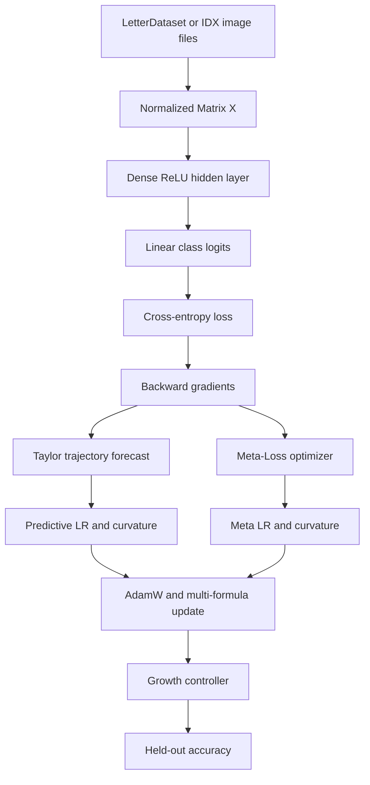

# Recognition Architecture Map

The active system is a labeled dense-classification pipeline. It is intentionally smaller than a sequence model: inputs are normalized vectors, outputs are class logits, and quality is judged by held-out label accuracy.

## Data Flow

## Ring Responsibilities

| Ring | Recognition responsibility |
|---|---|
| Ring 0 | Matrix math, activations, cross-entropy, gradient calculations, Taylor loss forecasting, numerical safeguards, and runtime configuration. |
| Ring 1 | Dense layers plus AdamW, Fisher/Nesterov updates, multi-formula routing, and the online Meta-Loss optimizer. |
| Ring 2 | `NeuralNet` sequential dense model and loss-guided hidden-layer expansion. |
| Ring 3 | `LetterDataset`, `MnistDataset`, `RingTrainer`, batching, shuffling, adaptive updates, and held-out evaluation. |
| Application | `src/main.cpp` selects datasets, prints telemetry, renders samples, and reports benchmarks. |

## Model Shapes

- A-Z: `35 -> 64 -> 26`
- MNIST: `784 -> 128 -> 10`
- Fashion-MNIST: `784 -> 128 -> 10`

The final layer emits one logit per class. The predicted label is the index of the largest logit, compared directly with the one-hot target label.

## Adaptive Update

For each batch, `RingTrainer`:

1. Computes loss and gradients.
2. Measures gradient norm and variance.
3. Feeds loss history, penalty sensitivity, and trajectory features to `MetaLossOptimizer`.
4. Uses `TaylorTrajectoryPredictor` to forecast near-future loss movement.
5. Blends Meta-LR with Taylor-LR and blends Meta curvature with Taylor curvature.
6. Clips gradients and updates weights through AdamW and multi-formula routing.
7. Records epoch loss and lets the Ring 2 growth controller respond to plateaus.
8. Evaluates top-1 accuracy on labels that were not used for that update.

## Related Notes

- [[00 - Overview & Architecture/Ring Dependency Hierarchy|Ring Dependency Hierarchy]]
- [[04 - Ring 3 (Data & Training Pipelines)/Recognition Benchmarks - Letters MNIST Fashion-MNIST|Recognition Benchmarks]]
- [[Index|Recognition Vault Index]]
