# 🗺️ Architecture Map & System Overview

The **RingWrapper Neural Network Framework** is a modular, high-performance C++17 deep learning and transformer language model engine designed from the ground up without third-party ML runtime dependencies (like PyTorch or TensorFlow). It implements pure mathematical rigor, cache-blocked tensor compute, an online meta-learning optimization framework, and hierarchical cognitive reasoning.

---

## 🎯 Practical Explanation: What is this System and Why Does it Exist?

### The Core Problem with Standard Modern AI Frameworks
Standard frameworks (like Python PyTorch/Transformers) suffer from:
1. **Massive Overhead**: Heavy Python runtime interpreted loops, multi-gigabyte memory bloat, dynamic graph tracking overhead, and opaque abstractions.
2. **Rigid Optimization**: Standard AdamW treats every single parameter identical to all other parameters, using static heuristic learning rates regardless of whether a weight is a critical semantic hub or a noisy background weight.
3. **Loss Plateaus**: Transformer language models trained from scratch frequently get stuck in unigram frequency traps ($\text{Loss} \approx 5.0 - 5.5$) because easy, high-frequency characters (spaces, newlines, vowels) dominate the gradient norm.

### How RingWrapper Solves This
1. **Strict Layered Architecture (Rings 0 to 4)**: Prevents circular dependencies, isolates math from model logic, and ensures modularity.
2. **Meta-Neural Loss Optimization (`Ring 1`)**: An internal auxiliary neural network observes optimization telemetry and actively adapts the loss scale, focal gamma exponent, and curvature preconditioning in real-time.
3. **4-Formula Dynamic Weight Physics (`Ring 1`)**: Dynamically evaluates the importance of every individual weight and applies 1 of 4 specialized update equations (Riemannian natural gradient for key weights down to inertial sparse decay for noise).
4. **Token Relevancy & Context Parsing (`Ring 3`)**: Discards fixed window constraints and dynamically scales context windows based on token information entropy and semantic significance.
5. **Labeled Recognition Benchmarks (`Ring 3`)**: Trains dense classifiers on a harder held-out A-Z split plus real MNIST and Fashion-MNIST IDX datasets, using the same AdamW, meta-loss, Taylor foresight, and growth-control components where they apply.

---

## 🏛️ Layered Ring System Topology

```mermaid
flowchart TD
    subgraph Ring0["Ring 0: Core Foundation & Hardware Acceleration"]
        T["Tensor3D & Matrix Math (Contiguous Float Arrays)"]
        ACT["Activations (GELU, SwiGLU, RMSNorm, Softmax)"]
        LOSS["Loss Formulations & Adaptive Scale Multiplier"]
        CUDA["CUDA Engine & AVX2/OpenMP Multithreading"]
        CFG["RuntimeConfig & Telemetry Hooks"]
    end

    subgraph Ring1["Ring 1: Neural Layers & Meta-Optimization Physics"]
        ATTN["Grouped-Query Attention (GQA) & ALiBi Falloff"]
        REC["Hierarchical Recursive Thought Layer (Multi-Pass Reflections)"]
        META["MetaLossOptimizer (Online Policy Gradient Network)"]
        PHYS["MultiFormulaKernel (4-Tier Weight Physics)"]
        OPT["AdamW, Fisher Metric & Nesterov Lookahead"]
        TB["TransformerBlock (RMSNorm + GQA + SwiGLU + Residuals)"]
    end

    subgraph Ring2["Ring 2: Models & Decoders"]
        TLM["TransformerLM Causal GPT Decoder (10 Layers)"]
        BPE["BPE Subword Tokenizer (512 Vocabulary)"]
        VM["Semantic VocabManager (16 Semantic Concept Clusters)"]
        KVC["O(1) Autoregressive KV-Cache Streaming Engine"]
    end

    subgraph Ring3["Ring 3: Data & Training Orchestration"]
        REL["Token Relevancy & Non-Linear Context Radius"]
        CURR["3D Progressive Curriculum (Horizon, Context, Depth)"]
        TRAIN["LLMTrainer (Dynamic LR Schedules & Focal Modulation)"]
        RECOG["RingTrainer (A-Z, MNIST & Fashion-MNIST Recognition)"]
        EVAL["Validation Engine & Multi-File Checkpoint Lifecycle"]
    end

    subgraph Ring4["Ring 4: Client & Applications"]
        CLI["Interactive CLI & Real-Time Streaming Generation"]
    end

    Ring0 --> Ring1
    Ring1 --> Ring2
    Ring2 --> Ring3
    Ring3 --> Ring4
```



---

## 💻 Code Architecture Walkthrough

### 1. The Separation of Concerns
Every capability in the system belongs strictly to its assigned Ring. For example:
- **`include/ring0/tensor.hpp`**: Contains raw numerical memory buffers without any concepts of attention or transformers.
- **`include/ring1/attention.hpp`**: Consumes `ring0::Matrix` to perform multi-head attention.
- **`include/ring2/transformer_lm.hpp`**: Assembles attention blocks and SwiGLU feed-forward networks into a complete causal language model.
- **`include/ring3/llm_trainer.hpp`**: Coordinates the dataset, backward pass, optimizer steps, and evaluation.
- **`include/ring3/trainer.hpp`**: Coordinates dense recognition training, labeled accuracy, AdamW updates, meta-loss control, Taylor foresight, and loss-guided growth.

### 2. High-Performance Contiguous Memory Management
In standard object-oriented programming, matrices are often represented as vectors of vectors (`vector<vector<float>>`). This creates massive pointer indirection, cache thrashing, and memory fragmentation.

In RingWrapper, **all tensors are stored as flat, 1D contiguous vectors (`std::vector<float>`)**:

```cpp
// From include/ring0/tensor.hpp
struct Matrix {
    size_t rows = 0;
    size_t cols = 0;
    std::vector<float> data; // Contiguous buffer in RAM

    // Inlined zero-overhead row-major indexing:
    inline float& operator()(size_t r, size_t c) {
        return data[r * cols + c];
    }
    inline const float& operator()(size_t r, size_t c) const {
        return data[r * cols + c];
    }
};
```

### 🔍 Line-by-Line Beginner Breakdown of Matrix:
- `struct Matrix`: Defines a custom data structure in C++ named `Matrix`.
- `size_t rows = 0; size_t cols = 0;`: Stores the dimensions (height and width) of the 2D grid. `size_t` is an unsigned integer used for memory sizes.
- `std::vector<float> data`: The actual memory storage. Instead of creating a pointer-to-pointer array (`float**`), all matrix elements are stored in one long contiguous strip in RAM.
- `inline float& operator()(size_t r, size_t c)`: Overloads the function call parentheses `()` so you can write `my_matrix(row, col)`.
  - `inline`: Tells the compiler to replace the function call with the direct math formula at compile time, eliminating call overhead.
  - `float&`: The `&` returns an assignable reference to the actual number in RAM (e.g. `my_matrix(2, 3) = 5.0f;`).
- `return data[r * cols + c];`: The row-major offset formula. To reach row `r`, we skip `r` complete rows of length `cols`, then add `c` to reach the target column.
- `inline const float& operator(...) const`: The read-only version used when a function receives a `const Matrix&` parameter (guarantees the matrix will not be modified).

**Why this matters**:
- Enables CPU SIMD auto-vectorization (AVX-512, AVX2, NEON).
- Allows direct memory mapping to GPU device pointers (`cudaMemcpy`).
- Ensures 100% cache-line utilization during row iterations.

---

## 🔗 Related Vault Notes
- [[00 - Overview & Architecture/Ring Dependency Hierarchy|Strict Ring Dependency Hierarchy]]
- [[00 - Overview & Architecture/System Roadmap|System Roadmap & Future Milestones]]
- [[01 - Ring 0 (Core Math & Hardware)/Tensor3D & Matrix Math|Tensor3D & Matrix Math]]
- [[02 - Ring 1 (Layers & Advanced Optimizers)/Meta-Neural Loss & Step Optimizer|Meta-Neural Loss Optimizer]]
- [[02 - Ring 1 (Layers & Advanced Optimizers)/4-Formula Dynamic Weight Physics|4-Formula Dynamic Weight Physics]]
- [[04 - Ring 3 (Data & Training Pipelines)/Recognition Benchmarks - Letters MNIST Fashion-MNIST|Recognition Benchmarks: A-Z, MNIST & Fashion-MNIST]]
- [[Index|Return to Master Index]]
