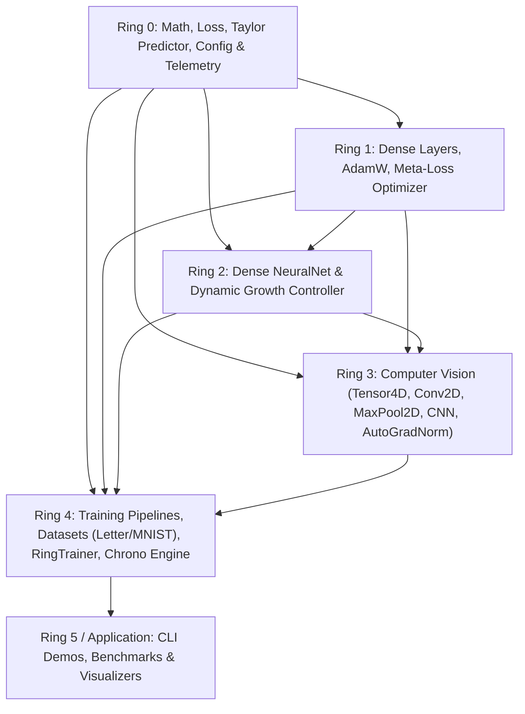

# Plain English Summary

This document explains the layered "Ring" architecture of the neural network library. Just like an operating system separates kernel operations from user applications, this library separates foundational math, layers, models, computer vision, and training pipelines into strict hierarchical rings ($0 \to 4$). Modules in a higher ring can depend on lower rings, but lower rings can never depend on higher rings, preventing circular dependencies and ensuring rock-solid modularity.

---

# Recognition Ring Dependency Hierarchy

The project strictly follows a one-way ring dependency rule: Ring $N$ may depend on Ring $M$ if and only if $M \le N$.

| Ring | Layer Name | Depends On | Architectural Role |
|---|---|---|---|
| **Ring 0** | Core Math & Hardware | Standard Library, CUDA/AVX2 | Matrix/Tensor math, activation functions, loss derivatives, Taylor loss-trajectory forecasting, runtime telemetry configuration. |
| **Ring 1** | Layers & Adaptive Optimizers | Ring 0 | Dense feedforward layers, AdamW, multi-formula dynamic weight physics, Meta-Loss optimization. |
| **Ring 2** | Models & Dense Networks | Rings 0–1 | Sequential `NeuralNet` architectures, dynamic parameter growth controller, and multi-layer perceptrons. |
| **Ring 3** | Computer Vision & CNN Subsystem | Rings 0–2 | 4D Tensors $(B, C, H, W)$, Conv2D layers with He init, MaxPool2D argmax routing, Modular CNN container, episodic mistake memory with repulsive barriers, Online Meta-LR, and Automatic Gradient Normalization. |
| **Ring 4** | Data & Training Pipelines | Rings 0–3 | Universal data loaders, LetterDataset, MnistDataset, ImageDataset, TextDataset, `RingTrainer`, ChronoScheduler, and curriculum schedulers. |
| **Ring 5 (App)** | Application & Benchmarks | Rings 0–4 | High-level CLI, benchmarking harnesses, letter & image dataset recognition verification, ASCII art visualization, and telemetry logging. |

## Architectural Boundary Rules

1. **Ring 0 Isolation**: Ring 0 must never `#include` any headers from Rings 1 through 5.
2. **Ring 1 Purity**: Ring 1 operates directly on Ring 0 matrices and vectors; it does not depend on full models or training datasets.
3. **Ring 2 Representation**: Ring 2 encapsulates complete multi-layer feedforward networks and controls neuron capacity growth.
4. **Ring 3 Vision Autonomy**: Ring 3 contains self-contained convolutional neural network operations. It combines Conv2D/MaxPool2D feature backbones with Ring 1 Dense classification heads and integrates Taylor foresight, Meta-LR, and Auto-Gradient Normalization.
5. **Ring 4 Orchestration**: Ring 4 owns batch loading, dataset generation/ingestion, asynchronous scheduling, and overarching training lifecycle execution.
6. **Ring 5 / Application**: The top-level application executes benchmarks and presents human-readable telemetry without duplicating lower-ring mechanics.
