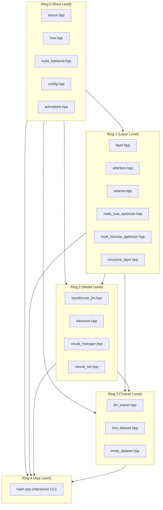

# 🔒 Strict Ring Dependency Hierarchy

The codebase adheres to the strict **Layered Ring Architectural Rule**:
> **Core Constraint**: A module in **Ring $N$** can require/include modules from **Ring $M$** if and only if **$M \le N$**. Violating this constraint introduces circular dependencies, tight coupling, and silent compilation/loading failures.

---

## 📊 Dependency Topology Matrix

| Ring Layer | Directory Namespace | May Depend On | Prohibited From Accessing | Key Responsibilities |
| :--- | :--- | :--- | :--- | :--- |
| **Ring 0** | `ring0::` / `include/ring0` | Core STL only | Ring 1, Ring 2, Ring 3, Ring 4 | Pure mathematical primitives, `Tensor3D`, `Matrix`, `Loss`, `CUDA`, `Config` |
| **Ring 1** | `ring1::` / `include/ring1` | Ring 0, Ring 1 | Ring 2, Ring 3, Ring 4 | Neural network layers, attention, `AdamW`, `MetaLossOptimizer`, `MultiFormulaKernel`, `RecursiveLayer` |
| **Ring 2** | `ring2::` / `include/ring2` | Ring 0, Ring 1, Ring 2 | Ring 3, Ring 4 | Full model architectures, `TransformerLM`, `Tokenizer`, `VocabManager` |
| **Ring 3** | `ring3::` / `include/ring3` | Ring 0, Ring 1, Ring 2, Ring 3 | Ring 4 | Datasets (`TextDataset`, `MNIST`), Training loops (`LLMTrainer`), Checkpointing |
| **Ring 4** | `ring4::` / Application | All Rings (0 to 4) | None | CLI endpoints, streaming user interfaces, benchmarks, evaluation apps |

---

## 🛡️ Ring Invariance Enforcements

---

## ⚠️ Anti-Patterns & Prohibitions

1. **Upward Dependency Violation**:
   - ❌ *Incorrect*: `#include "ring2/transformer_lm.hpp"` inside `include/ring1/adamw.hpp`.
   - ✅ *Correct*: `AdamW` operates strictly on `ring0::Matrix` references.
2. **Circular Inclusions**:
   - Forward declarations and clean header separation ensure zero compilation stalls.

---

## 🔗 Related Notes
- [[00 - Overview & Architecture/Architecture Map|Architecture Map]]
- [[Index|Return to Index]]
