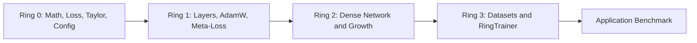

# Recognition Ring Dependency Hierarchy

The project uses a one-way ring dependency rule: Ring $N$ may depend on Ring $M$ when $M \le N$.

| Ring | Depends on | Recognition role |
|---|---|---|
| Ring 0 | Standard library | Matrix/tensor math, activations, losses, Taylor forecasting, runtime config. |
| Ring 1 | Ring 0 | Dense layers and adaptive optimizers. |
| Ring 2 | Rings 0-1 | Sequential dense `NeuralNet` and growth controller. |
| Ring 3 | Rings 0-2 | Letter/MNIST datasets and `RingTrainer`. |
| Application | Rings 0-3 | Benchmark selection, sample rendering, and accuracy reporting. |

## Boundary Rules

- Ring 0 must not include higher-ring model or trainer headers.
- Ring 1 operates on Ring 0 matrices and owns parameter-update behavior.
- Ring 2 can change hidden-layer capacity, but Ring 3 must re-register optimizer state after expansion.
- Ring 3 owns dataset iteration and evaluation; it does not redefine matrix math.
- The application reports behavior but does not duplicate training logic.
