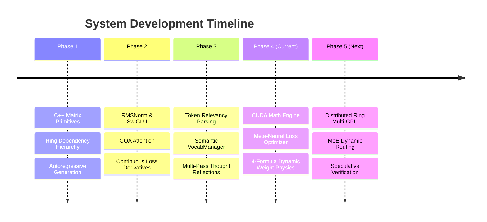

# 🗺️ Capabilities Roadmap & Milestones

This document tracks the milestones and planned directions for the **RingWrapper Neural Network** project.

---

## 📅 Roadmap Overview

---

## 🎯 Current Milestone Capabilities (Phase 4)

### 1. [[02 - Ring 1 (Layers & Advanced Optimizers)/Meta-Neural Loss & Step Optimizer|Meta-Neural Loss & Step Optimizer]]
- [x] Continuous state observation vector $\mathbf{s}_t \in \mathbb{R}^8$
- [x] Online policy gradient parameter adaptation with loss reward $R_t = -(\mathcal{L}_t - \mathcal{L}_{t-1})$
- [x] Dynamic focal gamma $\gamma \in [0.0, 3.0]$ and loss scaling multiplier $\mathcal{M}_{\mathcal{L}} \in [0.2, 4.0]$

### 2. [[02 - Ring 1 (Layers & Advanced Optimizers)/4-Formula Dynamic Weight Physics|4-Formula Dynamic Weight Physics]]
- [x] Taylor Salience $\times$ Empirical Fisher diagonal metric score $\mathcal{I}(w_i)$
- [x] Formula 1 (Riemannian Natural Gradient for critical semantic hubs)
- [x] Formula 2 (Curvature-Scaled Nesterov acceleration)
- [x] Formula 3 (Variance-Bounded AdamW)
- [x] Formula 4 (Inertial Sparse Decay & noise pruning)

### 3. [[01 - Ring 0 (Core Math & Hardware)/CUDA & Hardware Acceleration Engine|CUDA Hardware Math Engine]]
- [x] Unified GPU/CPU math dispatcher in Ring 0
- [x] OpenMP parallelized cache-blocked matrix multiplication
- [x] Fused ALiBi attention and SwiGLU activation kernels

---

## 🔮 Future Horizon Research (Phase 5 & Beyond)

### 1. Mixture of Thought Experts (MoTE)
- Routing latent activations into specialized cognitive expert trees based on prompt domain (code, reasoning, creative text).
- Top-2 gating with auxiliary load balancing loss $\mathcal{L}_{\text{balance}}$.

### 2. Speculative Geodesic Verification
- Drafting small speculative token batches via fast shallow layers (e.g., 2 layers) and verifying in parallel with deep 10-layer passes.

### 3. Non-Euclidean Hyperbolic Embeddings
- Mapping hierarchical lexical trees and taxonomy clusters into Poincaré ball manifolds to preserve exponential relationship capacities in low dimensions.

---

## 🔗 Related Notes
- [[00 - Overview & Architecture/Architecture Map|Architecture Map]]
- [[00 - Overview & Architecture/Ring Dependency Hierarchy|Ring Dependency Hierarchy]]
- [[Index|Return to Index]]
