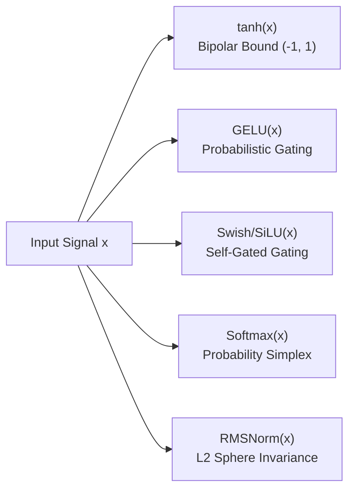

# ⚡ Activation Functions & Non-Linear Transformations

In the RingWrapper architecture, non-linear activation functions (`ring0::Activations`) are the mathematical engines that allow neural networks to break linear superposition and learn arbitrary complex mappings. All functions and their exact analytical Jacobian derivatives are vectorized with SIMD and OpenMP concurrency.

---

## 🧠 Intuitive Foundation: Why Activations Exist

Imagine stacking ten linear transformations in a row:
$$\mathbf{y} = \mathbf{W}_{10} (\mathbf{W}_9 (\dots (\mathbf{W}_1 \mathbf{x} + \mathbf{b}_1)\dots) + \mathbf{b}_9) + \mathbf{b}_{10}$$

Because matrix multiplication is associative and linear, all ten weight matrices can be collapsed into a **single matrix**:
$$\mathbf{W}_{\text{effective}} = \mathbf{W}_{10} \mathbf{W}_9 \dots \mathbf{W}_1$$

Without non-linear activations, a 100-layer deep neural network has the exact same representational power as a simple 1-layer linear regression model! Non-linear activations introduce "folds" and "curves" into the geometric state space, allowing the network to sculpt non-convex decision boundaries, model logical conditionals (IF-THEN routing), and approximate any continuous function (Universal Approximation Theorem).

---

## 📊 Catalog of Mathematical Activations

---

### 1. Hyperbolic Tangent ($\tanh$)

The **Hyperbolic Tangent** is the canonical smooth bipolar non-linearity. It maps the entire real line $\mathbb{R} = (-\infty, +\infty)$ into the strictly bounded open interval $(-1, 1)$.

#### 📐 Mathematical Formulations

$$\tanh(x) = \frac{\sinh(x)}{\cosh(x)} = \frac{e^x - e^{-x}}{e^x + e^{-x}}$$

Alternative computationally efficient exponential forms:
$$\tanh(x) = \frac{e^{2x} - 1}{e^{2x} + 1} = 1 - \frac{2}{e^{2x} + 1}$$

#### 🔄 Relationship to Standard Logistic Sigmoid $\sigma(x)$

The $\tanh$ function is a rescaled, shifted, and zero-centered version of the logistic sigmoid $\sigma(x) = \frac{1}{1 + e^{-x}}$:
$$\tanh(x) = 2\sigma(2x) - 1$$
$$\sigma(x) = \frac{1 + \tanh(x/2)}{2}$$

#### 📈 First & Second Analytical Derivatives

**First Derivative (Jacobian Rate of Change)**:
$$\frac{d}{dx}\tanh(x) = 1 - \tanh^2(x) = \text{sech}^2(x) = \frac{4}{(e^x + e^{-x})^2}$$

> **Key Computational Insight**: Because $\frac{d}{dx}\tanh(x) = 1 - y^2$ where $y = \tanh(x)$, the backward gradient can be calculated instantaneously from the cached forward output $y$ without evaluating any new exponential functions!

**Second Derivative (Curvature & Inflection)**:
$$\frac{d^2}{dx^2}\tanh(x) = -2\tanh(x)(1 - \tanh^2(x)) = -2\tanh(x)\text{sech}^2(x)$$

The second derivative has an inflection point at $x = 0$ where $\frac{d^2}{dx^2}\tanh(0) = 0$, giving the activation maximum linear sensitivity near the origin.

#### 🔢 Taylor Series Expansion (Local Approximation)

Around $x = 0$, $\tanh(x)$ is approximated by odd-power polynomials:
$$\tanh(x) = x - \frac{x^3}{3} + \frac{2x^5}{15} - \frac{17x^7}{315} + \mathcal{O}(x^9) \quad \text{for } |x| < \frac{\pi}{2}$$

#### 💡 Intuition & Role in RingWrapper

1. **Zero-Centered Balancing**: Unlike Sigmoid (which outputs strictly positive numbers in $(0, 1)$, pushing gradient updates into a single quadrant and causing oscillatory zig-zagging), $\tanh$ is zero-centered with $\tanh(0) = 0$. It can signal both **strong inhibition** (negative values $\to -1$) and **strong excitation** (positive values $\to +1$), keeping latent activations balanced around zero.
2. **Recursive Thought Bounding (`ring1::RecursiveLayer`)**: When reasoning across recursive loops, unbounded activations (like ReLU) can cause latent norms to explode to $\infty$. $\tanh$ acts as a protective mathematical clamp that keeps iterative thoughts strictly bounded on $[-1, 1]$.
3. **Smooth Damped Reversal & Trust Regions**: In `ring1::AdamW` and `ring0::loss`, $\tanh$ is used to soft-cap ratio bounds: $\Delta \theta_{\text{scaled}} = \tanh(\Delta \theta / \tau) \cdot \tau$, eliminating gradient explosion while maintaining smooth differentiability.
4. **Foundation of GELU**: The high-speed standard approximation of the Gaussian Error Linear Unit uses $\tanh$ internally to evaluate the Gaussian error function.

---

### 2. Gaussian Error Linear Unit (GELU)

Used as the standard hidden activation in Transformer feed-forward blocks (GPT, BERT, LLaMA).

#### 📐 Mathematical Formula

$$\text{GELU}(x) = x \cdot P(X \le x) = x \cdot \Phi(x) = x \cdot \frac{1}{2}\left[1 + \text{erf}\left(\frac{x}{\sqrt{2}}\right)\right]$$

High-speed numerical approximation using $\tanh$:
$$\text{GELU}(x) \approx 0.5 \cdot x \cdot \left(1 + \tanh\left(\sqrt{\frac{2}{\pi}} \cdot \left(x + 0.044715 \cdot x^3\right)\right)\right)$$

Letting $u = \sqrt{\frac{2}{\pi}} \cdot (x + 0.044715 \cdot x^3)$:
$$\frac{d}{dx}\text{GELU}(x) = 0.5 \cdot (1 + \tanh(u)) + 0.5 \cdot x \cdot (1 - \tanh^2(u)) \cdot \sqrt{\frac{2}{\pi}} \cdot (1 + 3 \cdot 0.044715 \cdot x^2)$$

#### 💡 Intuition: "Probabilistic Quantum Gating"

- While **ReLU** acts as a hard gate ($\text{if } x > 0 \text{ pass else } 0$), **GELU** gates the input based on how much it exceeds a Gaussian distribution of noise.
- For large positive values ($x > 2$), $\Phi(x) \to 1$, so $\text{GELU}(x) \to x$ (identity).
- For large negative values ($x < -2$), $\Phi(x) \to 0$, so $\text{GELU}(x) \to 0$ (drop).
- In the transition region ($-1 < x < 1$), it provides a smooth, differentiable curve with a slight negative dip near $x \approx -0.17$, allowing the model to propagate weak negative signals rather than hard-clipping them to zero like ReLU.

---

### 3. Swish / SiLU (Sigmoid Linear Unit) & SwiGLU

Used in modern Transformer GLU (Gated Linear Unit) MLP layers.

#### 📐 Formula & Derivative

$$\text{SiLU}(x) = x \cdot \sigma(x) = \frac{x}{1 + e^{-x}}$$

$$\frac{d}{dx}\text{SiLU}(x) = \sigma(x) + x \cdot \sigma(x)(1 - \sigma(x)) = \sigma(x)(1 + x(1 - \sigma(x)))$$

#### 💡 SwiGLU MLP Block Intuition

In `ring1::TransformerBlock`, the MLP uses SwiGLU:
$$\text{SwiGLU}(\mathbf{x}) = \left(\text{SiLU}(\mathbf{x} \mathbf{W}_{\text{gate}}) \odot (\mathbf{x} \mathbf{W}_{\text{up}})\right) \mathbf{W}_{\text{down}}$$

- $\mathbf{W}_{\text{up}}$ projects the token representation into candidate feature channels.
- $\mathbf{W}_{\text{gate}}$ computes an independent gating signal, smoothly masked by $\text{SiLU}$.
- The Hadamard product $\odot$ allows the network to dynamically switch on or off entire semantic subspaces based on context.

---

### 4. Numerically Stable Softmax & Logit Soft-Capping

Converts unbounded logits $\mathbf{z} \in \mathbb{R}^V$ into a valid probability distribution on the simplex $\Delta^{V-1}$.

#### 📐 Safe Subtraction Formula

To avoid numerical overflow where $e^{z_i} \to \text{inf}$ when $z_i > 88$ in 32-bit floats:
$$m = \max_{j} z_j, \quad s_i = \frac{e^{z_i - m}}{\sum_{j=1}^V e^{z_j - m}}$$

#### 🛡️ Logit Soft-Capping (Gemma-Style)

Before computing Softmax, logits are soft-capped via $\tanh$ with threshold $C = 20.0$:
$$z_{\text{capped}} = C \cdot \tanh\left(\frac{z}{C}\right)$$

This guarantees that $|z_{\text{capped}}| \le 20.0$, preventing entropy collapse, extreme gradient spikes, and softmax overflow during early training.

---

### 5. Root Mean Square Normalization (RMSNorm)

Replaces standard LayerNorm by normalizing inputs according to their root-mean-square energy:

$$\text{RMSNorm}(\mathbf{x}) = \frac{\mathbf{x}}{\text{RMS}(\mathbf{x}) + \epsilon} \odot \boldsymbol{\gamma}, \quad \text{where } \text{RMS}(\mathbf{x}) = \sqrt{\frac{1}{d}\sum_{i=1}^d x_i^2}$$

#### 💡 Intuition: Scaling without Shifting

LayerNorm computes both mean $\mu$ and variance $\sigma^2$ (centering + scaling). In deep transformer layers, empirical studies show that mean-centering offers negligible performance gains while incurring high memory-bandwidth cost. RMSNorm focuses purely on **scaling invariance**, ensuring that vectors are projected onto a stable hypersphere radius of length $\sqrt{d}$.

---

## 📈 Comparative Visual Guide

| Activation | Domain $\mathcal{X}$ | Range $\mathcal{Y}$ | Zero-Centered? | Self-Gated? | Primary Use Case in RingWrapper |
| :--- | :--- | :--- | :--- | :--- | :--- |
| **$\tanh(x)$** | $(-\infty, +\infty)$ | $(-1, 1)$ | **Yes ($f(0)=0$)** | No | Recursive thinking bounds, Logit soft-capping, Trust regions |
| **$\text{GELU}(x)$** | $(-\infty, +\infty)$ | $(-0.17, +\infty)$ | Near 0 | Yes ($\Phi(x)$) | Standard Transformer MLP activations |
| **$\text{SiLU}(x)$** | $(-\infty, +\infty)$ | $(-0.28, +\infty)$ | Near 0 | Yes ($\sigma(x)$) | SwiGLU Gated Feed-Forward Networks |
| **$\text{Softmax}(\mathbf{z})$** | $\mathbb{R}^V$ | $(0, 1), \sum=1$ | N/A | N/A | Multi-head attention weights, Next-token probability |
| **$\text{RMSNorm}(\mathbf{x})$** | $\mathbb{R}^d$ | Unit sphere $\cdot \gamma$ | Preserved | N/A | Pre-attention and pre-FFN layer normalization |

---

## 🔗 Related Notes
- [[01 - Ring 0 (Core Math & Hardware)/Numerical Stability & NaN Prevention Physics|Numerical Stability & NaN Prevention]]
- [[01 - Ring 0 (Core Math & Hardware)/Tensor3D & Matrix Math|Tensor3D & Matrix Math]]
- [[02 - Ring 1 (Layers & Advanced Optimizers)/Hierarchical Recursive Thought Layer|Hierarchical Recursive Thought Layer]]
- [[03 - Ring 2 (Models & Transformers)/Recognition Network|Recognition Network]]
- [[Index|Return to Master Index]]
