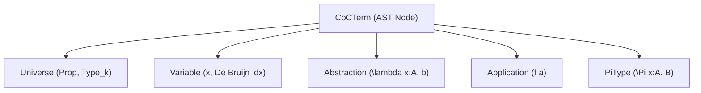
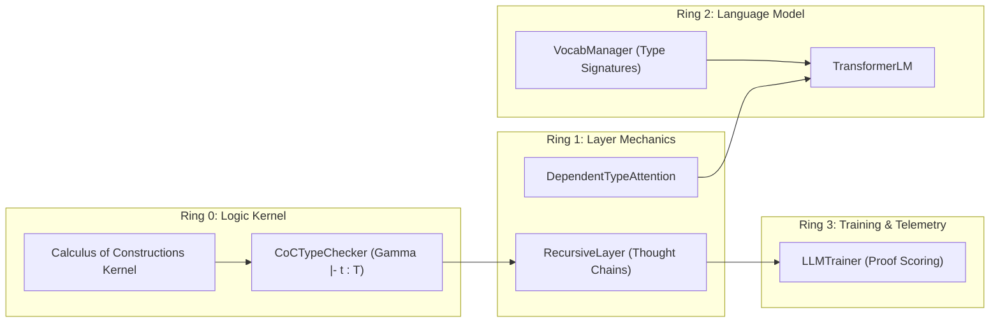

# Calculus of Constructions & Dependent-Typed Neural Reasoning

The **Calculus of Constructions (CoC)** ($\lambda C$) represents the apex of **Barendregt's Lambda Cube**, combining:
1. **Terms depending on Terms** (Ordinary $\lambda$-Calculus functions: $x \mapsto f(x)$)
2. **Terms depending on Types** (Parametric Polymorphism / System F: $X \mapsto \lambda x:X. x$)
3. **Types depending on Types** (Type Operators / System $F\omega$: $X \mapsto \text{List}(X)$)
4. **Types depending on Terms** (Dependent Types / System $\lambda P$: $n \mapsto \text{Vector}(n)$)

In the **RingWrapper NeuralNet** architecture, the Calculus of Constructions bridges formal constructive logic and continuous latent representations through the **Curry-Howard Isomorphism** ($\text{Propositions-as-Types}$, $\text{Proofs-as-Programs}$).

---

## 1. Formal Mathematical Foundations

### 1.1 Universe Stratification & Sorts

To prevent Russell-style and Girard-style paradoxes (such as $\text{Type} : \text{Type}$ collapsing into inconsistency), universes are stratified into an impredicative propositional base and a cumulative predicative hierarchy:

$$\mathcal{S} = \{ \text{Prop}, \text{Type}_0, \text{Type}_1, \text{Type}_2, \dots \}$$

* **$\text{Prop}$**: The impredicative universe of propositions. Any dependent product whose codomain is $\text{Prop}$ remains in $\text{Prop}$:
  $$\frac{\Gamma \vdash A : s \quad \Gamma, x:A \vdash B : \text{Prop}}{\Gamma \vdash \Pi (x : A). B : \text{Prop}} \quad (s \in \mathcal{S})$$
* **$\text{Type}_k$**: Predicative computational universes of data and higher-order module structures:
  $$\frac{\Gamma \vdash A : \text{Type}_i \quad \Gamma, x:A \vdash B : \text{Type}_j}{\Gamma \vdash \Pi (x : A). B : \text{Type}_{\max(i, j)}}$$

---

### 1.2 Syntax and AST Representation

Every term $t$ in $\lambda C$ is defined inductively:

$$t, u, A, B ::= x \mid s \mid \lambda (x : A). b \mid (f \; a) \mid \Pi (x : A). B$$

---

### 1.3 Normalization and Definitional Equality ($\beta$-Reduction)

A $\beta$-redex is an application of an abstraction to an argument:

$$(\lambda (x : A). b) \; a \longrightarrow_\beta b [x := a]$$

Two terms $t_1, t_2$ are **definitionally equal** ($t_1 \equiv_\beta t_2$) if their weak-head normal forms (WHNF) are syntactically isomorphic modulo $\alpha$-renaming of bound variables.

---

### 1.4 Type-Checking Rules (Typing Judgments)

A context $\Gamma$ is a sequence of variable declarations: $\Gamma = x_1 : A_1, x_2 : A_2, \dots, x_n : A_n$.

1. **Axiom (Universe Progression)**:
   $$\vdash \text{Prop} : \text{Type}_0, \quad \vdash \text{Type}_k : \text{Type}_{k+1}$$

2. **Variable Rule**:
   $$\frac{\Gamma \vdash \text{wf} \quad (x : A) \in \Gamma}{\Gamma \vdash x : A}$$

3. **Abstraction Rule (Proof Constructor)**:
   $$\frac{\Gamma, x:A \vdash b : B \quad \Gamma \vdash \Pi (x:A). B : s}{\Gamma \vdash \lambda (x:A). b : \Pi (x:A). B}$$

4. **Application Rule (Modus Ponens / Proof Elimination)**:
   $$\frac{\Gamma \vdash f : \Pi (x:A). B \quad \Gamma \vdash a : A}{\Gamma \vdash (f \; a) : B[x := a]}$$

5. **Conversion Rule**:
   $$\frac{\Gamma \vdash t : A \quad \Gamma \vdash B : s \quad A \equiv_\beta B}{\Gamma \vdash t : B}$$

---

## 2. Neural Architecture Integration

### 2.1 Dependent Type-Directed Attention (Ring 1)

In standard causal self-attention, attention logits depend solely on learned geometric inner products:
$$\text{Attn}(Q, K) = \text{Softmax}\left(\frac{Q K^T}{\sqrt{d_k}}\right)$$

In **Dependent Type-Directed Attention**, tokens project continuous type embeddings $\tau(q_i), \tau(k_j) \in \mathbb{R}^{d_{\text{type}}}$ corresponding to their constructive type signatures:

$$\text{TypeScore}(q_i, k_j) = \frac{\langle \tau(q_i), \tau(k_j) \rangle}{\|\tau(q_i)\| \|\tau(k_j)\| + \epsilon}$$

$$\text{Attn}_{\text{CoC}}(Q, K)_{ij} = \text{Softmax}\left(\frac{Q_i K_j^T}{\sqrt{d}} + \alpha \cdot \text{TypeScore}(q_i, k_j)\right)$$

This forces semantic queries to align with structurally compatible antecedent types (e.g. predicates binding to objects of the expected dependent domain).

---

### 2.2 Constructive Proof Witnesses in Thought Chains (Ring 1 & Ring 2)

During multi-pass recursive thought reflection loops (`RecursiveLayer`), each latent reflection step produces:
* A continuous thought activation matrix $H \in \mathbb{R}^{B \times d}$.
* A **Constructive Proof Witness** $w \in \lambda C$ asserting the deductive validity of the transition from step $t$ to $t+1$.

The Ring 0 `CoCTypeChecker` formally verifies $\Gamma \vdash w : \text{ValidDeduction}(H_t, H_{t+1})$, computing a **Proof Consistency Score** $C_{\text{proof}} \in [0.0, 1.0]$. Ill-typed or logically invalid reasoning steps receive verification penalties, guiding latent policy exploration towards sound inferences.

---

### 2.3 Semantic Type Signatures in VocabManager (Ring 2)

Vocabulary entries are enriched with explicit CoC type signatures:
* **Entities / Objects**: $\tau = \text{Term}(\text{Type}_0)$
* **Actions / Verbs**: $\tau = \Pi (x : \text{Object}). \text{StateTransition}(x)$
* **Logical Relators**: $\tau = \Pi (P : \text{Prop}). \Pi (Q : \text{Prop}). \text{Prop}$
* **Polymorphic Functions**: $\tau = \Pi (A : \text{Type}_0). \Pi (x : A). A$

---

## 3. Directional Stability & Damped Operation Reversal

When optimizing coupled continuous neural weights and discrete type compatibility scores:
1. Every layer tracks the sign of its parameter shift $\Delta W$ and penalty update $\Delta \text{pen}$.
2. If an operation increases loss ($\Delta L > 0$), the optimizer executes **damped reversal**:
   $$\Delta \text{param}_{\text{next}} = - \text{sign}(\Delta \text{param}) \cdot \frac{0.5 \cdot |\Delta \text{param}|}{1.0 + 2.0 \cdot \Delta L}$$
3. This guarantees that unconstructive parameter perturbations are immediately inverted and reduced in magnitude, preventing runaway oscillatory destabilization.
