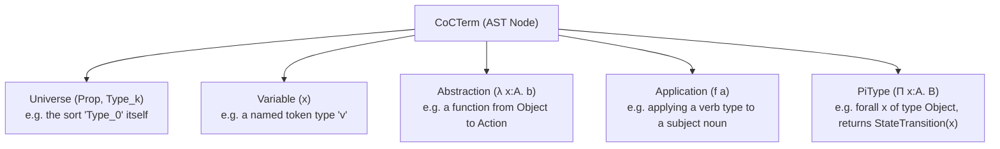
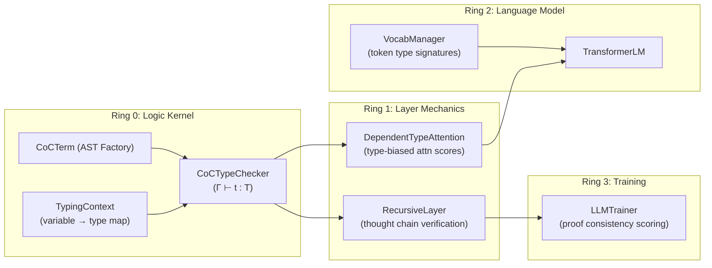

# Calculus of Constructions & Dependent-Typed Neural Reasoning

> **Ring Level**: Ring 0 (`ring0::CoCTypeChecker`, `ring0::CoCTerm`)
> **Source Files**: `include/ring0/calculus_of_constructions.hpp`, `src/ring0/calculus_of_constructions.cpp`
> **Used By**: Ring 1 `DependentTypeAttention`, Ring 1 `RecursiveLayer`, Ring 3 `LLMTrainer`

---

## 🧠 Plain-English Overview

**Think of the Calculus of Constructions (CoC) as a type-safety inspector for the neural network's reasoning.**

When you write a normal Python/C++ function, the type system checks that you're not passing a string where an integer is expected. The CoC does the same thing — but for *logical arguments* instead of just data types.

In practice, this means:
- **Tokens have hidden "logical types"** beyond just their embedding vector. A verb token has a different type signature than a noun token.
- The **attention mechanism uses these types** to score whether one token *logically* makes sense attending to another — not just whether their embedding vectors are geometrically similar.
- A **proof consistency score** (0.0 to 1.0) is computed every few training steps and logged in the telemetry. If this drops below ~0.85, reasoning quality is compromised.
- The training system **penalizes illogical attention patterns**, pushing the model toward semantically sound token associations during learning.

> **Bottom line**: CoC is the brain's "logic linter" — it ensures the model doesn't just say statistically likely words, but words that *logically follow* from what came before.

---

## 1. The Lambda Cube — Background

The **Calculus of Constructions (CoC / λC)** sits at the apex of **Barendregt's Lambda Cube**, meaning it supports all four combinations of dependency:

| Feature | Example |
|---|---|
| **Terms → Terms** | Ordinary functions: $x \mapsto f(x)$ |
| **Terms → Types** | Polymorphism (like C++ templates): `List<A>` |
| **Types → Types** | Type operators / functors |
| **Types → Terms** | Dependent types: `Vector(n)` — the type changes based on the *value* of n |

The key power is **dependent types**: a type can be parameterized by a runtime *value*. This is what lets you say "this token's type *depends on* what the surrounding tokens proved."

In the **RingWrapper NeuralNet**, CoC bridges formal constructive logic and continuous latent representations through the **Curry-Howard Isomorphism**:

$$\text{Propositions} \equiv \text{Types} \qquad \text{Proofs} \equiv \text{Programs}$$

This means every valid neural computation can be interpreted as a proof of a logical proposition, and vice versa.

---

## 2. Universe Stratification & Sorts

### Why Universes Matter

Without stratification, you'd get **Russell's Paradox** — e.g., "the type of all types" containing itself leads to contradictions. Universes prevent this by layering types into levels:

$$\mathcal{S} = \{ \text{Prop}, \text{Type}_0, \text{Type}_1, \text{Type}_2, \dots \}$$

### In Practice (RingWrapper)

| Universe | What Lives Here |
|---|---|
| `Prop` | Logical propositions: "token X implies token Y", "this argument is valid" |
| `Type_0` | Concrete data: tensors, embedding vectors, token IDs |
| `Type_1` | Layer/module type constructors — things that *produce* concrete data |
| `Type_2` | Architecture-level meta-policies |

```cpp
// From calculus_of_constructions.hpp
enum class UniverseSort {
    PROP  = 0,   // Propositions / proofs — logical truth lives here
    TYPE_0 = 1,  // Concrete data (tensors, tokens, floats)
    TYPE_1 = 2,  // Module and layer type constructors (things that build Type_0 things)
    TYPE_2 = 3   // Architecture and meta-policy universe (highest level)
};
```

> **What this code does**: Defines the 4-level universe hierarchy. When the type checker runs, it assigns every term to one of these levels. A tensor embedding lives in `TYPE_0`. A function that *produces* tensors lives in `TYPE_1`. This prevents circular paradoxes where a type claims to contain itself.

### Formal Rules

* **`Prop` (impredicative)** — A dependent product whose codomain is `Prop` stays in `Prop`. This lets you quantify over all types without going to a higher universe:
  $$\frac{\Gamma \vdash A : s \quad \Gamma, x:A \vdash B : \text{Prop}}{\Gamma \vdash \Pi (x : A). B : \text{Prop}} \quad (s \in \mathcal{S})$$

* **`Type_k` (predicative)** — A Pi-type across two computational universes lives in the *higher* of the two:
  $$\frac{\Gamma \vdash A : \text{Type}_i \quad \Gamma, x:A \vdash B : \text{Type}_j}{\Gamma \vdash \Pi (x : A). B : \text{Type}_{\max(i, j)}}$$

---

## 3. Term Syntax & AST Structure

### The Five Building Blocks

Every term in the CoC is exactly one of five things:

$$t, u, A, B ::= x \mid s \mid \lambda (x : A). b \mid (f \; a) \mid \Pi (x : A). B$$



### Code: Factory Constructors

```cpp
// From calculus_of_constructions.cpp

// Create a Universe node (e.g. "Type_0" or "Prop")
CoCTermPtr CoCTerm::make_universe(UniverseSort s, int lvl) {
    auto term = std::make_shared<CoCTerm>(TermKind::UNIVERSE);
    term->sort = s;    // Which universe level (Prop, Type_0, Type_1, Type_2)
    term->level = lvl; // Numeric level for cumulativity (Type_0 < Type_1 < ...)
    return term;
}
```
> **What this does**: Creates a "universe" node — not a concrete value, but a sort marker that says "this term lives at level X". Think of it like a tag that says "this is a raw tensor (Type_0)" vs "this is a layer constructor (Type_1)".

```cpp
// Create a variable reference (e.g. the token type named "verb")
CoCTermPtr CoCTerm::make_var(const std::string &name, int db_idx) {
    auto term = std::make_shared<CoCTerm>(TermKind::VARIABLE);
    term->var_name = name;          // Human-readable name ("x", "A", "verb")
    term->de_bruijn_index = db_idx; // Nameless index (avoids renaming conflicts)
    return term;
}
```
> **What this does**: Creates a variable reference. The `de_bruijn_index` is a nameless way to refer to a variable by *position* instead of *name*, which prevents variable-capture bugs when substituting terms into other terms.

```cpp
// Create a lambda abstraction: λ(x : A). body
// e.g. "given a token of type Object, produce a StateTransition"
CoCTermPtr CoCTerm::make_abstraction(const std::string &param, CoCTermPtr p_type, CoCTermPtr b) {
    auto term = std::make_shared<CoCTerm>(TermKind::ABSTRACTION);
    term->param_name = param;  // Name of the parameter (e.g. "x")
    term->param_type = p_type; // Type that the parameter must have (e.g. "Object")
    term->body = b;            // The body — what the function computes/returns
    return term;
}
```
> **What this does**: Creates a function. In type-theory terms, every function is a "proof constructor" — it takes evidence that x has type A, and produces evidence that something else holds. In our network, this models the idea "if token X is a noun, then applying this verb type to it produces a valid state transition."

```cpp
// Create function application: (f a) — apply function f to argument a
CoCTermPtr CoCTerm::make_application(CoCTermPtr f, CoCTermPtr a) {
    auto term = std::make_shared<CoCTerm>(TermKind::APPLICATION);
    term->func = f; // The function being applied (must be a Pi-type or abstraction)
    term->arg = a;  // The argument (must match the function's expected input type)
    return term;
}
```
> **What this does**: Applies one term to another — like calling a function with an argument. In logic, this is **Modus Ponens**: if you have "A implies B" and you have "A", you conclude "B". In the neural net, this fires when token j *satisfies* the type requirement of token i, strengthening their attention bond.

```cpp
// Create a Pi type: Π(x : A). B(x) — "for all x of type A, B(x) holds"
// When B doesn't mention x, this simplifies to: A → B  (ordinary function type)
CoCTermPtr CoCTerm::make_pi(const std::string &param, CoCTermPtr p_type, CoCTermPtr b) {
    auto term = std::make_shared<CoCTerm>(TermKind::PI_TYPE);
    term->param_name = param;  // Parameter name (can be "_" for non-dependent arrow types)
    term->param_type = p_type; // Domain type A
    term->body = b;            // Codomain/return type B (may depend on the value of x)
    return term;
}

// Shorthand: non-dependent A → B is just Π(_ : A). B
CoCTermPtr CoCTerm::make_arrow(CoCTermPtr from_type, CoCTermPtr to_type) {
    return make_pi("_", from_type, to_type); // "_" signals no dependency on the value
}
```
> **What this does**: Defines the *type* of a function. `Π(x:A). B(x)` means "a function that, given any x of type A, returns something of type B(x)" — where B can actually *depend on the value* of x. For non-dependent functions (plain A→B), `make_arrow` is a shorthand.

---

## 4. Beta-Reduction & Normalization

**Beta-reduction** is the core computation step of lambda calculus: applying a function to an argument yields the function body with the argument substituted in.

$$(\lambda (x : A). \; b) \; a \longrightarrow_\beta b[x := a]$$

**Practical meaning**: If you have "a function that, given a noun x, returns x's associated action" and you feed it the noun "cat", you get "cat's associated action" after one step.

```cpp
// From calculus_of_constructions.cpp
CoCTermPtr CoCTerm::normalize_beta() const {
    switch (kind) {
    // Atoms (universe sorts and variables) are already in normal form — nothing to reduce
    case TermKind::UNIVERSE:
    case TermKind::VARIABLE:
        return std::const_pointer_cast<CoCTerm>(shared_from_this());

    // For abstractions (λ x:A. b): normalize the parameter type and body separately
    case TermKind::ABSTRACTION: {
        auto norm_type = param_type ? param_type->normalize_beta() : nullptr;
        auto norm_body = body ? body->normalize_beta() : nullptr;
        return make_abstraction(param_name, norm_type, norm_body);
    }

    // KEY CASE: Application (f a) — this is where beta-reduction fires
    case TermKind::APPLICATION: {
        auto norm_func = func ? func->normalize_beta() : nullptr; // Normalize the function first
        auto norm_arg  = arg  ? arg->normalize_beta()  : nullptr; // Normalize the argument

        // Beta-reduction: if the function IS a lambda (λ x:A. b), substitute arg for x in body
        // (λ x:A. b) a  ==>  b[x := a]
        if (norm_func && norm_func->kind == TermKind::ABSTRACTION && norm_func->body) {
            auto reduced = norm_func->body->substitute(norm_func->param_name, norm_arg);
            return reduced ? reduced->normalize_beta() : nullptr; // Keep reducing recursively
        }
        return make_application(norm_func, norm_arg); // Can't reduce yet — return as-is
    }

    // Pi types: normalize domain and codomain independently
    case TermKind::PI_TYPE: {
        auto norm_type = param_type ? param_type->normalize_beta() : nullptr;
        auto norm_body = body ? body->normalize_beta() : nullptr;
        return make_pi(param_name, norm_type, norm_body);
    }
    }
    return std::const_pointer_cast<CoCTerm>(shared_from_this());
}
```

> **What this code does (plain English)**: This function takes a CoC expression and reduces it to its simplest form by repeatedly applying function calls. If it finds `(λx. body) argument`, it substitutes `argument` for every `x` in `body`. This keeps going recursively until no more reductions are possible. The result is the **normal form** — the "answer" after fully computing the expression. Two terms that normalize to the same thing are *definitionally equal* (same meaning, different notation).

### Definitional Equality

```cpp
bool CoCTerm::is_definitionally_equal(const CoCTermPtr &other) const {
    // Normalize BOTH terms to weak head normal form first
    auto t1 = this->normalize_beta();
    auto t2 = other->normalize_beta();
    // Then compare structure recursively
    if (t1->kind != t2->kind) return false;
    // ... (compare payloads based on kind)
}
```
> **What this does**: Two terms are "the same" in CoC if they normalize to the same thing, even if they're written differently. This is used during type-checking to verify that an argument's type *matches* a function's expected input type — even if they were constructed differently.

---

## 5. Type-Checking Kernel

The `CoCTypeChecker` is the core engine. It implements the five **typing judgment** rules that determine whether a term is well-typed.

### The 5 Typing Rules

#### Rule 1: Axiom — Universes have Types
$$\vdash \text{Prop} : \text{Type}_0 \qquad \vdash \text{Type}_k : \text{Type}_{k+1}$$

```cpp
case TermKind::UNIVERSE:
    if (term->sort == UniverseSort::PROP) {
        res.inferred_type = CoCTerm::make_universe(UniverseSort::TYPE_0, 0);
        // Prop lives inside Type_0 — propositions are a kind of data
    } else {
        res.inferred_type = CoCTerm::make_universe(UniverseSort::TYPE_1, term->level + 1);
        // Every Type_k lives inside Type_{k+1} — hierarchy goes up infinitely
    }
```
> **Plain English**: "What is the type of `Type_0`?" → It's `Type_1`. "What is the type of `Prop`?" → It's `Type_0`. Every universe has a type one level higher. This prevents the "type of all types" paradox.

#### Rule 2: Variable — Look Up the Type in Context
$$\frac{(x : A) \in \Gamma}{\Gamma \vdash x : A}$$

```cpp
case TermKind::VARIABLE: {
    auto t = ctx.lookup(term->var_name); // Search context Gamma for x's declared type
    if (t) {
        res.inferred_type = t;           // Found it — x has type t
        res.proof_consistency_score = 1.0f;
    } else {
        res.error_message = "Unbound variable: " + term->var_name; // x wasn't declared!
    }
}
```
> **Plain English**: When you reference a variable `x`, the checker looks it up in the *context* Γ (a dictionary of what type each variable has). If `x` isn't in the context, it's an error — like using a variable before declaring it.

#### Rule 3: Pi Type — Dependent Function Space
$$\frac{\Gamma \vdash A : s_1 \quad \Gamma, x:A \vdash B : s_2}{\Gamma \vdash \Pi (x:A). B : s_2}$$

```cpp
case TermKind::PI_TYPE: {
    // Step 1: Check the domain type A is well-formed
    auto type_a_res = check_type(ctx, term->param_type);

    // Step 2: Extend context with x:A, then check codomain B under that extended context
    TypingContext extended_ctx = ctx;
    extended_ctx.extend(term->param_name, term->param_type); // Add "x : A" to Gamma
    auto type_b_res = check_type(extended_ctx, term->body);

    // Step 3: Impredicativity rule — if B : Prop, then Π(x:A).B : Prop (stays in Prop)
    if (type_b_res.inferred_type->sort == UniverseSort::PROP) {
        res.inferred_type = CoCTerm::make_universe(UniverseSort::PROP, 0);
    } else {
        res.inferred_type = type_b_res.inferred_type; // Otherwise, use B's universe
    }
}
```
> **Plain English**: To check `Π(x:A).B` is valid, first verify `A` is a real type. Then, temporarily pretend `x` exists with type `A`, and check that `B` is also a valid type *in that extended context*. The result's universe level is determined by `B`'s level (with a special rule for `Prop` — logical statements stay logical regardless of what you quantify over).

#### Rule 4: Abstraction — Creating Functions
$$\frac{\Gamma, x:A \vdash b : B}{\Gamma \vdash \lambda(x:A).b : \Pi(x:A).B}$$

```cpp
case TermKind::ABSTRACTION: {
    // Extend context with the parameter: now x:A is known inside the body
    TypingContext extended_ctx = ctx;
    extended_ctx.extend(term->param_name, term->param_type);

    // Type-check the body b in the extended context
    auto body_res = check_type(extended_ctx, term->body);

    // The type of (λx:A. b) is (Π x:A. B) where B is the inferred type of b
    res.inferred_type = CoCTerm::make_pi(term->param_name, term->param_type, body_res.inferred_type);
}
```
> **Plain English**: A lambda `λ(x:A).b` is valid if, *assuming* x has type A, the body `b` has some type `B`. The *type of the whole lambda* is then `Π(x:A).B` — "a function from A to B". This is how functions get their types.

#### Rule 5: Application — Modus Ponens
$$\frac{\Gamma \vdash f : \Pi(x:A).B \quad \Gamma \vdash a : A}{\Gamma \vdash (f \; a) : B[x := a]}$$

```cpp
case TermKind::APPLICATION: {
    auto func_res = check_type(ctx, term->func); // What type does f have? Must be Π(x:A).B
    auto arg_res  = check_type(ctx, term->arg);  // What type does a have? Must be A

    // Verify f's type is actually a Pi-type (a function type)
    auto norm_func_type = func_res.inferred_type->normalize_beta();
    if (norm_func_type->kind != TermKind::PI_TYPE) {
        // Error: you're trying to "call" something that isn't a function
        res.error_message = "Application target is not a function/Pi-type";
    }

    // Dependent type matching: arg type must definitionally equal Pi's domain
    if (!norm_func_type->param_type->is_definitionally_equal(arg_res.inferred_type)) {
        // Error: argument type mismatch — like passing a string to an int function
        res.error_message = "Type mismatch in application!";
    }

    // The result type is B with x substituted for the actual argument a: B[x := a]
    // This is the KEY dependent type step — the return type changes based on the actual arg value
    auto result_type = norm_func_type->body->substitute(norm_func_type->param_name, term->arg);
    res.inferred_type = result_type->normalize_beta();
}
```
> **Plain English**: To apply `f` to `a`, verify that `f` is a function and `a` has the right type for `f`'s input. The *return type* is computed by substituting the actual argument `a` into the body type `B` — this is what "dependent" means. The return type can literally change based on the *value* of what you passed in. In the neural net, this fires when checking whether token j "satisfies" the type requirement of token i.

---

## 6. Proof Verification

```cpp
// From calculus_of_constructions.cpp
ProofValidationResult CoCTypeChecker::verify_proof(
    const TypingContext &ctx,
    const CoCTermPtr &witness,       // The "proof term" — a concrete computation
    const CoCTermPtr &expected_prop) // The proposition we want to prove
{
    // Step 1: Type-check the witness — infer what it actually proves
    auto type_res = check_type(ctx, witness);

    // Step 2: Check if what the witness proves MATCHES the expected proposition
    if (type_res.inferred_type->is_definitionally_equal(expected_prop)) {
        type_res.proof_consistency_score = 1.0f; // Perfect proof! Full score.
    } else {
        mismatch_res.proof_consistency_score = 0.2f; // Wrong proof — penalize heavily
        mismatch_res.error_message = "Proof witness proved: " + type_res.inferred_type->to_string()
                                   + " but goal was: " + expected_prop->to_string();
    }
}
```
> **What this does**: Takes a "proof witness" (a computation/term) and checks whether it actually proves the claim we wanted. This is analogous to a math teacher checking your work: you wrote down a proof, and the checker verifies it's a proof of the *correct* theorem — not just *some* valid theorem. Score 1.0 = correct proof, 0.2 = wrong theorem proved.

---

## 7. Standard Logic Context

```cpp
// From calculus_of_constructions.cpp
TypingContext CoCTypeChecker::create_standard_logic_context() {
    TypingContext ctx;
    auto prop  = CoCTerm::make_universe(UniverseSort::PROP, 0);
    auto type0 = CoCTerm::make_universe(UniverseSort::TYPE_0, 0);

    ctx.extend("Prop",    type0); // "Prop" is itself a Type_0 object
    ctx.extend("Type",    CoCTerm::make_universe(UniverseSort::TYPE_1, 1)); // "Type" lives in Type_1
    ctx.extend("Truth",   prop);  // Logical True — a proposition
    ctx.extend("Falsity", prop);  // Logical False — a proposition

    // Classical Identity Type: Id : Π(A : Type). A → A → Prop
    // "Given any type A and two values of type A, return a proposition asserting they're equal"
    auto id_type = CoCTerm::make_pi("A", type0,
                       CoCTerm::make_arrow(CoCTerm::make_var("A"),
                           CoCTerm::make_arrow(CoCTerm::make_var("A"), prop)));
    ctx.extend("Id", id_type);

    return ctx;
}
```
> **What this does**: Pre-populates the typing context with basic logical primitives so every type-check starts from a consistent foundation. `Truth` and `Falsity` are built-in propositions. The Identity type `Id(A, x, y)` says "x and y are equal values of type A" — it's the foundation for equality reasoning in dependent type theory.

---

## 8. Architecture Integration



### How Each Ring Uses CoC

| Ring | Component | How It Uses CoC |
|------|-----------|-----------------|
| Ring 0 | `CoCTypeChecker` | The kernel — implements all 5 typing rules |
| Ring 1 | `DependentTypeAttention` | Uses proof consistency score to bias attention weights |
| Ring 1 | `RecursiveLayer` | Verifies validity of each thought chain reflection step |
| Ring 2 | `VocabManager` | Assigns type signatures (Noun, Verb, Relator, etc.) to vocab tokens |
| Ring 3 | `LLMTrainer` | Reads proof consistency telemetry; penalizes bad reasoning |

---

## 9. Directional Stability & Damped Operation Reversal

When optimizing coupled neural weights and discrete type compatibility scores, the system uses **damped operation reversal** to prevent runaway oscillatory instability.

**How it works**:
1. Every layer tracks the sign of its parameter shift $\Delta W$ and penalty update $\Delta \text{pen}$.
2. If an operation **increases loss** ($\Delta L > 0$), the optimizer executes a damped reversal:
   $$\Delta \text{param}_{\text{next}} = -\text{sign}(\Delta \text{param}) \cdot \frac{0.5 \cdot |\Delta \text{param}|}{1.0 + 2.0 \cdot \Delta L}$$
3. The denominator `1.0 + 2.0 * ΔL` **scales the reversal magnitude down** when the loss increase is large — the worse the step was, the more cautiously it reverses, preventing overshoot in the opposite direction.

> **Practical effect**: If a gradient step accidentally pushed the model toward a worse proof consistency configuration, this mechanism immediately shrinks and inverts that parameter change — but doesn't overcorrect.

---

## 10. Telemetry in Training Output

During training, the CoC proof engine status appears in the telemetry dashboard:

```
[CoC Logic & Proof]   Proof Consistency: 100.0% | Type-Attention Prior: ACTIVE (alpha=0.25)
```

| Field | Meaning |
|-------|---------|
| `Proof Consistency` | Percentage of recent thought-chain steps that passed formal type verification. Below 85% = reasoning degradation. |
| `Type-Attention Prior` | Whether `DependentTypeAttention` is actively biasing attention scores based on CoC type compatibility. |
| `alpha=0.25` | Strength of the type-guidance term in attention (`coc_type_guidance_alpha` in `config.hpp`). Higher = stronger logical bias. |

---

## 11. Config Values (in `config.hpp`)

| Parameter | Default | What It Does |
|-----------|---------|-------------|
| `enable_coc_verification` | `true` | Master switch — enables periodic proof checking during training |
| `coc_verification_interval` | `5` | Check proofs every 5 training steps. Lower = more overhead but more frequent validation. |
| `coc_type_guidance_alpha` | `0.25f` | How strongly type compatibility biases attention (0 = disabled, 1 = fully dominant) |
| `enable_coc_universe_stratification` | `true` | Enforces Prop < Type_0 < Type_1 hierarchy — prevents type paradoxes |
| `max_beta_reduction_steps` | `1000` | Maximum normalization steps before giving up — prevents infinite loops |
| `coc_proof_consistency_threshold` | `0.85f` | Minimum proof score for a thought step to be considered "sound" |

---

## 📎 See Also

- [[05 - Theoretical Foundations & Physics/Calculus of Constructions & Dependent Types|CoC Theoretical Deep Dive]]
- [[02 - Ring 1 (Layers & Advanced Optimizers)/Dependent Type Attention|Dependent Type Attention]]
- [[02 - Ring 1 (Layers & Advanced Optimizers)/Recursive Layer & Thought Chains|Recursive Layer & Thought Chains]]
- [[06 - Reference Dictionaries & Practical Guides/Config Values Reference|Config Values Reference]]
