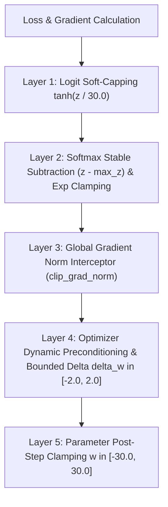

# 🛡️ Numerical Stability, NaN Prevention & Gradient Sanitization Physics

In deep transformer neural networks, training instabilities (vanishing/exploding activations, division by zero, float underflows) can corrupt parameters with `NaN` (Not a Number) or `Inf` (Infinity). Once a single `NaN` enters a weight tensor, standard matrix operations propagate it through the entire network in a single step, permanently destroying model weights.

RingWrapper implements a multi-layer **Defense-in-Depth NaN Shield** across all Ring architectural layers.

---

## 🎓 Beginner-Friendly Learning Guide: How NaNs Happen

### The 4 Major Culprits of NaN in Deep Learning

| Culprit | Root Cause in Plain English | Real-World Mathematical Example | RingWrapper Shield |
| :--- | :--- | :--- | :--- |
| **1. Log of Zero / Negative Probability** | Trying to compute $\log(0)$ or $\log(-0.01)$ during Cross-Entropy loss. | $\log(0) \to -\infty$<br>$-\infty \cdot 0 \to \text{NaN}$ | Log-Sum-Exp trick & probability clamping in $[10^{-12}, 1.0]$. |
| **2. Softmax Overflow / Underflow** | Large logits (e.g. $z = 1000$) cause $e^{1000} \to \infty$. | $\frac{\infty}{\infty} \to \text{NaN}$ | Subtract row maximum $\max(z)$ and clamp exponents to $[-50.0, 50.0]$. |
| **3. RMSNorm Division by Zero** | All activation features in a vector are near zero ($\sum x_k^2 \approx 0$). | $\frac{x_i}{\sqrt{0}} \to \infty$ | $\epsilon = 10^{-5}$ guard floor and reciprocal verification. |
| **4. Exploding Gradient Shockwaves** | A steep cliff on the loss surface produces gradient norms $\|g\|_2 > 10,000$. | $w \gets w - 0.1 \times 10000 = -1000$ | Intercepted in `clip_grad_norm`, zeroed out if corrupt, and scaled to $\le 1.0$. |

---

## 🏛️ Multi-Layer Defense Architecture



---

## 🔬 The 5 RingWrapper NaN Defense Kernels

### 1. Matrix & Tensor3D Sanitization (`Ring 0`)
`Matrix::has_nan_or_inf()` and `Matrix::sanitize_nan_inf()` scan contiguous flat float buffers and cleanly replace any corrupted bits with safe replacements:

```cpp
void Matrix::sanitize_nan_inf(float replace_val, float clamp_min, float clamp_max) {
    for (float& v : data) {
        if (std::isnan(v) || std::isinf(v)) {
            v = replace_val;
        } else {
            v = std::clamp(v, clamp_min, clamp_max);
        }
    }
}
```

### 2. Numerical RMSNorm Reciprocal Shield (`Ring 0`)
Prevents negative square roots or underflowed variance:
```cpp
float mean_sq = sum_sq / static_cast<float>(cols);
if (std::isnan(mean_sq) || std::isinf(mean_sq) || mean_sq < 0.0f) {
    mean_sq = 0.0f;
}
float rms_inv = 1.0f / sqrt(mean_sq + eps);
if (std::isnan(rms_inv) || std::isinf(rms_inv)) rms_inv = 1.0f;
```

### 3. Gradient Interceptor & Zero-Tolerance Purge (`Ring 2`)
If any backpropagation step produces a `NaN` gradient anywhere in the 10 transformer blocks, `clip_grad_norm` automatically zeroes out the corrupted elements before they reach the optimizer:
```cpp
bool found_nan_inf = false;
for (auto* g : grads) {
    for (float& v : g->data) {
        if (std::isnan(v) || std::isinf(v)) {
            v = 0.0f;
            found_nan_inf = true;
        } else {
            sum_sq += v * v;
        }
    }
}
```

### 4. Bounded Parameter Physics Step (`Ring 1`)
Prevents catastrophic jumps in a single update:
```cpp
if (std::isnan(delta_w) || std::isinf(delta_w)) {
    delta_w = 0.0f;
} else {
    delta_w = std::clamp(delta_w, -2.0f, 2.0f);
}
```

### 5. Meta-Neural Telemetry Protection (`Ring 1`)
Clamps all 8 continuous input signals before entering the meta-network and clamps outputs in domain intervals (`loss_scale` $\in [0.2, 4.0]$, $\gamma \in [0.0, 3.0]$).

---

## 🔗 Related Notes
- [[01 - Ring 0 (Core Math & Hardware)/Tensor3D & Matrix Math|Tensor3D & Matrix Math]]
- [[01 - Ring 0 (Core Math & Hardware)/Loss Formulations & Calculus|Loss Formulations & Calculus]]
- [[02 - Ring 1 (Layers & Advanced Optimizers)/4-Formula Dynamic Weight Physics|4-Formula Dynamic Weight Physics]]
- [[Index|Return to Master Index]]
