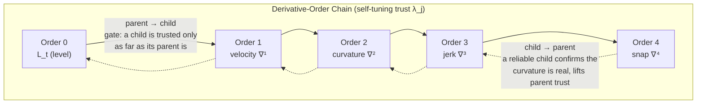
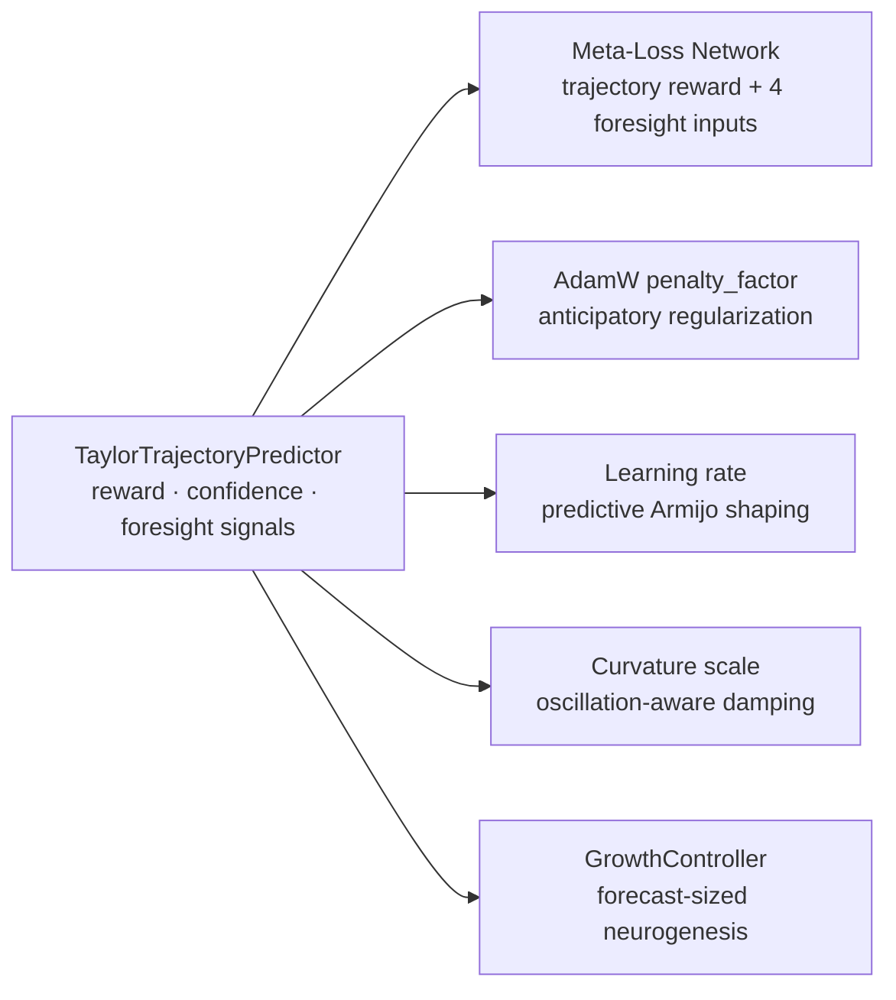

# 🔮 Taylor Loss-Trajectory Predictor (nth-Order Foresight)

The **Taylor Trajectory Predictor** (`ring0::TaylorTrajectoryPredictor`) forecasts *where the loss is going* — not just where it is. It takes the step-to-step loss history, builds an nth-order finite-difference ladder, and extrapolates the next $K$ losses $L_{t+1}, \dots, L_{t+K}$ using the discrete Taylor / Newton–Gregory series. That forecast then steers the meta-optimizer, the penalty controller, the learning rate, curvature, and even structural growth — turning the whole system from **reactive** (respond after the loss moves) into **anticipatory** (act before it moves).

> **One-line intuition:** the existing engine drives by looking in the rear-view mirror (what did loss just do?). This bolts on a **windshield** — a short-range forecast of the road ahead — so the optimizer can brake *before* the cliff and floor it *before* the straightaway.

---

## 🎯 Practical Explanation: What is this and Why Does it Exist?

### The Problem: Every Controller Here Was Reactive
Look at the pre-existing feedback loops:
- `AdamW::self_adjust_by_loss` reacts to `current_loss - ema_loss` **after** the spike.
- `update_penalization_derivative` measures $\frac{d\mathcal{L}}{d\text{Pen}}$ from what **already** happened.
- The Armijo check dampens the step **after** loss overshoots.

Every one of them is a step (or more) **late**. On a plateau or right before a spike, "late" means wasted steps and instability.

### The Fix: A Discrete Taylor Forecast
Any smooth-ish signal can be locally extrapolated from its derivatives. We don't have analytic derivatives of the loss curve, but we have its **samples**, and the **finite differences** of those samples *are* discrete estimates of the derivatives (with step $h = 1$):

$$
\Delta^1 L_t = L_t - L_{t-1} \;\approx\; \mathcal{L}'(t), \qquad
\Delta^2 L_t = \Delta^1 L_t - \Delta^1 L_{t-1} \;\approx\; \mathcal{L}''(t), \;\dots
$$

Feed those into the Taylor expansion and you get a forecast:

$$
L_{t+k} \;\approx\; L_t + k\,\Delta^1 L_t + \binom{k}{2}\Delta^2 L_t + \binom{k}{3}\Delta^3 L_t + \dots
$$

This is exactly **Newton–Gregory forward extrapolation** — the discrete cousin of the Taylor series. The engine already builds a difference ladder for *token* losses within one step (see [[01 - Ring 0 (Core Math & Hardware)/Loss Formulations & Calculus|LossDerivativePyramid]]); this note is its **temporal** sibling: it differences the loss **across steps** and then *extrapolates forward* instead of merely describing the present.

---

## 🧮 The Mathematics

### 1. Backward Difference Ladder
Given the last $n+1$ scalar losses, we build backward differences at the newest point $t$:

$$
\nabla^0 L_t = L_t, \qquad \nabla^{j} L_t = \nabla^{j-1} L_t - \nabla^{j-1} L_{t-1}
$$

These are the $\Delta^j$ from your idea, indexed at the most recent step.

### 2. Damped Newton–Gregory Extrapolation
The raw polynomial extrapolant is:

$$
\boxed{\; \hat{L}_{t+k} = \sum_{j=0}^{n} \binom{k+j-1}{j}\; \lambda_j \; \nabla^{j} L_t \;}
$$

The binomial weights $\binom{k+j-1}{j}$ **grow** with order, so a naive high-order fit oscillates violently (the **Runge phenomenon**). Two guards keep it sane — the same anti-explosion philosophy as the rest of Ring 0:

- **Per-order trust $\lambda_j$** — a recursively self-tuned damping factor (see coupling below). High orders start distrusted ($\lambda_j = \text{base}^j$) and must *earn* influence by predicting well.
- **`soft_clamp`** — a $C^1$-continuous tanh saturator on the deviation $\hat{L}_{t+k} - L_t$, identical in spirit to the pyramid's clamp. Predictions can't run away, and loss can't be predicted negative.

### 3. The Discounted Trajectory Reward
The whole point is to optimize the **path**, not the point:

$$
R_t = -\alpha\,\Delta^1 L_t \;-\; \sum_{k=1}^{K} \text{disc}^{\,k}\,\big(\hat{L}_{t+k} - \hat{L}_{t+k-1}\big)
$$

A predicted **drop** is a negative delta → **positive** reward. The geometric discount $\text{disc}^k$ trusts the near future more than the far. This single scalar is what the meta-network is trained against.

---

## 🔢 Worked Example (see the forecast by hand)

Suppose the last four step-losses were `[8.0, 7.5, 7.1, 6.8]`. Build the backward differences at the newest point:

| Order | Value | Meaning |
|---|---|---|
| $\nabla^0 L_t$ | $6.8$ | current loss (level) |
| $\nabla^1 L_t$ | $6.8 - 7.1 = -0.3$ | velocity (still dropping) |
| $\nabla^2 L_t$ | $(-0.3) - (7.1-7.5) = -0.3-(-0.4) = +0.1$ | curvature (decelerating — drops are shrinking) |

Extrapolate one step with trust $\lambda_1=\lambda_2=1$ (untrained, for illustration):
$$\hat{L}_{t+1} = L_t + \binom{1}{1}\nabla^1 + \binom{2}{2}\nabla^2 = 6.8 + (-0.3) + (0.1) = 6.6$$

The predictor doesn't just say "it'll keep dropping by 0.3" — the positive **curvature** tells it the drops are *slowing*, so it forecasts a smaller drop (to 6.6, not 6.5). That deceleration signal is exactly what a first-order-only view misses, and it's what lets the meta-optimizer sense a plateau *forming* several steps early. The trajectory reward then sums these predicted deltas so the optimizer is rewarded for the whole downhill path, not just the next foothold.

---

## 🔁 Recursive Parent ↔ Child Coupling (Orders as Interacting Neurons)

This is the "neurons affect the parent and the child" idea, applied to derivative **orders**. Each order $j$ is a node in a chain: order $j$ is the **child** of $j-1$ and the **parent** of $j+1$. After every real step, the node sees how well it predicted the next difference, and two signals flow:



- **Parent → child (top-down gate):** if a low order is unreliable, the noisier higher order riding on top of it is throttled proportionally. You can't trust curvature if you can't even trust velocity.
- **Child → parent (bottom-up correction):** a consistently accurate higher order is *evidence* the local curvature is genuine, so it nudges its parent's trust upward; an erratic child warns the parent to be cautious.

Trust is updated from an **EMA of each order's prediction error**, so the system *learns which orders to believe* for the current loss regime — no backprop, just a few scalars. Early in training (chaotic loss) high orders stay damped; on a smooth descent they wake up and sharpen the forecast.

---

## 💻 Code Breakdown

Header: `include/ring0/taylor_predictor.hpp` — Impl: `src/ring0/taylor_predictor.cpp`.

### The forecast bundle
```cpp
struct TaylorTrajectory {
    array<float, 6> diffs;       // diffs[0]=L_t, diffs[j]=∇ʲL_t
    array<float, 5> predicted;   // L_{t+1..t+K}
    array<float, 5> pred_delta;  // predicted step deltas
    float reward;                // discounted trajectory reward (↑ = improvement ahead)
    float confidence;            // aggregate forecast trust ∈ [0,1]
    float penalty_foresight;     // >0 → raise penalty pre-emptively (spike ahead)
    float lr_foresight_scale;    // predictive LR multiplier ∈ [0.5, 1.6]
    float curvature_foresight;   // predictive curvature scale ∈ [0.5, 1.5]
    bool  valid;
};
```

### The extrapolation core
```cpp
// L_{t+k} = Σ_{j=0..n} C(k+j-1, j) · trust_j · ∇ʲL_t   (soft-clamped)
float prev_level = L_t;
for (size_t k = 1; k <= K; ++k) {
    float acc = L_t;                       // j = 0 term
    for (size_t j = 1; j <= n; ++j) {
        float coeff = binom(k + j - 1, j) * trust_[j];
        acc += coeff * traj.diffs[j];
    }
    float dev   = soft_clamp(acc - L_t, config.clip_band); // anti-Runge guard
    float level = max(0.0f, L_t + dev);                    // loss can't go negative
    traj.predicted[k - 1]  = level;
    traj.pred_delta[k - 1] = level - prev_level;
    prev_level = level;
}
```

### Deriving the actionable signals
```cpp
float net_pred = traj.predicted[K-1] - L_t;   // net predicted change over horizon
// Anticipatory penalty: push up before a predicted rise, relax before a drop.
traj.penalty_foresight  = traj.confidence * tanhf(net_pred * 0.75f);
// Predictive LR (a forward-looking Armijo): bolder into descent, damped into a rise.
traj.lr_foresight_scale = clamp(1.0f + 0.6f * (-tanhf(net_pred*0.75f) * traj.confidence), 0.5f, 1.6f);
```

---

## ⚡ Efficiency: Foresight for Almost Free

This is a **hard design constraint**, not an afterthought. The predictor operates purely on the **scalar loss history** — it never touches a weight tensor.

| Cost dimension | Complexity |
|---|---|
| Difference ladder | $O(n^2)$, $n \le 5$ → ≤ 25 flops |
| Extrapolation | $O(n \cdot K)$, $\le 25$ flops |
| Trust recoupling | $O(n)$ |
| **Heap allocations in hot path** | **Zero** (fixed `std::array`) |

Total: a few **dozen** floating-point ops per training step, against the **billions** in a single transformer forward/backward. The overhead is unmeasurable next to the $O(\text{params})$ optimizer update it improves. Foresight is essentially free.

---

## 🔌 Where the Forecast Plugs In



1. **[[02 - Ring 1 (Layers & Advanced Optimizers)/Meta-Neural Loss & Step Optimizer|Meta-Loss Network]]** — the reward becomes the meta training signal (blended with realized reward); `predicted_delta`, `predicted_net`, `reward`, `confidence` become 4 new network **inputs** (dim 8 → 12).
2. **Penalty** — `penalty_foresight` nudges `AdamW::penalty_factor` *before* a predicted spike.
3. **Learning rate** — `lr_foresight_scale` shapes the LR predictively (a forward-looking Armijo).
4. **Curvature** — `curvature_foresight` shrinks steps when the forecast oscillates.
5. **[[04 - Ring 3 (Data & Training Pipelines)/LLMTrainer Architecture|Structural growth]]** — the same forecaster tells the `GrowthController` a plateau is coming so capacity arrives **just-in-time** (see below).

---

## 🌱 Self-Determining Model Size ("very little limits")

The predictor also drives **auto-sizing** in `ring2::GrowthController`. Instead of a fixed `max_hidden_neurons` cap, a *confident* forecast of stagnation lifts a **dynamic width ceiling** toward a very high hard limit and sizes the neuron injection from the predicted severity:

```cpp
float stall     = clamp(0.5f + 0.5f*tanhf(forecast_net*2.0f), 0.0f, 1.0f); // 0=descending, 1=flat/rising
float expansion = 1.0f + forecast_conf * stall * (growth_rate + 1.0f);
dyn_ceiling     = min(max_hidden_neurons * expansion, forecast_hard_ceiling);
```

So the network's width is governed by *what the loss curve is predicted to do*, not by a hand-picked constant — the model determines its own capacity, bounded only by a very loose safety ceiling.

---

## 🔗 Related Notes
- [[01 - Ring 0 (Core Math & Hardware)/Loss Formulations & Calculus|Loss Formulations & Calculus (LossDerivativePyramid)]]
- [[05 - Theoretical Foundations & Physics/Multi-Order Loss Derivatives & Optimization|Multi-Order Loss Derivatives & Optimization]]
- [[02 - Ring 1 (Layers & Advanced Optimizers)/Meta-Neural Loss & Step Optimizer|Meta-Neural Loss & Step Optimizer]]
- [[04 - Ring 3 (Data & Training Pipelines)/LLMTrainer Architecture|LLMTrainer Architecture]]
- [[02 - Ring 1 (Layers & Advanced Optimizers)/Hierarchical Recursive Thought Layer|Hierarchical Recursive Thought Layer (parent/child recursion)]]
- [[Index|Return to Master Index]]
