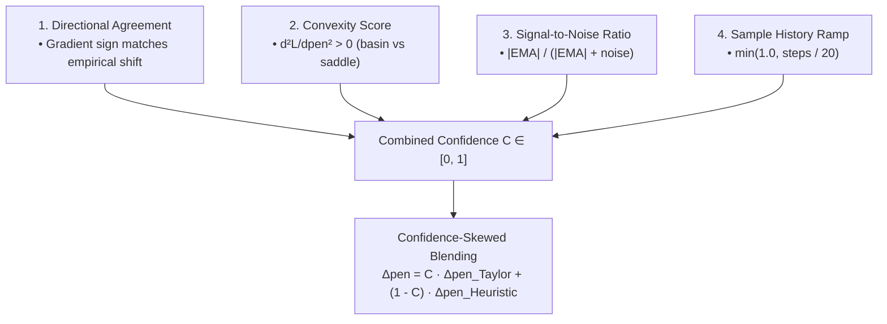

# 🎯 Taylor Expansion Prediction to Penalty & Confidence Gating

Regularization and attribution penalty factors dynamically govern weight decay and parameter dampening. Hardcoded fixed step heuristics can either under-react to loss spikes or oscillate when loss derivatives are noisy.

RingWrapper implements a **2nd-Order Taylor Series Extrapolation to Penalty Optimization** combined with a continuous **Multi-Factor Confidence Scoring Gate ($C \in [0, 1]$)** that skews and blends predictive foresight with robust baseline heuristics.

---

## 📋 Prerequisites

Before reading this, you should be comfortable with:
- **Second-order Taylor expansion** — the "loss curves quadratically near the current point" idea and the classical Newton step $-g/H$
- **Weight decay / regularization** — what the "penalty" being tuned actually controls
- [[05 - Theoretical Foundations & Physics/Multi-Order Loss Derivatives & Optimization|Multi-Order Loss Derivatives]] — the first-derivative sibling of this note; provides the `dL/dpen` and its EMA
- [[01 - Ring 0 (Core Math & Hardware)/Taylor Loss-Trajectory Predictor|Taylor Loss-Trajectory Predictor]] — same "damped extrapolation + confidence gate" pattern applied to the loss trajectory instead of the penalty
- Basic **exponential moving averages** (for the SNR and convexity signals)
- Basic **sign / directional-agreement** logic

> **Honest framing:** this is a scalar Newton-style step on one hyperparameter with a heuristic confidence gate — pragmatic, cheap, useful. Not a novel numerical method.

---

## 📐 Mathematical Formulation

### 1. Second-Order Taylor Expansion on the Loss Surface
Let $\mathcal{L}(\text{pen})$ represent the local loss manifold as a function of the regularization penalty parameter. The local quadratic approximation is:
$$\mathcal{L}(\text{pen} + \Delta \text{pen}) \approx \mathcal{L}(\text{pen}) + \frac{d\mathcal{L}}{d\text{pen}} \Delta \text{pen} + \frac{1}{2} \frac{d^2\mathcal{L}}{d\text{pen}^2} (\Delta \text{pen})^2$$

Setting the derivative with respect to $\Delta \text{pen}$ to zero yields the optimal Newton-Taylor step:
$$\Delta \text{pen}_{\text{Taylor}} = -\frac{\frac{d\mathcal{L}}{d\text{pen}}}{\max\left(\left|\frac{d^2\mathcal{L}}{d\text{pen}^2}\right|, \epsilon\right)}$$
where $\epsilon = 0.15$ prevents zero-curvature singularities and $\Delta \text{pen}_{\text{Taylor}} \in [-0.04, 0.04]$.

---

## 🛡️ Multi-Factor Dynamic Confidence Scoring Gate ($C$)

Taylor extrapolation on noisy loss surfaces can overfit to single-step batch variance. The confidence score $C \in [0.0, 1.0]$ scales the influence of the prediction:

### 1. Directional Consistency ($S_{\text{dir}}$)
$$S_{\text{dir}} = \begin{cases} 0.95 & \text{if } \operatorname{sign}(\Delta \text{pen}_{\text{Taylor}}) = \operatorname{sign}(\Delta \text{loss}) \\ 0.70 & \text{if } |\Delta \text{loss}| < 0.02 \\ 0.35 & \text{otherwise (divergent direction)} \end{cases}$$

### 2. Surface Convexity ($S_{\text{cvx}}$)
A local quadratic minimum exists only when curvature is positive ($\frac{d^2\mathcal{L}}{d\text{pen}^2} > 0$):
$$S_{\text{cvx}} = \begin{cases} 1.00 & \text{if } \text{EMA}_{d^2} > 0 \text{ (convex bowl)} \\ 0.25 & \text{if } \text{EMA}_{d^2} \le 0 \text{ (concave/saddle)} \end{cases}$$

### 3. Signal-to-Noise Ratio ($S_{\text{snr}}$)
$$S_{\text{snr}} = \frac{|\text{EMA}_{d\mathcal{L}/d\text{pen}}|}{|\text{EMA}_{d\mathcal{L}/d\text{pen}}| + |\frac{d\mathcal{L}}{d\text{pen}} - \text{EMA}| + 10^{-4}}$$

### 4. Warmup History Ramp ($S_{\text{warmup}}$)
$$S_{\text{warmup}} = \min\left(1.0, \frac{\text{observed\_steps}}{20}\right)$$

---

## 🔀 Confidence-Skewed Blending & Application

The final applied penalty adjustment dynamically interpolates between the high-confidence Taylor forecast and the conservative base heuristic:
$$\Delta \text{pen}_{\text{applied}} = C \cdot \Delta \text{pen}_{\text{Taylor}} + (1 - C) \cdot \Delta \text{pen}_{\text{heuristic}}$$
$$\text{penalty\_factor}_{t+1} = \operatorname{clamp}(\text{penalty\_factor}_t + \Delta \text{pen}_{\text{applied}}, 0.01, 1.50)$$

---

## 🔗 Related Notes
- [[01 - Ring 0 (Core Math & Hardware)/Taylor Loss-Trajectory Predictor|Taylor Loss-Trajectory Predictor]]
- [[02 - Ring 1 (Layers & Advanced Optimizers)/AdamW, Fisher Metric & Nesterov|AdamW, Fisher Metric & Nesterov]]
- [[04 - Ring 3 (Data & Training Pipelines)/Real-Time Benchmark & Telemetry Dashboard|Real-Time Benchmark & Telemetry Dashboard]]
- [[Index|Return to Master Index]]
