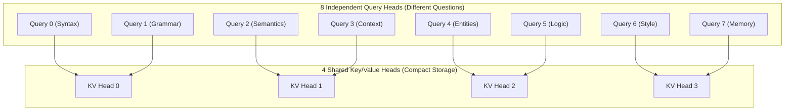

# ⚡ Grouped-Query Attention (GQA), RoPE & ALiBi Falloff

The `ring1::Attention` module implements **Grouped-Query Causal Self-Attention** with **ALiBi linear position falloff** and **Rotary Position Embeddings (RoPE)**.

---

## 🎓 Beginner-Friendly Learning Guide: What is Attention?

### The Filing Cabinet Analogy (Query, Key, Value)
Imagine you are in a library trying to answer a question:
1. **Query ($\mathbf{Q}$)**: What you are looking for (*"Who wrote Romeo and Juliet?"*).
2. **Key ($\mathbf{K}$)**: The label or title on the spine of every book in the library (*"Author: William Shakespeare"*, *"Physics Textbook"*, *"Cookbook"*).
3. **Value ($\mathbf{V}$)**: The actual page content inside each book.

When you compute $\mathbf{Q} \cdot \mathbf{K}^\top$, you are checking how well your question matches every book title.
- If $\mathbf{Q}$ matches $\mathbf{K}$ strongly, the dot product is high $\implies$ Softmax gives a score near $1.0$ ($100\%$).
- You multiply this score by $\mathbf{V}$ to extract only the relevant information!

---

## 🔍 Why Grouped-Query Attention (GQA)?

### The Problem with Standard Multi-Head Attention (MHA)
In standard attention (like GPT-3 or BERT):
- If the model has 8 Query heads, it also has 8 Key heads and 8 Value heads ($H_q = 8, H_{kv} = 8$).
- During text generation, **every single token must store its Keys and Values in RAM** (the KV-Cache).
- For large sequences, the KV-Cache consumes gigabytes of memory, causing GPU out-of-memory errors!

### How GQA Solves This (The Shared Teacher Analogy)
Instead of hiring 8 private tutors (8 KV heads) for 8 students (8 Query heads), GQA groups the students:
- Query Head 0 & Query Head 1 **share** KV Head 0.
- Query Head 2 & Query Head 3 **share** KV Head 1.
- Query Head 4 & Query Head 5 **share** KV Head 2.
- Query Head 6 & Query Head 7 **share** KV Head 3.

$$\text{Group Size } G = \frac{H_q}{H_{kv}} = \frac{8}{4} = 2$$

> [!TIP]
> **Practical Result**: GQA reduces KV-cache memory bandwidth and RAM usage by **$50\%$ to $75\%$** with **$0\%$ loss in model intelligence**!



---

## 📐 Position Encoding: What is ALiBi & Why Is It Better than Learned Embeddings?

### The Position Extrapolation Problem
Older models (like GPT-2) learned a fixed positional lookup table for positions $0 \dots 512$.
- If you trained the model on 512 tokens and then gave it 600 tokens during inference, it completely broke down because it had never learned position index 513!

### How ALiBi Solves This (Attention with Linear Biases)
Instead of adding numbers to the input tokens, ALiBi directly subtracts a linear penalty from the attention score proportional to the distance between two tokens:

$$\text{Attention Score}(i, j) = \frac{\mathbf{q}_i^\top \mathbf{k}_j}{\sqrt{d}} - m \cdot (i - j)$$

- **Token right next to you ($i - j = 1$)**: Penalty is small (e.g. $-0.25$).
- **Token 50 words ago ($i - j = 50$)**: Penalty is large (e.g. $-12.5$).
- **Slope $m$**: Each attention head gets a different geometric slope:
  $$m_h = 2^{-\frac{8 \cdot (h + 1)}{H}}$$

> [!NOTE]
> Because ALiBi is a simple distance formula, the model can extrapolate to **2,048, 8,192, or 32,000+ tokens** without retraining!

---

## 💻 Deep Code Breakdown

Located in `src/ring1/attention.cpp`:

```cpp
// 1. Grouped-Query Loop across Batch, Sequence, and Heads
#pragma omp parallel for schedule(static)
for (int b = 0; b < static_cast<int>(B); ++b) {
    for (size_t h = 0; h < num_heads; ++h) {
        // Find which shared KV head this Query head belongs to:
        size_t kv_h = h / group_size;
        float alibi_slope = alibi_slopes[h];

        for (size_t i = 0; i < T; ++i) {
            // Extract Query vector q_i for head h
            const float* q_vec = &Q_proj(b * T + i, h * head_dim);

            // Compute causal dot products against past Keys: j <= i
            float max_score = -1e9f;
            vector<float> scores(i + 1);

            for (size_t j = 0; j <= i; ++j) {
                const float* k_vec = &K_proj(b * T + j, kv_h * head_dim);
                
                // Dot Product: q_i . k_j / sqrt(d)
                float dot = 0.0f;
                for (size_t d = 0; d < head_dim; ++d) {
                    dot += q_vec[d] * k_vec[d];
                }
                dot *= inv_sqrt_d;

                // ALiBi Linear Distance Penalty: -m * (i - j)
                float dist = static_cast<float>(i - j);
                float score = dot - alibi_slope * dist;
                scores[j] = score;
                if (score > max_score) max_score = score;
            }

            // Numerically stable Softmax over scores
            float sum_exp = 0.0f;
            for (size_t j = 0; j <= i; ++j) {
                scores[j] = exp(scores[j] - max_score);
                sum_exp += scores[j];
            }
            float inv_sum = 1.0f / (sum_exp + 1e-8f);

            // Weighted sum over Values: O_i = sum(score_j * v_j)
            float* out_vec = &out(b * T + i, h * head_dim);
            for (size_t d = 0; d < head_dim; ++d) {
                float val_acc = 0.0f;
                for (size_t j = 0; j <= i; ++j) {
                    const float* v_vec = &V_proj(b * T + j, kv_h * head_dim);
                    val_acc += (scores[j] * inv_sum) * v_vec[d];
                }
                out_vec[d] = val_acc;
            }
        }
    }
}
```

---

## 🔗 Related Notes
- [[03 - Ring 2 (Models & Transformers)/TransformerLM Decoder (GQA + SwiGLU + RoPE)|TransformerLM Decoder]]
- [[03 - Ring 2 (Models & Transformers)/Autoregressive KV-Cache Generation|Autoregressive KV-Cache Generation]]
- [[Index|Return to Master Index]]
