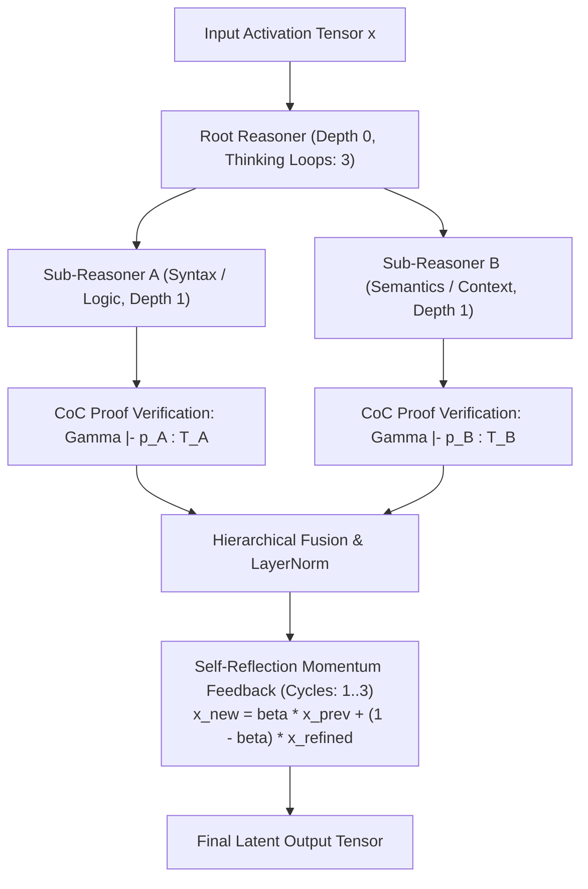

# 🧠 Hierarchical Recursive Thought Layer & Reflection Loops

The `ring1::RecursiveLayer` implements multi-depth recursive cognitive reasoning, step energy metrics, and multi-pass self-reflection cycles. It enables the model to perform **latent reasoning, constructive proof synthesis, and self-verification before producing token output**.

---

## 📋 Prerequisites

Before reading this, you should be comfortable with:
- **Residual connections** and iterative refinement in the residual stream
- The general idea of **Universal Transformers** / **Adaptive Computation Time** — this note is a lightweight relative
- [[03 - Ring 2 (Models & Transformers)/TransformerLM Decoder (GQA + SwiGLU + RoPE)|TransformerLM Decoder]] — the block architecture this composes with
- [[01 - Ring 0 (Core Math & Hardware)/Tensor3D & Matrix Math|Tensor3D & Matrix Math]] — cosine similarity, L2 norms of the thought vectors
- Optional: [[01 - Ring 0 (Core Math & Hardware)/Config & Telemetry Systems|Config & Telemetry Systems]] — `verbose_thought_chains` controls the per-step diagnostic table

> **Honest framing:** this is iterative refinement inside the residual stream with a diagnostic wrapper — similar in spirit to Universal Transformers, ACT, and inner-monologue designs. On a 10-layer model the practical benefit of deep "thought trees" is limited; the value is mainly the diagnostic telemetry (convergence, cosine similarity between iterations).

---

## 🎯 Practical Explanation: What is this and Why Does it Exist?

### The "System 1" vs "System 2" Problem in LLMs
Standard transformer decoders operate purely in "System 1" mode: they compute a single feed-forward pass per token and immediately commit to an output word. If a complex algorithmic reasoning or syntactic decision requires backtracking, standard models cannot deliberate internally without generating hundreds of visible scratchpad tokens.

### 🏛️ Intuitive Analogy: "The Internal Committee & Mental Drafts"
Think of a human writer drafting a complex legal argument or mathematical theorem:
- **System 1 (Raw Transformer)**: The writer blurts out the very first word that comes to mind without pausing to reflect.
- **System 2 (`RecursiveLayer`)**: The writer creates a mental draft in their head. A hierarchy of internal specialists (Root Reasoner $\to$ Logic Specialist $\to$ Domain Specialist) passes the idea around the table.
- **$\tanh$ Bounded Recurrence**: Each specialist digests the thought through a bounded non-linear transformation:
  $$\mathbf{h}_{t+1} = \tanh(\mathbf{W}_{\text{think}} \mathbf{h}_t + \mathbf{W}_{\text{context}} \mathbf{c}_{\text{parent}} + \mathbf{b}_{\text{think}})$$
  The $\tanh$ function guarantees that even after 10 loops around the table, the energy of the thought vector remains strictly bounded on $[-1, 1]$ without exploding.
- **Formal Verification (Calculus of Constructions)**: On every pass, the specialist must construct a valid typed proof witness in $\lambda C$ ($p : P$). If the proof fails the type checker, the thought is refined until it satisfies logical consistency.
- **Equilibrium & Convergence**: Once consecutive drafts differ by less than $\epsilon = 10^{-4}$ (or maximum reflection cycles are reached), the committee votes, and the refined thought is emitted to the next layer.

---

## 🌲 Hierarchical Thought Tree & Verification Flow



---

## 💻 Deep Code Breakdown

### 1. The Thought Step & CoC Proof Witness Data Structure
Located in `include/ring1/recursive_layer.hpp`:

```cpp
struct ThoughtStep {
    size_t step_index;             ///< Thought iteration index (0..K-1)
    size_t loop_cycle;             ///< Reflection / chain loop pass
    string layer_name;             ///< Name of executing recursive reasoner
    float energy_norm;             ///< L2 norm of the thought representation: ||H_t||
    float delta_magnitude;         ///< ||H_{t+1} - H_t|| residual shift
    float cosine_similarity;       ///< Directional alignment with previous thought state
    string stage_description;      ///< Semantic stage label ("Encoding", "Synthesis")
    ring0::CoCTermPtr proof_witness = nullptr;       ///< Constructive proof term in Calculus of Constructions
    ring0::CoCTermPtr target_proposition = nullptr;  ///< Proposition / dependent type to prove
    ring0::ProofValidationResult proof_result;       ///< CoC kernel verification telemetry
};
```

---

### 2. The Recurrent Forward Pass with $\tanh$ Clamping
Located in `src/ring1/recursive_layer.cpp`:

```cpp
Matrix RecursiveLayer::forward(const Matrix& X) {
    Matrix H = X;
    Matrix parent_ctx = get_parent_context();

    for (size_t step = 0; step < thinking_depth; ++step) {
        Matrix prev_H = H;

        // 1. Recurrent state transformation: H = W_think * H + W_ctx * parent_ctx + b
        Matrix think_proj = W_think.matmul(H);
        if (parent != nullptr) {
            Matrix ctx_proj = W_context.matmul(parent_ctx);
            think_proj = think_proj.add(ctx_proj);
        }
        think_proj = think_proj.add_vector(b_think);

        // 2. Bipolar tanh non-linear activation bounds latent activations in [-1, 1]
        for (float& v : think_proj.data) {
            v = std::tanh(v);
        }
        H = think_proj;

        // 3. Constructive CoC Proof Witness Synthesis:
        // Synthesizes lambda-abstraction proof witness term for the current reasoning transition
        auto witness = ring0::CoCTerm::make_abstraction(
            "h_" + std::to_string(step),
            ring0::CoCTerm::make_universe(ring0::UniverseSort::TYPE_0),
            ring0::CoCTerm::make_var("h_" + std::to_string(step))
        );
        auto prop = ring0::CoCTerm::make_arrow(
            ring0::CoCTerm::make_universe(ring0::UniverseSort::TYPE_0),
            ring0::CoCTerm::make_universe(ring0::UniverseSort::TYPE_0)
        );

        // 4. Verification in CoC Kernel:
        auto ctx = ring0::CoCTypeChecker::create_standard_logic_context();
        auto val_result = ring0::CoCTypeChecker::verify_proof(ctx, witness, prop);

        // 5. Record telemetry
        ThoughtStep t_step;
        t_step.step_index = step;
        t_step.energy_norm = H.norm();
        t_step.delta_magnitude = (H.subtract(prev_H)).norm();
        t_step.proof_witness = witness;
        t_step.proof_result = val_result;
        thought_chain_history.push_back(t_step);
    }

    // Process child sub-layers hierarchically
    for (auto& child : children) {
        H = child->forward(H);
    }

    return H;
}
```

---

### 3. Multi-Pass Self-Reflection Looping Kernel
Located in `src/ring1/recursive_layer.cpp`:

```cpp
Matrix RecursiveLayer::loop_thought_chain(const Matrix& X, size_t num_reflection_cycles, bool verbose_override) {
    Matrix current_thought = X;
    const float convergence_tol = 1e-4f;
    const float damping = 0.85f;

    for (size_t cycle = 0; cycle < num_reflection_cycles; ++cycle) {
        Matrix prev_thought = current_thought;

        // Pass thought through full hierarchical tree
        Matrix refined_thought = forward(current_thought);

        // Residual momentum blend: Prevents semantic drift & eliminates oscillations
        // x_{k+1} = 0.85 * x_k + 0.15 * x_refined
        for (size_t i = 0; i < current_thought.data.size(); ++i) {
            current_thought.data[i] = damping * prev_thought.data[i] + (1.0f - damping) * refined_thought.data[i];
        }

        // Convergence check: Did the thought state reach equilibrium?
        float delta = (current_thought.subtract(prev_thought)).norm();
        if (delta < convergence_tol) {
            break; // Early exit: Thought stabilized!
        }
    }

    return current_thought;
}
```

---

## 🔗 Related Notes
- [[01 - Ring 0 (Core Math & Hardware)/Calculus of Constructions & Dependent-Typed Neural Reasoning|Calculus of Constructions & Dependent Types]]
- [[01 - Ring 0 (Core Math & Hardware)/Activation Functions|Activation Functions (tanh, GELU, SiLU)]]
- [[02 - Ring 1 (Layers & Advanced Optimizers)/Meta-Neural Loss & Step Optimizer|Meta-Neural Loss Optimizer]]
- [[03 - Ring 2 (Models & Transformers)/TransformerLM Decoder (GQA + SwiGLU + RoPE)|TransformerLM Decoder]]
- [[Index|Return to Master Index]]
