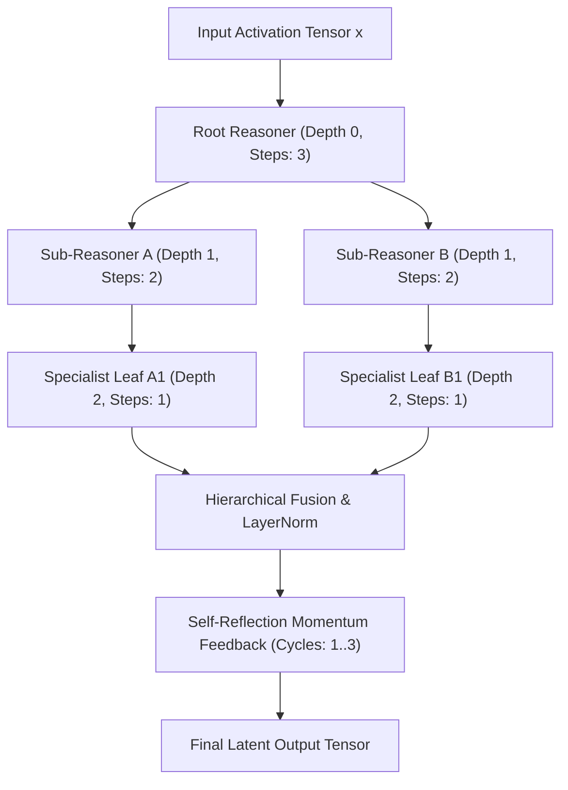

# 🧠 Hierarchical Recursive Thought Layer & Reflection Loops

The `ring1::RecursiveLayer` implements multi-depth recursive cognitive reasoning, step energy metrics, and multi-pass self-reflection cycles. It enables the model to perform **latent reasoning and self-verification before producing token output**.

---

## 🎯 Practical Explanation: What is this and Why Does it Exist?

### The "System 1" vs "System 2" Problem in LLMs
Standard transformer decoders operate purely in "System 1" mode: they compute a single forward pass per token and immediately commit to an output. If a complex algorithmic reasoning or syntactic decision requires backtracking, standard models cannot deliberate internally without generating hundreds of raw text tokens.

### How Hierarchical Recursive Thought Layers Solve This
`RecursiveLayer` provides a tree of internal sub-reasoners:
1. **Internal Multi-Step Deliberation**: Rather than a single feed-forward layer, the input activation is passed through a sequence of internal recursive reasoning steps.
2. **Kinetic Energy & Shift Metrics**: Tracks how much the thought activation shifts on each step ($\Delta_{\text{shift}}$) and calculates cosine alignment with previous thoughts.
3. **Multi-Pass Self-Reflection Looping**: Feeds the output of the reasoning tree back into itself for $C$ cycles with residual momentum, allowing the network to refine, verify, and stabilize its internal representations.

---

## 🌲 Hierarchical Thought Tree Diagram



---

## 💻 Deep Code Breakdown

### 1. The Thought Step Data Structure
Located in `include/ring1/recursive_layer.hpp`:

```cpp
struct ThoughtStepMetric {
    size_t step_index = 0;
    float kinetic_energy = 0.0f; // L2 norm of the thought vector: ||h_s||
    float delta_shift = 0.0f;    // Vector shift from previous step: ||h_s - h_{s-1}||
    float cosine_alignment = 0.0f; // Directional stability: (h_s . h_{s-1}) / (||h_s|| * ||h_{s-1}||)
};

struct ThoughtChainTrace {
    size_t node_depth = 0;
    std::string node_name;
    std::vector<ThoughtStepMetric> steps;
    std::vector<ThoughtChainTrace> children;
};
```

---

### 2. Multi-Pass Self-Reflection Loop Kernel
Located in `src/ring1/recursive_layer.cpp`:

```cpp
Matrix RecursiveLayer::loop_thought_chain(
    const Matrix& input,
    size_t max_reflection_cycles,
    float residual_momentum,
    ThoughtChainTrace* trace
) {
    Matrix current_thought = input;
    const float convergence_tolerance = 1e-4f;

    for (size_t cycle = 0; cycle < max_reflection_cycles; ++cycle) {
        Matrix prev_thought = current_thought;

        // 1. Forward pass through full hierarchical cognitive tree
        Matrix refined_thought = forward_tree(current_thought, trace);

        // 2. Residual momentum blend: Prevents oscillation & stabilizes semantic drift
        // x_{t+1} = momentum * x_t + (1 - momentum) * refined(x_t)
        #pragma omp parallel for schedule(static)
        for (int i = 0; i < static_cast<int>(current_thought.data.size()); ++i) {
            current_thought.data[i] = residual_momentum * prev_thought.data[i] + 
                                      (1.0f - residual_momentum) * refined_thought.data[i];
        }

        // 3. Convergence test: Check if thoughts have stabilized
        float diff_norm_sq = 0.0f;
        for (size_t i = 0; i < current_thought.data.size(); ++i) {
            float d = current_thought.data[i] - prev_thought.data[i];
            diff_norm_sq += d * d;
        }

        if (std::sqrt(diff_norm_sq) < convergence_tolerance) {
            // Early exit: Reasoning has reached stable equilibrium!
            break;
        }
    }

    return current_thought;
}
```

---

## 🔗 Related Notes
- [[02 - Ring 1 (Layers & Advanced Optimizers)/Meta-Neural Loss & Step Optimizer|Meta-Neural Loss Optimizer]]
- [[03 - Ring 2 (Models & Transformers)/TransformerLM Decoder (GQA + SwiGLU + RoPE)|TransformerLM Decoder]]
- [[Index|Return to Master Index]]
