# 🧠 Meta-Neural Loss & Step Optimizer Network

The **Meta-Neural Loss Optimizer** (`ring1::MetaLossOptimizer`) is an online self-learning neural network that dynamically shapes the optimization landscape during training. It represents a breakthrough concept: **using an auxiliary neural network to train and tune the primary transformer network in real time**.

---

## 🎯 Practical Explanation: What is this and Why Does it Exist?

### The Problem with Fixed Human Schedulers
Traditional optimizers rely on rigid human-coded heuristic schedules:
- **Cosine Annealing**: Assumes loss descends uniformly according to an artificial calendar schedule.
- **Fixed Hyperparameters**: Learning rate $\alpha$, weight decay $\lambda$, and focal power $\gamma$ remain constant regardless of whether the model is in a steep valley, a flat plateau, or a chaotic saddle point.

### How Meta-Loss Optimization Solves This
Instead of a fixed schedule, an internal 3-layer neural network observes 8 continuous telemetry metrics on every step:
1. Is the loss dropping rapidly or stalling?
2. Is the loss accelerating or decelerating?
3. What is the sensitivity derivative $\frac{d\mathcal{L}}{d\text{Pen}}$?
4. What is the variance and entropy of the predictions?

The meta-network processes these 8 signals and dynamically outputs real-time adjustment factors:
- **Loss Scaling Multiplier $\mathcal{M}_{\mathcal{L}}$**: Scales up cross-entropy loss gradients during plateaus.
- **Focal Gamma $\gamma$**: Amplifies focus on unlearned tokens.
- **Curvature Scale $\kappa$**: Preconditions step sizes based on local manifold geometry.

---

## 🏛️ Topology & Telemetry Vectors

```mermaid
graph LR
    subgraph Inputs["8 Telemetry Observations"]
        I1["Loss L_t"]
        I2["Velocity dL/dt"]
        I3["Acceleration d²L/dt²"]
        I4["Empirical Derivative dL/dPen"]
        I5["Gradient Variance"]
        I6["Layer Alignment"]
        I7["Token Entropy"]
        I8["Learning Rate"]
    end

    subgraph Hidden["Meta MLP (3-Layer Perceptron)"]
        H1["Dense 1: 8 -> 32 + GELU"]
        H2["Dense 2: 32 -> 16 + GELU"]
        H3["Dense 3: 16 -> 4 + Specialized Heads"]
    end

    subgraph Outputs["4 Dynamic Multipliers"]
        O1["Loss Multiplier M_L in [0.2, 4.0]"]
        O2["Focal Gamma γ in [0.0, 3.0]"]
        O3["LR Step Modulator in [0.5, 3.0]"]
        O4["Curvature Scale in [0.2, 2.5]"]
    end

    Inputs --> H1 --> H2 --> H3 --> Outputs
```



---

## 💻 Deep Code Breakdown

### 1. The Observation & Control Data Structures
Located in `include/ring1/meta_loss_optimizer.hpp`:

```cpp
struct MetaLossTelemetry {
    float current_loss;       // Current loss value
    float delta_loss;         // First derivative dL/dt
    float accel_loss;         // Second derivative d²L/dt²
    float d_loss_d_penalty;   // Empirical derivative of loss w.r.t penalty
    float gradient_variance;  // Variance across parameter gradients
    float layer_alignment;    // Cosine similarity across layer shifts
    float token_entropy;      // Prediction distribution entropy
    float learning_rate;      // Active learning rate
};

struct MetaOptimizationOutput {
    float loss_scale_multiplier; // Output 1: Scales cross-entropy gradients [0.2, 4.0]
    float dynamic_focal_gamma;   // Output 2: Dynamic focal loss exponent [0.0, 3.0]
    float lr_step_modulator;     // Output 3: Learning rate modulator [0.5, 3.0]
    float curvature_scale;       // Output 4: Second-order curvature scale [0.2, 2.5]
};
```

---

### 2. Forward Prediction Pass
Located in `src/ring1/meta_loss_optimizer.cpp`:

```cpp
MetaOptimizationOutput MetaLossOptimizer::predict(const MetaLossTelemetry& telemetry) {
    // 1. Pack telemetry into normalized input vector (8 features)
    vector<float> in(8);
    in[0] = telemetry.current_loss / 10.0f; // Normalize loss to [0, 1]
    in[1] = tanhf(telemetry.delta_loss * 2.0f);
    in[2] = tanhf(telemetry.accel_loss * 2.0f);
    in[3] = tanhf(telemetry.d_loss_d_penalty * 5.0f);
    in[4] = min(1.0f, telemetry.gradient_variance * 10.0f);
    in[5] = telemetry.layer_alignment;
    in[6] = telemetry.token_entropy / 10.0f;
    in[7] = min(1.0f, telemetry.learning_rate * 100.0f);
    last_input = in;

    // 2. Forward pass through Layer 1 (8 -> 32)
    last_h1.assign(32, 0.0f);
    for (size_t j = 0; j < 32; ++j) {
        float sum = b1[j];
        for (size_t i = 0; i < 8; ++i) {
            sum += in[i] * W1[i * 32 + j];
        }
        last_h1[j] = meta_gelu(sum);
    }

    // 3. Forward pass through Layer 2 (32 -> 16)
    last_h2.assign(16, 0.0f);
    for (size_t j = 0; j < 16; ++j) {
        float sum = b2[j];
        for (size_t i = 0; i < 32; ++i) {
            sum += last_h1[i] * W2[i * 16 + j];
        }
        last_h2[j] = meta_gelu(sum);
    }

    // 4. Forward pass through Output Heads (16 -> 4) with specialized bounding ranges
    vector<float> raw_out(4, 0.0f);
    for (size_t j = 0; j < 4; ++j) {
        float sum = b3[j];
        for (size_t i = 0; i < 16; ++i) {
            sum += last_h2[i] * W3[i * 4 + j];
        }
        raw_out[j] = meta_sigmoid(sum);
    }
    last_output = raw_out;

    // Map outputs from sigmoid [0, 1] to physical control zones:
    MetaOptimizationOutput out;
    out.loss_scale_multiplier = 0.2f + raw_out[0] * 3.8f; // Range: [0.2, 4.0]
    out.dynamic_focal_gamma   = raw_out[1] * 3.0f;        // Range: [0.0, 3.0]
    out.lr_step_modulator     = 0.5f + raw_out[2] * 2.5f; // Range: [0.5, 3.0]
    out.curvature_scale       = 0.2f + raw_out[3] * 2.3f; // Range: [0.2, 2.5]

    return out;
}
```

---

### 3. Online Policy Gradient Adaptation
How does the meta-network learn? On each training step, it evaluates whether its previous prediction helped the transformer reduce loss:

```cpp
void MetaLossOptimizer::update_online(float current_loss) {
    if (last_loss_observed > 0.0f) {
        // Step Reward R_t = -(Loss_current - Loss_previous)
        // Positive reward = Loss decreased (good prediction)
        // Negative reward = Loss increased (bad prediction)
        float loss_delta = current_loss - last_loss_observed;
        float reward = -loss_delta;
        reward = max(-2.0f, min(2.0f, reward)); // Clamp reward to prevent exploding gradients

        // Online Policy Gradient Step on meta weights:
        // dW3 = learning_rate * reward * (output * (1 - output)) * h2
        for (size_t j = 0; j < 4; ++j) {
            float sig_grad = last_output[j] * (1.0f - last_output[j]);
            float delta = meta_learning_rate * reward * sig_grad;
            b3[j] += delta;
            for (size_t i = 0; i < 16; ++i) {
                W3[i * 4 + j] += delta * last_h2[i];
            }
        }
    }
    last_loss_observed = current_loss;
}
```

---

---

## 🔮 Upgrade: Taylor Foresight Inputs + Un-Sticking the Policy

The meta-network was upgraded to consume **forecasts** and to actually train every layer. Three concrete changes, each with its reason.

### 1. Four new foresight inputs (8 → 12)
The input vector now carries the [[01 - Ring 0 (Core Math & Hardware)/Taylor Loss-Trajectory Predictor|Taylor Trajectory Predictor]]'s output alongside the original 8 telemetry signals:

| # | New input | Meaning |
|---|---|---|
| 8 | `predicted_delta` | forecast next-step change $\hat{L}_{t+1}-L_t$ |
| 9 | `predicted_net` | forecast net change over the horizon |
| 10 | `trajectory_reward` | discounted path reward $R_t$ |
| 11 | `trajectory_confidence` | forecast trust $\in[0,1]$ |

The network now decides its multipliers using **where the loss is heading**, not only where it has been.

### 2. The policy is trained against the *trajectory* reward
`update_online(loss, trajectory_reward, foresight_weight)` blends the realized reward with the predicted-path reward:
$$R = (1-w)\underbrace{(-(L_t - L_{t-1}))}_{\text{realized}} + w\underbrace{R_t^{\text{Taylor}}}_{\text{foresight}}, \quad w = 0.5$$
So the meta-policy is rewarded for setting up a good *future*, not just a good *last step*.

### 3. Fixing the "stuck at initialization" pathology
**Symptom observed in runs:** focal $\gamma$ pinned at 1.50 and loss-scale at 2.10× for **all** 500 steps — the outputs never left `sigmoid(0)`. Three root causes, three fixes:

- **`W1` was never trained.** The original online update only touched `W2`/`W3`; the input layer stayed frozen — so the new foresight inputs would have had *no learnable path* at all. Now a single helper `apply_policy_gradient(reward)` updates **W1, W2, and W3** together.
- **Meta learning rate too low.** Near a plateau the reward $-(L_t-L_{t-1})$ is tiny, so the step was negligible. Raised `meta_lr` **0.005 → 0.02**.
- **No exploration.** Deterministic outputs sat at their symmetric init. Added annealed Gaussian **exploration noise** on the output logits (amplitude decays with step count but never dies), breaking the symmetry so the heads actually probe the space.

```cpp
// Exploration noise breaks the sigmoid(0) symmetry that froze the outputs.
float anneal    = 1.0f / (1.0f + 0.002f * step_count);  // 1.0 → ~0.33 over ~1k steps
float noise_amp = 0.35f * anneal + 0.05f;               // floor so it never fully dies
for (size_t j = 0; j < 4; ++j)
    logits[j] = clamp(logits[j] + noise_amp * jitter(rng), -30.f, 30.f);
```

**Result:** in a fresh run the multiplier now moves across `1.50 → 1.82 → 2.60 → 2.99 → 1.60 → 2.71` and $\gamma$ across `1.62 → 1.17 → 1.08 → 1.82 → 1.33` — a live, exploring policy instead of a frozen one.

---

## 🔗 Related Notes
- [[01 - Ring 0 (Core Math & Hardware)/Taylor Loss-Trajectory Predictor|Taylor Loss-Trajectory Predictor (nth-Order Foresight)]]
- [[02 - Ring 1 (Layers & Advanced Optimizers)/4-Formula Dynamic Weight Physics|4-Formula Dynamic Weight Physics]]
- [[01 - Ring 0 (Core Math & Hardware)/Loss Formulations & Calculus|Loss Formulations & Calculus]]
- [[04 - Ring 3 (Data & Training Pipelines)/LLMTrainer Architecture|LLMTrainer Architecture]]
- [[Index|Return to Master Index]]
