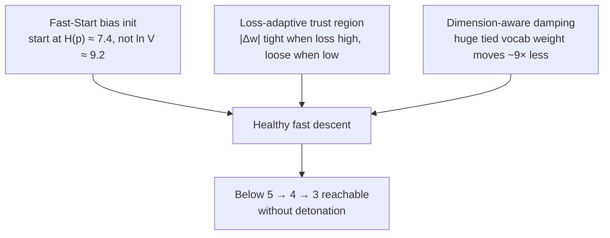

# 🚀 Training Stability & Fast-Start Descent

Three mechanisms that make cross-entropy loss **start low** and **descend without detonating**. They were added after observing a real pathology: on a 10k-vocab model the loss began at `ln(V) ≈ 9.2` (the uniform-guess floor) and, once it finally started to descend, a single optimizer step could blow it up from **8.7 → 47** in one iteration.

---

## 🧠 The Big Picture (read this first)

Imagine you're teaching someone to guess the next word in a sentence, and they start by assuming **every word in a 10,000-word dictionary is equally likely.** That's where an untrained language model begins. Two things go wrong at the start of training, and they're easy to mix up:

1. **It starts blind.** Guessing uniformly over 10,000 words is the *worst possible* starting strategy. Nobody speaks that way — "the" and "of" are thousands of times more common than "photosynthesis." The model is throwing away free knowledge on step one.

2. **When it finally learns, it over-corrects violently.** The moment real gradients start flowing, the optimizer takes a step so large on its biggest, most-shared weight that it lurches straight past the good region and lands somewhere terrible — loss rockets from 8.7 to 47 in a single update, like a student who hears one correction and rewrites their entire theory of grammar.

The three fixes below cure these precisely:

| Disease | Cure | Analogy |
|---|---|---|
| Starts blind (loss = `ln V`) | **Fast-start bias init** | Give the student a frequency list before the first lesson |
| Over-corrects when loss is high | **Loss-adaptive trust region** | Small careful steps while lost; bigger strides once oriented |
| One giant weight destabilizes everything | **Dimension-aware damping** | The heaviest lever gets the gentlest touch |

> **One-sentence version:** start from a smart guess instead of a blind one, take timid steps while you're confused, and be extra gentle with the one weight that controls the most.

---

## 1. 🎯 Fast-Start: Log-Unigram Head-Bias Initialization

### Intuitive explanation
The very last thing the model does before producing a prediction is add a **bias** — one number per vocabulary word — to its output scores. Think of it as the model's "default hunch" about each word before it even looks at the context. At initialization that hunch is **zero for every word**, i.e. "I have no idea, they're all equally likely." For a 10,000-word vocabulary that's a terrible default, and it costs exactly:

$$\mathcal{L}_0 = \ln V = \ln(10000) = 9.21 \text{ nats}$$

Here's the key insight: **we already know the answer to "which words are common?"** — it's right there in the training text. We can just *count*. So instead of starting the default hunch at zero, we start it at the **log-frequency** of each word. Now, before learning anything about grammar or context, the model already predicts "the" and "of" often and "photosynthesis" rarely — which is most of what next-word prediction is.

### The math
Seed the head bias with the log-unigram probability, mean-centered:

$$b_{\text{head}}[c] = \log P(c) - \frac{1}{V}\sum_{c'} \log P(c')$$

The mean-centering is *free* — softmax only cares about *differences* between scores, so shifting all biases by a constant changes nothing (log-softmax is shift-invariant). We center only to keep the raw numbers small and numerically clean.

The instant the bias is $\log P(c)$, the model's step-0 output *is* the corpus's word-frequency distribution, so its loss becomes the **unigram entropy** — the information-theoretic cost of knowing word frequencies but nothing about context:

$$\mathcal{L}_0 = H(p) = -\sum_c P(c)\log P(c) \;\le\; \ln V$$

$H(p)$ is always $\le \ln V$, with equality only if every word truly were equally likely. Real text is highly skewed, so the drop is large.

### Worked example (our corpus)
- Uniform floor: $\ln(10000) = 9.210$
- Measured unigram entropy: $H(p) \approx 7.48$
- **Free improvement before any training: −1.73 nats**, i.e. perplexity drops from $e^{9.21}=10{,}000$ to $e^{7.48}\approx 1{,}770$ — the model is ~5.6× less confused on step 0 for zero compute.

Measured eval baseline: **9.210 → 7.419**. The code prints its own sanity check:
```
>> [Fast-Start Init] LM-head bias seeded from log-unigram frequencies.
   Expected step-0 loss ~ 7.483 (vs ln(V) = 9.210).
```

### Why it also speeds *later* descent
With the marginal already baked in, gradient descent no longer has to spend steps re-discovering word frequencies. Every gradient now pushes on the thing that actually matters: **how context should bend the prediction away from the marginal.** The model learns *deltas from a good baseline* instead of *everything from scratch* — a much easier, better-conditioned optimization problem.

```cpp
// src/ring2/transformer_lm.cpp
void TransformerLM::init_head_bias_from_unigram(const vector<int>& token_stream) {
    vector<double> counts(V, 1.0);          // Laplace (+1) smoothing -> no log(0)
    double total = V;
    for (int tok : token_stream) { counts[tok] += 1.0; total += 1.0; }
    // b_head[c] = log P(c), mean-centered (log-softmax is shift-invariant)
    for (size_t c = 0; c < V; ++c) b_head.data[c] = log(counts[c]/total) - mean_log;
}
```

> **Weight-tying note:** the output head shares the same matrix as the input embedding (`embedding.token_weights`). We therefore seed **only the bias** — the tied matrix stays learnable. This is standard practice (GPT-2, most modern LMs) and is *why* the next two fixes matter so much: that one shared matrix is enormous and does double duty.

---

## 2. 📉 Loss-Adaptive Step Trust Region ("move inversely to loss")

### Intuitive explanation
A "trust region" is a leash on how far any single weight is allowed to move in one step. The original leash was a fixed $|\Delta w| \le 2.0$. That sounds small until you realize weights **start** at a scale of about $0.02$–$0.1$. So a single step was allowed to fling a weight **20 to 100 times its own size** — like being told you can adjust a thermostat by ±2°, except the room only spans 0.05°. While the model was frozen (near-zero gradients) this slack was harmless. The instant real gradients arrived, one step hurled a weight across the entire sane range and the loss exploded 8.7 → 47.

The cure is **confidence-scaled caution**: when loss is high the model is, by definition, in a bad and probably unfamiliar region, so it should step *timidly*; as loss falls it's clearly near something good and well-understood, so it can *stride* more freely. High loss ⇒ short leash. This is the "move inversely" principle — the permitted step size moves **opposite** to the loss.

Contrast with a human learning to park a car: when you're way off (high error) you make tiny corrective nudges to avoid hitting anything; once you're almost aligned (low error) you can confidently pull it in.

### The schedule
$$
|\Delta w|_{\max}(\mathcal{L}) =
\begin{cases}
0.12 & \mathcal{L} \ge 6 \quad(\text{very lost — tiny steps})\\
0.12 \to 0.35 & 3 \le \mathcal{L} < 6 \quad(\text{orienting})\\
0.35 \to 0.60 & 1 \le \mathcal{L} < 3 \quad(\text{closing in})\\
0.60 & \mathcal{L} < 1 \quad(\text{fine-tuning — free to stride})
\end{cases}
$$

```cpp
// include/ring1/adamw.hpp — recomputed each step from the current loss
inline float trust_region_for_loss(float loss) {
    if (loss >= 6.0f) return 0.12f;
    if (loss >= 3.0f) return 0.12f + (0.35f-0.12f)*(6.0f-loss)/3.0f;
    if (loss >= 1.0f) return 0.35f + (0.60f-0.35f)*(3.0f-loss)/2.0f;
    return 0.60f;
}
```
The trainer calls this every step (`optimizer.config.max_step = trust_region_for_loss(ema_loss)`), and `update_param` clamps each `delta_w` to `±max_step`.

**Why not just lower the learning rate?** A global LR cut slows *everything* forever, including the healthy fine-tuning phase. The trust region is *state-dependent*: it's strict exactly when it needs to be (high loss) and gets out of the way exactly when it's safe (low loss). You get early stability **and** late speed, instead of trading one for the other.

**Result:** the catastrophic 8.7 → 47 spike disappeared; the worst observed excursion fell to ~16.

---

## 3. 📐 Dimension-Aware Step Damping ("higher dimension → less affected")

### Intuitive explanation
Not all weights are equal. The single biggest tensor in the model is the **tied vocabulary matrix** `token_weights`, shape $V \times d = 10000 \times 128$ — that's **1.28 million** numbers, ~73% of the whole model. And it's used **twice on every forward pass**: once to turn input tokens into vectors (the embedding), and again — the *same* numbers — to turn the final vector into 10,000 output scores (the tied head). So nudging it doesn't move one gear; it moves the input gear *and* the output gear at the same time. A step that would be reasonable for a small 128-wide attention weight is, for this shared giant, a double-strength shove — and that double shove was the actual detonator behind the blow-ups.

The fix borrows the oldest trick in neural-net initialization: **fan-in scaling.** We already initialize weights proportional to $1/\sqrt{\text{dimension}}$ precisely because wide layers accumulate more terms and need smaller individual values. The same logic applies to *updates*: the wider the matrix, the smaller each element's step should be, so the aggregate change stays comparable across differently-sized layers. Big lever ⇒ gentle touch.

### The math
$$
\alpha_{\text{eff}} \;\mathrel{*}=\; \sqrt{\frac{d_{\text{ref}}}{\max\!\big(d_{\text{ref}},\; \max(\text{rows},\text{cols})\big)}}, \qquad d_{\text{ref}} = 128
$$

The reference dimension 128 is the model's embed width, so "normal-sized" layers are unaffected (factor 1.0) and only genuinely oversized tensors are throttled:

| Parameter | Largest dim | Damping factor | Meaning |
|---|---|---|---|
| Attention / LayerNorm ($d=128$) | 128 | **1.00** | full speed |
| SwiGLU FFN ($d=256$) | 256 | **0.71** | mildly gentler |
| **Tied vocab weight** ($V=10000$) | 10000 | **0.11** | ~9× gentler — the culprit, tamed |

So the destabilizing weight moves **~9× less per element** than a small attention weight, while the rest of the network keeps training at full speed. We surgically slow *only* the dangerous parameter instead of penalizing the whole model.

```cpp
// src/ring1/adamw.cpp
const float ref_dim = 128.0f;
float big_dim  = max(param.rows, param.cols);
float dim_damp = sqrt(ref_dim / max(ref_dim, big_dim));
effective_lr  *= dim_damp;   // higher dimension -> smaller per-element step
```

### Why $\sqrt{\cdot}$ and not $1/d$?
Linear ($1/d$) damping would crush the vocab weight by 78× — so hard it would barely learn. The square root matches how *variance* accumulates across independent dimensions (a sum of $d$ random terms has std $\propto\sqrt{d}$), so it removes the *destabilizing* excess without freezing the layer. It's the same reasoning behind $1/\sqrt{d}$ Xavier/He initialization and the $1/\sqrt{d_k}$ scaling inside attention — this is just that principle applied to the optimizer step.

---

## 🧩 How the Three Compose



They're **orthogonal** — each attacks a different axis of the problem:
- **Bias init** fixes *where you start* (altitude).
- **Trust region** fixes *when* steps are dangerous (the high-loss regime).
- **Dimension damping** fixes *which weight* is dangerous (the biggest one).

Because they don't overlap, they stack cleanly: a good starting altitude, careful steps while disoriented, and a gentle hand on the heaviest control. That converts "loss stuck at 9–10, occasionally exploding to 47" into a descent stable enough for the [[01 - Ring 0 (Core Math & Hardware)/Taylor Loss-Trajectory Predictor|Taylor foresight]] and [[02 - Ring 1 (Layers & Advanced Optimizers)/Meta-Neural Loss & Step Optimizer|meta-optimizer]] to then *accelerate* rather than *amplify into chaos*.

---

## 🔬 Efficiency (it stays cheap)

None of this adds meaningful cost — a hard requirement:
- **Bias init:** one pass over the token stream **once** at startup, then never again. $O(\text{corpus})$ one-time, zero per-step cost.
- **Trust region:** one scalar function of the loss per step ($O(1)$), plus a clamp that was already there.
- **Dimension damping:** one `sqrt` and one multiply **per tensor** (not per element) — a few dozen extra flops across the whole model per step.

All three touch the *scalars around* the update, not the billion-flop matrix math inside it. Foresight-grade cheapness, same as the [[01 - Ring 0 (Core Math & Hardware)/Taylor Loss-Trajectory Predictor|Taylor predictor]].

---

## ❓ Mini-FAQ

**Q: Doesn't the bias init "cheat" by hard-coding the answer?**
No — it hard-codes only the *marginal* word frequencies, which are trivially countable and carry no contextual/grammatical information. All the actual language modeling (what follows what) is still learned. It's the difference between giving a chess student the rules versus giving them the winning moves.

**Q: Why did the blow-ups only appear *after* the fixes started working?**
Because a blow-up needs a real gradient to blow up *with*. While the head was blind, gradients were tiny and diffuse, so the loose ±2.0 clamp never engaged. The bias init created strong, coherent gradients — which is *good* — and those immediately exposed the latent step-size bug. The instability was always there; descent just finally poked it.

**Q: Is the tied vocab matrix a design flaw?**
No — weight tying is a proven win (fewer parameters, better generalization, standard in GPT-style models). It just concentrates responsibility into one tensor, which means that one tensor deserves special care during updates. Dimension damping *is* that care.

**Q: What's left to reach loss < 3?**
Stability is necessary but not sufficient. The next suspect is `compute_loss_scale_multiplier`, which returns **3.0×** whenever loss ≥ 5 — it triples the learning rate during the exact high-loss regime where we want caution. That heuristic was meant for *plateaus* (stuck loss), but at a *fresh* start high-loss ≠ plateau. Making it plateau-conditional (boost only when loss is high **and flat**) rather than purely loss-magnitude driven is the next lever.

---

## 🔗 Related Notes
- [[02 - Ring 1 (Layers & Advanced Optimizers)/AdamW, Fisher Metric & Nesterov|AdamW, Fisher Metric & Nesterov]]
- [[02 - Ring 1 (Layers & Advanced Optimizers)/4-Formula Dynamic Weight Physics|4-Formula Dynamic Weight Physics]]
- [[01 - Ring 0 (Core Math & Hardware)/Taylor Loss-Trajectory Predictor|Taylor Loss-Trajectory Predictor]]
- [[02 - Ring 1 (Layers & Advanced Optimizers)/Meta-Neural Loss & Step Optimizer|Meta-Neural Loss & Step Optimizer]]
- [[03 - Ring 2 (Models & Transformers)/TransformerLM Decoder (GQA + SwiGLU + RoPE)|TransformerLM Decoder (weight tying)]]
- [[01 - Ring 0 (Core Math & Hardware)/Numerical Stability & NaN Prevention Physics|Numerical Stability & NaN Prevention]]
- [[05 - Theoretical Foundations & Physics/Multi-Order Loss Derivatives & Optimization|Multi-Order Loss Derivatives & Optimization]]
- [[Index|Return to Master Index]]
