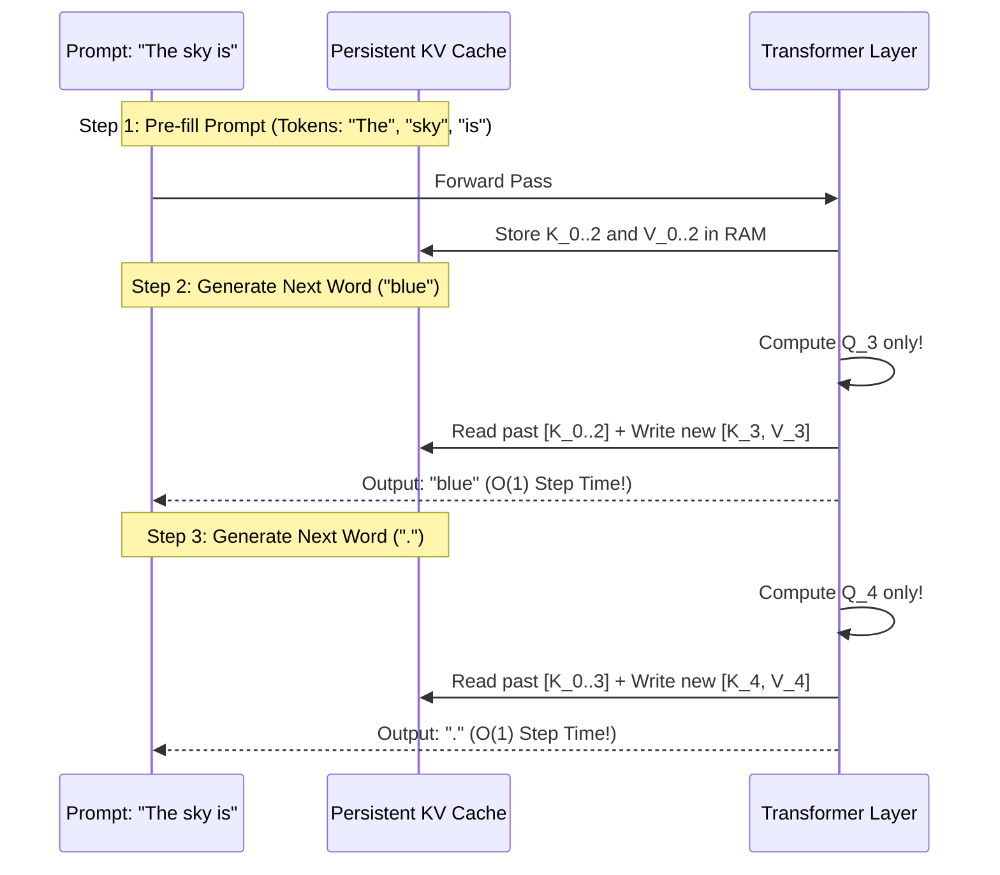

# 🔮 Autoregressive KV-Cache Streaming Generation

The inference engine in `ring2::TransformerLM::generate` uses persistent **Key-Value (KV) Caching** to achieve blazing-fast $O(1)$ computation per generated token, paired with **Top-K**, **Top-P (Nucleus)**, **Temperature scaling**, and **Repetition Penalties**.

---

## 📋 Prerequisites

Before reading this, you should be comfortable with:
- **Autoregressive decoding** — generating one token at a time, each conditioned on all previous tokens
- Basic attention — enough to understand what "K" and "V" are and why re-computing them for the whole prefix is wasteful
- [[02 - Ring 1 (Layers & Advanced Optimizers)/Attention Mechanics & ALiBi|Attention Mechanics & ALiBi]] — GQA-style attention where the KV heads are already fewer than the Q heads (reduces cache size)
- **Sampling strategies** — temperature, top-k, top-p (nucleus), repetition penalty
- [[03 - Ring 2 (Models & Transformers)/TransformerLM Decoder (GQA + SwiGLU + RoPE)|TransformerLM Decoder]] — the training-time counterpart to this inference-time path
- Optional: [[03 - Ring 2 (Models & Transformers)/BPE Tokenizer & Merging Engine|BPE Tokenizer]] — decode the emitted token IDs back to text

---

## 🎓 Beginner-Friendly Learning Guide: How LLMs Generate Words

### The "Autoregressive" Concept (Word-by-Word Generation)
Language models do not generate entire sentences at once. They are **autoregressive**:
1. You feed the prompt: `"The sky is "`
2. Model predicts: `"blue"`
3. You append `"blue"` to the prompt: `"The sky is blue"`
4. Model predicts: `"."`
5. Repeat until the model produces `<eos>` (End of Sequence).

---

## ⚡ KV-Cache: $O(T^2) \to O(1)$ Per-Token Decoding

### The Naive Method (Extremely Slow)
Suppose you have already generated 1,000 words. To generate word 1,001:
- You re-pass **all 1,000 previous words** through all 10 transformer layers.
- You re-calculate the exact same Keys and Values for every single past word!
- Generating $T$ words takes $O(T^2)$ total operations. At 2,000 words, text generation slows down to a crawl.

### The KV-Cache Method (Instantaneous)
Why recompute the past when it never changes?
- During the prompt, we compute the Keys and Values once and store them in memory (`K_cache` and `V_cache`).
- When generating word 1,001, we **only compute the Query for word 1,001**!
- We append the single new Key and Value to the cache and perform attention in $O(1)$ time!



---

## 🎲 The Sampling Controls (Temperature, Top-K, Top-P, Repetition)

When logits are generated for all 512 vocabulary tokens, how does the AI choose which token to pick?

| Parameter | What it Does in Plain English | Real-World Intuition |
| :--- | :--- | :--- |
| **Temperature ($T$)** | Divides logits by $T$. | **High ($1.2$)**: Creative, wild, unpredictable.<br>**Low ($0.2$)**: Factual, deterministic, robotic. |
| **Top-K ($K$)** | Keeps only the top $K$ highest-scoring tokens and sets all others to $-\infty$. | If $K=40$, the model will never consider the 472 least likely words. |
| **Top-P / Nucleus ($P$)** | Dynamically keeps the smallest set of top tokens whose cumulative probability $\ge P$. | If 2 tokens hold $95\%$ of the probability mass, only those 2 are sampled! |
| **Repetition Penalty ($\rho$)** | Reduces the logits of any token that was already generated recently. | Prevents annoying loops (*"and then and then and then"*). |

---

## 💻 Deep Code Breakdown

Located in `src/ring2/transformer_lm.cpp`:

```cpp
void TransformerLM::generate(
    const vector<int>& prompt_tokens,
    size_t max_new_tokens,
    float temperature,
    int top_k,
    float top_p,
    float min_p,
    float repetition_penalty,
    const function<void(int)>& on_token,
    bool use_kv_cache
) {
    vector<int> current_tokens = prompt_tokens;
    std::unordered_map<int, int> token_counts;
    for (int t : prompt_tokens) token_counts[t]++;

    for (size_t step = 0; step < max_new_tokens; ++step) {
        // 1. Forward Pass (using KV-Cache if enabled)
        Matrix logits;
        if (use_kv_cache) {
            // Forward single token through KV-cached layers
            int next_token = current_tokens.back();
            logits = forward_cached(next_token);
        } else {
            // Full context forward pass
            logits = forward(current_tokens);
        }

        // 2. Extract logits for the last token position
        size_t V = config.vocab_size;
        vector<float> last_logits(V);
        for (size_t c = 0; c < V; ++c) {
            last_logits[c] = logits(logits.rows - 1, c);
        }

        // 3. Apply Repetition Penalty
        for (const auto& pair : token_counts) {
            int tok = pair.first;
            if (tok >= 0 && static_cast<size_t>(tok) < V) {
                if (last_logits[tok] > 0.0f) {
                    last_logits[tok] /= repetition_penalty;
                } else {
                    last_logits[tok] *= repetition_penalty;
                }
            }
        }

        // 4. Apply Temperature Scaling: z / T
        if (temperature > 0.0f) {
            for (auto& z : last_logits) z /= temperature;
        }

        // 5. Top-K & Top-P Nucleus Filtering
        vector<pair<float, int>> candidates;
        for (size_t c = 0; c < V; ++c) {
            candidates.push_back({last_logits[c], static_cast<int>(c)});
        }
        std::sort(candidates.rbegin(), candidates.rend()); // Sort descending

        // Keep Top-K
        if (top_k > 0 && static_cast<size_t>(top_k) < candidates.size()) {
            candidates.resize(top_k);
        }

        // Softmax over candidates
        float max_val = candidates[0].first;
        float sum_exp = 0.0f;
        for (auto& cand : candidates) {
            cand.first = exp(cand.first - max_val);
            sum_exp += cand.first;
        }
        for (auto& cand : candidates) cand.first /= sum_exp;

        // Top-P Nucleus Truncation:
        float cum_p = 0.0f;
        size_t p_cutoff = candidates.size();
        for (size_t i = 0; i < candidates.size(); ++i) {
            cum_p += candidates[i].first;
            if (cum_p >= top_p) {
                p_cutoff = i + 1;
                break;
            }
        }
        candidates.resize(p_cutoff);

        // 6. Multinomial Random Sampling
        float r = static_cast<float>(rand()) / static_cast<float>(RAND_MAX);
        float acc = 0.0f;
        int sampled_token = candidates[0].second;
        for (const auto& cand : candidates) {
            acc += cand.first / cum_p;
            if (r <= acc) {
                sampled_token = cand.second;
                break;
            }
        }

        // 7. Output Token
        if (on_token) on_token(sampled_token);
        current_tokens.push_back(sampled_token);
        token_counts[sampled_token]++;

        // Stop on End of Sequence (<eos>)
        if (sampled_token == 3) break;
    }
}
```

---

## 🔗 Related Notes
- [[03 - Ring 2 (Models & Transformers)/TransformerLM Decoder (GQA + SwiGLU + RoPE)|TransformerLM Decoder]]
- [[02 - Ring 1 (Layers & Advanced Optimizers)/Attention Mechanics & ALiBi|Attention Mechanics & ALiBi]]
- [[Index|Return to Master Index]]
