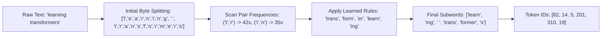

# 🔤 Byte-Pair Encoding (BPE) Subword Tokenizer

The `ring2::BPETokenizer` is a subword tokenization engine implementing Byte-Pair Encoding (BPE), iterative frequency-based pair merging, special token management, and file persistence.

---

## 🎓 Beginner-Friendly Learning Guide: What is Tokenization?

### Why Can't Computers Read Words Directly?
Computers only understand numbers ($0, 1, 2, \dots$), not characters (`"a"`, `"b"`, `"c"`).
1. **Character-Level (Too Slow)**: If you represent `"transformer"` as 11 individual characters `['t', 'r', 'a', 'n', 's', 'f', 'o', 'r', 'm', 'e', 'r']`, sequence lengths become huge ($10\times$ longer), making self-attention $100\times$ slower ($O(T^2)$).
2. **Word-Level (Too Inflexible)**: If you only store full words, the vocabulary needs $>1,000,000$ words. If a user types a new word (*"un-Googleable"*), the model sees `<unk>` (Unknown) and fails.

### The Subword Sweet Spot: Byte-Pair Encoding (BPE)
BPE starts with basic individual characters and iteratively merges the most frequently occurring adjacent pairs of characters into subwords:
- Step 1: `"t"` + `"h"` $\to$ `"th"`
- Step 2: `"th"` + `"e"` $\to$ `"the"`
- Step 3: `"trans"` + `"former"` $\to$ `"transformer"`

> [!TIP]
> **Why BPE is Brilliant**: Frequent words (`"the"`, `"function"`, `"return"`) become single tokens, while rare words (`"antigravity"`) are broken into recognizable pieces (`"anti"` + `"gravity"`). The model never encounters an unknown word!

---

## 🏛️ BPE Compression Pipeline



---

## 💻 Deep Code Breakdown

Located in `src/ring2/tokenizer.cpp`:

```cpp
vector<int> BPETokenizer::encode(const string& text) const {
    if (text.empty()) return {};

    // 1. Split input into initial single-character strings
    vector<string> symbols;
    for (char c : text) {
        symbols.push_back(string(1, c));
    }

    // 2. Iteratively apply learned merge rules in priority order
    while (symbols.size() >= 2) {
        // Find best pair that exists in our learned merge table
        int best_rank = 1e9;
        size_t best_idx = 0;
        string best_merged = "";

        for (size_t i = 0; i < symbols.size() - 1; ++i) {
            string pair = symbols[i] + " " + symbols[i + 1];
            auto it = merge_ranks.find(pair);
            if (it != merge_ranks.end() && it->second < best_rank) {
                best_rank = it->second;
                best_idx = i;
                best_merged = symbols[i] + symbols[i + 1];
            }
        }

        // If no more valid pairs found, break
        if (best_rank == 1e9) break;

        // Merge the two symbols
        vector<string> next_symbols;
        for (size_t i = 0; i < symbols.size(); ++i) {
            if (i == best_idx) {
                next_symbols.push_back(best_merged);
                ++i; // Skip next symbol because it was merged
            } else {
                next_symbols.push_back(symbols[i]);
            }
        }
        symbols = next_symbols;
    }

    // 3. Map subword strings to integer token IDs
    vector<int> token_ids;
    for (const auto& sym : symbols) {
        auto it = token_to_id.find(sym);
        if (it != token_to_id.end()) {
            token_ids.push_back(it->second);
        } else {
            token_ids.push_back(1); // 1 = <unk>
        }
    }

    return token_ids;
}
```

---

## 🔗 Related Notes
- [[03 - Ring 2 (Models & Transformers)/Semantic VocabManager & Lexicon Clusters|Semantic VocabManager]]
- [[03 - Ring 2 (Models & Transformers)/TransformerLM Decoder (GQA + SwiGLU + RoPE)|TransformerLM Decoder]]
- [[Index|Return to Master Index]]
