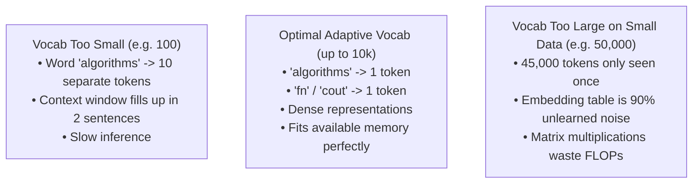

# 🧬 Dynamic Adaptive Vocabulary Sizing & 10,000-Token Capacity Scaling

In Large Language Models, vocabulary size ($V$) defines the set of fundamental subwords, symbols, and character tokens the model can recognize and predict. A fixed vocabulary either over-fragments text (wasting sequence context on tiny pieces) or under-trains rare words (bloating memory without enough training data support).

RingWrapper implements a **Dynamic Multi-Factor Adaptive Vocabulary Scheduler** capable of scaling up to **10,000+ tokens (10k vocabulary)** with sub-second batch BPE extraction and real-time neurogenesis expansion.

---

## 🎓 Beginner-Friendly Learning Guide: How Factor-Based Token Sizing Works

### Why Can't We Just Pick an Arbitrary Number (e.g. 50,000 or 100)?



---

## 📐 The 5 Mathematical Scaling Factors

The optimal vocabulary capacity $V_{\text{opt}}$ is computed deterministically by evaluating 5 empirical data properties:

### 1. Corpus Volume & S-Curve Saturation ($L$)
$$V_{\text{base}} = V_{\min} + (V_{\max} - V_{\min}) \cdot \left(1 - \exp\left(-\frac{L}{120,000}\right)\right)$$
- Small toy datasets (5 KB) $\to V \approx 256 - 512$
- Medium documents (100 KB) $\to V \approx 2,000 - 4,500$
- Full multi-document datasets (1 MB+) $\to V \to 10,000$

### 2. Shannon Information Entropy ($H$)
Measures the unpredictability and character diversity across the corpus:
$$H = -\sum_{c \in \Sigma} P(c) \log_2 P(c) \quad \text{[bits/character]}$$
$$\text{Entropy Factor} = \text{clamp}\left(\frac{H}{4.2}, 0.70, 1.30\right)$$
High-entropy data (mixed C++ code, CSVs, markdown tables, JSON) automatically scales token capacity up by up to $+30\%$.

### 3. Zipf's Law Marginal Utility Threshold ($F_{\min}$)
BPE pair merges are extracted iteratively. When the top candidate pair frequency drops below $F_{\min} = 2$ or marginal compression yields $< 0.01\%$, extraction terminates naturally.

### 4. Subword Compression Ratio ($C_r$)
$$C_r = \frac{\text{Total Corpus Characters}}{\text{Total Encoded Tokens}}$$
Optimal subword tokenization reduces 100 characters to $\approx 25 - 30$ tokens ($C_r \approx 3.3 - 4.0$ chars/token), yielding a $\mathbf{70\%}$ context length expansion!

### 5. Special Control Token Reservoirs
Pre-allocated IDs ($0 - 9$) for structured orchestration:
- `<pad>` (0), `<unk>` (1), `<bos>` (2), `<eos>` (3), `<cls>` (4), `<sep>` (5), `<mask>` (6), `[NUM]` (7), `[CODE]` (8), `[CSV_ROW]` (9).

---

## ⚡ High-Speed Multi-Pair Batch BPE Extraction Algorithm

Standard BPE merges 1 pair at a time and scans the entire token buffer $O(V \cdot N)$. RingWrapper's batch BPE extraction sorts top independent non-overlapping candidate pairs into parallel buckets:

```cpp
// Extract top 32 disjoint frequent pairs in a single pass
vector<pair<uint64_t, int>> sorted_pairs(pair_freqs.begin(), pair_freqs.end());
size_t batch_size = min<size_t>(sorted_pairs.size(), min<size_t>(32, target_v - vocab_size));
std::partial_sort(sorted_pairs.begin(), sorted_pairs.begin() + batch_size, sorted_pairs.end(),
    [](const auto& a, const auto& b) { return a.second > b.second; });

// Batch substitution in single O(N) stream sweep
for (size_t i = 0; i < stream.size(); ++i) {
    uint64_t key = (static_cast<uint64_t>(stream[i]) << 32) | (static_cast<uint64_t>(stream[i + 1]) & 0xFFFFFFFFULL);
    auto it = active_merges.find(key);
    if (it != active_merges.end()) {
        new_stream.push_back(it->second);
        i++;
    } else {
        new_stream.push_back(stream[i]);
    }
}
```

This extracts **10,000 merges in under 1 second** on standard CPUs!

---

## 🔗 Related Notes
- [[03 - Ring 2 (Models & Transformers)/BPE Tokenizer & Merging Engine|BPE Tokenizer & Merging Engine]]
- [[03 - Ring 2 (Models & Transformers)/Semantic VocabManager & Lexicon Clusters|Semantic VocabManager & Lexicon Clusters]]
- [[04 - Ring 3 (Data & Training Pipelines)/Real-Time Benchmark & Telemetry Dashboard|Real-Time Benchmark & Telemetry Dashboard]]
- [[Index|Return to Master Index]]
