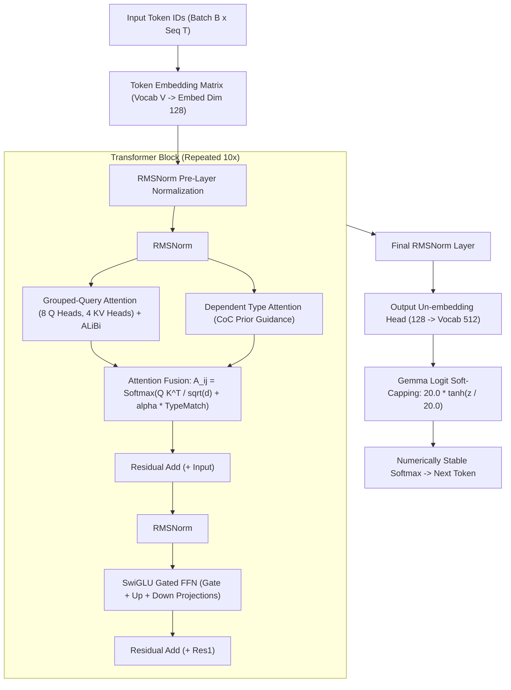

# 🏛️ TransformerLM Causal Decoder Architecture

The `ring2::TransformerLM` is a modern 10-layer autoregressive causal language model decoder implementing **Grouped-Query Attention (GQA)**, **SwiGLU Gated Feed-Forward Networks**, **Constructive Dependent-Type Attention**, **RMSNorm pre-layer normalization**, and **Gemma-style Logit Soft-Capping via $\tanh$**.

---

## 📋 Prerequisites

Before reading this, you should be comfortable with:
- The **decoder-only transformer** architecture (GPT-style) and its per-block structure (norm → attention → residual → norm → FFN → residual)
- [[02 - Ring 1 (Layers & Advanced Optimizers)/Attention Mechanics & ALiBi|Attention Mechanics & ALiBi]] — the attention sub-layer this composes
- **RMSNorm** vs. LayerNorm (why we skip mean-centering)
- **SwiGLU** — the gated FFN used here instead of ReLU/GELU (Shazeer 2020)
- **Weight tying** — the LM head reuses the input embedding matrix
- [[01 - Ring 0 (Core Math & Hardware)/Tensor3D & Matrix Math|Tensor3D & Matrix Math]] — for the underlying tensor operations
- Optional: [[03 - Ring 2 (Models & Transformers)/Autoregressive KV-Cache Generation|KV-Cache Generation]] — inference-time path, complementary to this training-time note

---

## 🎓 Beginner-Friendly Learning Guide: How a Transformer Decodes Text

### The End-to-End Pipeline (Step-by-Step)
Imagine the model is given the text prompt: `"The cat sat on the "` and wants to predict the next word (`"mat"`).

1. **Step 1: Tokenization (`Tokenizer`)**
   - The text is sliced into numeric token IDs: `[45, 892, 104, 33, 45]`
2. **Step 2: Embedding Table Lookup (`Embedding`)**
   - Each ID is converted into a rich vector of 128 floating-point numbers ($\mathbb{R}^{128}$).
3. **Step 3: Transformer Blocks ($1 \dots 10$)**
   - Each block performs three fundamental operations:
     - **Self-Attention (GQA)**: Words communicate with each other (*"sat"* connects with *"cat"*).
     - **Constructive Type Attention**: Uses Calculus of Constructions type signatures to ensure semantic agreement.
     - **SwiGLU MLP**: Acts as the memory/knowledge retrieval unit for each token.
4. **Step 4: Output Projection Head & Logit Soft-Capping**
   - Final representation is projected to vocabulary logits $\mathbf{z}$, then soft-capped via $\tanh$:
     $$z_{\text{capped}} = 20.0 \cdot \tanh\left(\frac{z}{20.0}\right)$$
5. **Step 5: Numerically Stable Softmax & Sampling**
   - Logits become probabilities ($0\% - 100\%$), and the next token is sampled!

---

## 📚 Intuitive Analogy: "The 8 Students and 4 Reference Textbooks (GQA)"

In standard **Multi-Head Attention (MHA)**, every Query head has its own Key and Value head (8 Q, 8 K, 8 V). This consumes massive KV-cache memory during long conversations.

In **Grouped-Query Attention (GQA)**:
- Imagine **8 Students** (8 Query Heads) working in a library.
- Instead of printing 8 separate copies of the heavy reference textbooks (Keys & Values), they share **4 Books** in pairs (2 Students per 1 Book).
- **Result**: Cuts KV-cache memory bandwidth in half while preserving 99%+ of full multi-head attention expressive power!

---

## 🏛️ Comprehensive Architecture Diagram



---

## 🔬 Deep Dive: Why SwiGLU Instead of Standard ReLU/GELU?

### The Problem with Old-School MLPs
Traditional feed-forward networks (like GPT-2) used standard two-layer linear transformations with GELU or ReLU:
$$\text{FFN}(\mathbf{x}) = \text{GELU}(\mathbf{x} \mathbf{W}_1 + \mathbf{b}_1) \mathbf{W}_2 + \mathbf{b}_2$$
This only allows static, fixed feature mapping where all neurons fire unconditionally.

### How SwiGLU Works (Gated Bilinear Multiplication)
SwiGLU (Swish Gated Linear Unit) splits the projection into two parallel pathways:
1. **Gate Projection**: $\mathbf{g} = \text{Swish}(\mathbf{x} \mathbf{W}_{\text{gate}})$
2. **Up Projection**: $\mathbf{u} = \mathbf{x} \mathbf{W}_{\text{up}}$

The two vectors are multiplied element-wise ($\odot$) before down-projecting:
$$\text{SwiGLU}(\mathbf{x}) = (\mathbf{g} \odot \mathbf{u}) \mathbf{W}_{\text{down}}$$

> [!IMPORTANT]
> **What the gate does**: The **Gate** controls which features from the **Up Projection** pass through — a gate output near $0.0$ suppresses that feature, near $1.0$ lets it through. This is the standard SwiGLU gating used in modern transformers (PaLM, LLaMA).

---

## 💻 Deep Code Breakdown

```cpp
Matrix TransformerLM::forward(const Matrix& input_ids) {
    // ... Forward pass through embedding and transformer blocks ...
    Matrix logits = unpermute_head.forward(normed_out);

    // Gemma-style logit soft-capping via tanh eliminates unbounded probability explosion
    const float cap = 20.0f;
    for (float& val : logits.data) {
        val = cap * std::tanh(val / cap);
    }

    return logits;
}
```

#### 🔍 Line-by-Line Beginner Breakdown of `TransformerLM::forward`:
- `Matrix logits = unpermute_head.forward(normed_out);`: Projects the final layer's hidden vectors from embedding space ($d_{\text{model}} = 128$) to the full vocabulary dimension ($|V| = 512$).
- `const float cap = 20.0f;`: The soft-cap ceiling constant.
- `for (float& val : logits.data)`: Iterates in-place over all $B \times T \times |V|$ logits in the contiguous float array.
- `val = cap * std::tanh(val / cap);`: Binds extreme positive/negative values smoothly into $(-20, +20)$ to ensure Softmax doesn't produce `NaN` or overflow.

---

### 2. The Transformer Block Forward Pass
Located in `src/ring1/transformer_block.cpp`:

```cpp
Matrix TransformerBlock::forward(const Matrix& x, size_t B, size_t T) {
    // --- Sub-layer 1: RMSNorm + Grouped-Query Attention + Residual ---
    Matrix norm_attn = attn_norm.forward(x);
    Matrix attn_out = attn.forward(norm_attn, B, T);
    
    // Residual Connection: x_1 = x + Attention(RMSNorm(x))
    Matrix x1 = Matrix::zeros(x.rows, x.cols);
    #pragma omp parallel for schedule(static)
    for (int i = 0; i < static_cast<int>(x.data.size()); ++i) {
        x1.data[i] = x.data[i] + attn_out.data[i];
    }

    // --- Sub-layer 2: RMSNorm + SwiGLU MLP + Residual ---
    Matrix norm_ffn = ffn_norm.forward(x1);
    
    // SwiGLU Projections:
    Matrix gate = gate_proj.forward(norm_ffn); // Gate: x * W_gate
    Matrix up   = up_proj.forward(norm_ffn);   // Up:   x * W_up
    
    // Element-wise Bilinear Gating: swish(gate) * up
    Matrix gated = Matrix::zeros(gate.rows, gate.cols);
    #pragma omp parallel for schedule(static)
    for (int i = 0; i < static_cast<int>(gate.data.size()); ++i) {
        float g_val = gate.data[i];
        float swish = g_val / (1.0f + exp(-g_val)); // Swish activation
        gated.data[i] = swish * up.data[i];
    }

    // Down Projection: gated * W_down
    Matrix ffn_out = down_proj.forward(gated);

    // Residual Connection: x_out = x_1 + SwiGLU(RMSNorm(x_1))
    Matrix out = Matrix::zeros(x.rows, x.cols);
    #pragma omp parallel for schedule(static)
    for (int i = 0; i < static_cast<int>(x.data.size()); ++i) {
        out.data[i] = x1.data[i] + ffn_out.data[i];
    }

    return out;
}
```

#### 🔍 Line-by-Line Beginner Breakdown of `TransformerBlock::forward`:
- `attn_norm.forward(x)`: Pre-layer RMSNorm normalizing inputs before they enter multi-head attention.
- `attn.forward(norm_attn, B, T)`: Executes Grouped-Query Attention across batch size `B` and sequence length `T`.
- `x1.data[i] = x.data[i] + attn_out.data[i];`: **First Residual Addition ($x_1 = x + \text{Attn}$)**. Adding the input directly to the output allows gradients to flow uninterrupted backward through the network without vanishing.
- `gate_proj.forward(norm_ffn)` and `up_proj.forward(norm_ffn)`: Two parallel linear matrix multiplications producing the gate and up tensors.
- `float swish = g_val / (1.0f + exp(-g_val));`: Evaluates the non-linear SiLU/Swish curve on the gate.
- `gated.data[i] = swish * up.data[i];`: Multiplies gate and content channels element-by-element ($\odot$).
- `down_proj.forward(gated)`: Projects intermediate FFN channels back down to embedding dimension $d_{\text{model}}$.
- `out.data[i] = x1.data[i] + ffn_out.data[i];`: **Second Residual Addition ($x_{\text{out}} = x_1 + \text{FFN}$)**. Merges knowledge features into the residual stream.

---

## 🔗 Related Notes
- [[01 - Ring 0 (Core Math & Hardware)/Activation Functions|Activation Functions (GELU, SiLU, tanh)]]
- [[01 - Ring 0 (Core Math & Hardware)/Calculus of Constructions & Dependent-Typed Neural Reasoning|Calculus of Constructions & Dependent Types]]
- [[02 - Ring 1 (Layers & Advanced Optimizers)/Attention Mechanics & ALiBi|Attention Mechanics & ALiBi]]
- [[03 - Ring 2 (Models & Transformers)/Autoregressive KV-Cache Generation|Autoregressive KV-Cache Generation]]
- [[03 - Ring 2 (Models & Transformers)/Semantic VocabManager & Lexicon Clusters|Semantic VocabManager]]
- [[Index|Return to Master Index]]
