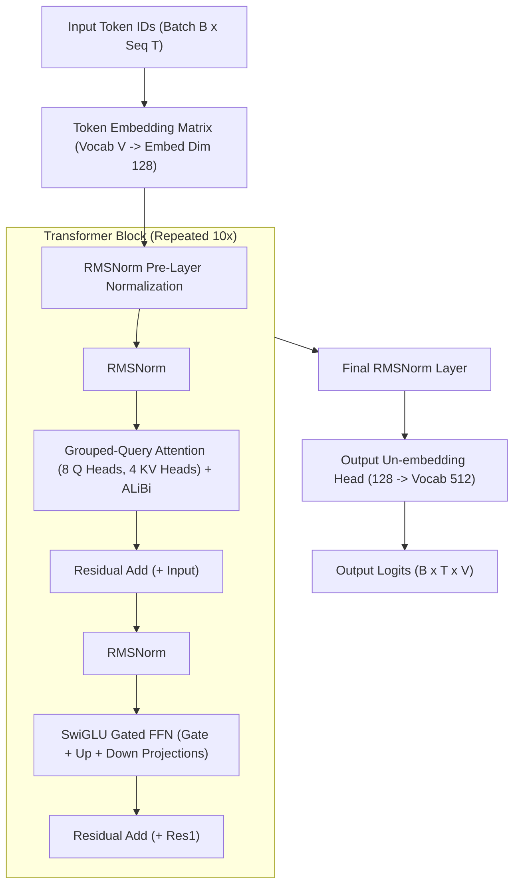

# 🏛️ TransformerLM Causal Decoder Architecture

The `ring2::TransformerLM` is a modern 10-layer autoregressive causal language model decoder implementing **Grouped-Query Attention (GQA)**, **SwiGLU Gated Feed-Forward Networks**, **RMSNorm pre-layer normalization**, and **ALiBi positional encoding**.

---

## 🎓 Beginner-Friendly Learning Guide: How a Transformer Decodes Text

### The End-to-End Pipeline (Step-by-Step)
Imagine the model is given the text prompt: `"The cat sat on the "` and wants to predict the next word (`"mat"`).

1. **Step 1: Tokenization (`Tokenizer`)**
   - The text is sliced into numeric token IDs: `[45, 892, 104, 33, 45]`
2. **Step 2: Embedding Table Lookup (`Embedding`)**
   - Each ID is converted into a rich vector of 128 floating-point numbers ($\mathbb{R}^{128}$).
3. **Step 3: Transformer Blocks ($1 \dots 10$)**
   - Each block performs two fundamental operations:
     - **Self-Attention**: Allows words to look back and communicate with each other (*"sat"* connects with *"cat"*).
     - **SwiGLU MLP**: Acts as the memory/knowledge retrieval unit for each token.
4. **Step 4: Output Projection Head**
   - The final 128-dimensional vector is multiplied against the vocabulary matrix to produce **logits** (scores for all 512 possible next tokens).
5. **Step 5: Softmax & Sampling**
   - Logits are converted to probabilities ($0\% - 100\%$), and the top word (`"mat"`, $92\%$) is chosen!

---

## 🏛️ Comprehensive Architecture Diagram



---

## 🔬 Deep Dive: Why SwiGLU Instead of Standard ReLU/GELU?

### The Problem with Old-School MLPs
Traditional feed-forward networks (like GPT-2) used standard two-layer linear transformations with GELU or ReLU:
$$\text{FFN}(\mathbf{x}) = \text{GELU}(\mathbf{x} \mathbf{W}_1 + \mathbf{b}_1) \mathbf{W}_2 + \mathbf{b}_2$$
This only allows static, fixed feature mapping where all neurons fire unconditionally.

### How SwiGLU Works (Gated Bilinear Multiplication)
SwiGLU (Swish Gated Linear Unit) splits the projection into two parallel pathways:
1. **Gate Projection**: $\mathbf{g} = \text{Swish}(\mathbf{x} \mathbf{W}_{\text{gate}})$
2. **Up Projection**: $\mathbf{u} = \mathbf{x} \mathbf{W}_{\text{up}}$

The two vectors are multiplied element-wise ($\odot$) before down-projecting:
$$\text{SwiGLU}(\mathbf{x}) = (\mathbf{g} \odot \mathbf{u}) \mathbf{W}_{\text{down}}$$

> [!IMPORTANT]
> **What the gate does**: The **Gate** controls which features from the **Up Projection** pass through — a gate output near $0.0$ suppresses that feature, near $1.0$ lets it through. This is the standard SwiGLU gating used in modern transformers (PaLM, LLaMA).

---

## 💻 Deep Code Breakdown

### 1. The Transformer Block Forward Pass
Located in `src/ring1/transformer_block.cpp`:

```cpp
Matrix TransformerBlock::forward(const Matrix& x, size_t B, size_t T) {
    // --- Sub-layer 1: RMSNorm + Grouped-Query Attention + Residual ---
    Matrix norm_attn = attn_norm.forward(x);
    Matrix attn_out = attn.forward(norm_attn, B, T);
    
    // Residual Connection: x_1 = x + Attention(RMSNorm(x))
    Matrix x1 = Matrix::zeros(x.rows, x.cols);
    #pragma omp parallel for schedule(static)
    for (int i = 0; i < static_cast<int>(x.data.size()); ++i) {
        x1.data[i] = x.data[i] + attn_out.data[i];
    }

    // --- Sub-layer 2: RMSNorm + SwiGLU MLP + Residual ---
    Matrix norm_ffn = ffn_norm.forward(x1);
    
    // SwiGLU Projections:
    Matrix gate = gate_proj.forward(norm_ffn); // Gate: x * W_gate
    Matrix up   = up_proj.forward(norm_ffn);   // Up:   x * W_up
    
    // Element-wise Bilinear Gating: swish(gate) * up
    Matrix gated = Matrix::zeros(gate.rows, gate.cols);
    #pragma omp parallel for schedule(static)
    for (int i = 0; i < static_cast<int>(gate.data.size()); ++i) {
        float g_val = gate.data[i];
        float swish = g_val / (1.0f + exp(-g_val)); // Swish activation
        gated.data[i] = swish * up.data[i];
    }

    // Down Projection: gated * W_down
    Matrix ffn_out = down_proj.forward(gated);

    // Residual Connection: x_out = x_1 + SwiGLU(RMSNorm(x_1))
    Matrix out = Matrix::zeros(x.rows, x.cols);
    #pragma omp parallel for schedule(static)
    for (int i = 0; i < static_cast<int>(x.data.size()); ++i) {
        out.data[i] = x1.data[i] + ffn_out.data[i];
    }

    return out;
}
```

---

## 🔗 Related Notes
- [[02 - Ring 1 (Layers & Advanced Optimizers)/Attention Mechanics & ALiBi|Attention Mechanics & ALiBi]]
- [[03 - Ring 2 (Models & Transformers)/Autoregressive KV-Cache Generation|Autoregressive KV-Cache Generation]]
- [[03 - Ring 2 (Models & Transformers)/Semantic VocabManager & Lexicon Clusters|Semantic VocabManager]]
- [[Index|Return to Master Index]]
