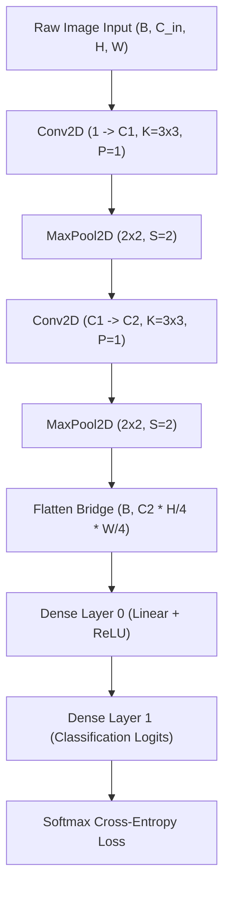

# Plain English Summary

A Convolutional Neural Network (CNN) combines two main parts:
1. **Feature Extraction Backbone**: A sequence of convolutional and pooling layers that scan raw images and turn raw pixels into abstract visual features (like lines, loops, corners, and shapes).
2. **Dense Classification Head**: Fully connected layers (from Ring 1) that take those abstract visual features and decide which class (like letter 'A' or digit '7') the image belongs to.

This document describes how the `CNN` container connects these pieces, tracks layer dimensions automatically, and supports dynamic filter expansion.

---

# Modular CNN Architecture

## 1. Architectural Pipeline

---

## 2. Dynamic Filter & Capacity Growth

When the network encounters a plateau or repeats mistake patterns, Ring 3 can expand filter capacity on-the-fly:

### Conv Filter Expansion
- Layer $L$: Filters expand from $C_{\text{out}} \to C_{\text{out}} + \Delta C$.
- Layer $L+1$: Input channels expand from $C_{\text{in}} \to C_{\text{in}} + \Delta C$.
- If Layer $L$ is the final conv layer before flattening, Dense Layer 0's incoming weight matrix expands its row dimension by $(\Delta C \cdot H_{\text{final}} \cdot W_{\text{final}})$.

New filter weights are initialized with scaled random noise ($0.05 \times \text{std}$) to preserve existing learned representations while unlocking new feature capacity.
