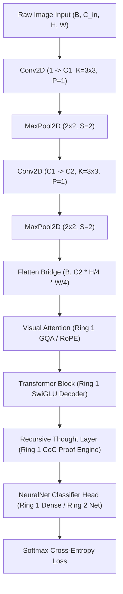

# Plain English Summary

A Convolutional Neural Network (CNN) in Ring 3 seamlessly connects spatial vision backbones with all lower layers from Ring 1 and Ring 2:
1. **Spatial Feature Extraction Backbone**: 2D Convolution and Pooling layers that scan raw images and turn raw pixels into spatial feature representations.
2. **Visual Attention & Transformers (Ring 1)**: Multi-Head Attention and Pre-RMSNorm Transformer decoder blocks with SwiGLU FFN that model global context and spatial token correlations.
3. **Cognitive Recursive Thought Layers (Ring 1)**: Multi-pass latent reasoning loops with residual damping and Calculus of Constructions (CoC) constructive proof verification over visual feature vectors.
4. **Dense Classifiers & Neural Networks (Ring 1 & Ring 2)**: Fully connected `DenseLayer` stacks and modular `ring2::NeuralNet` sequential networks that perform high-precision multi-class categorization.

This document describes how the `CNN` container connects these pieces, tracks layer dimensions automatically, backpropagates gradients across all hybrid layers, and optimizes them uniformly.

---

# Modular CNN Architecture & Layer Interoperability

## 1. Unified Architectural Pipeline

---

## 2. Connected Layer Types & APIs

The Ring 3 `CNN` container provides modular builder methods to connect any Ring 1 or Ring 2 component:

| Layer Type | Ring | Connection Method | Functionality |
| :--- | :--- | :--- | :--- |
| **Conv2D & MaxPool2D** | Ring 3 | `add_conv()`, `add_conv_block()` | Spatial feature extraction, edge/texture filters, downsampling |
| **MultiHeadAttention** | Ring 1 | `add_attention(embed_dim, heads, kv_heads)` | Grouped-Query Attention (GQA), RoPE relative rotation, ALiBi decay |
| **TransformerBlock** | Ring 1 | `add_transformer_block(dim, heads, ffn_dim)` | Pre-RMSNorm attention + SwiGLU gated bilinear MLP |
| **RecursiveLayer** | Ring 1 | `add_recursive_thought(name, out_dim, depth)` | Latent reasoning loops ($K$ steps), reflection damping, CoC proofs |
| **DenseLayer** | Ring 1 | `add_dense(out_dim)`, `add_dense_layer(layer)` | Fully connected linear projections + ReLU/GELU/SiLU |
| **NeuralNet** | Ring 2 | `attach_neural_net(head_net)` | Full multi-layer sequential classifier head |

---

## 3. Backpropagation & Gradient Flow

Backpropagation flows continuously in reverse through the entire connected stack:

$$\text{Loss} \longrightarrow \frac{\partial \mathcal{L}}{\partial \text{Dense}} \longrightarrow \frac{\partial \mathcal{L}}{\partial \text{Recursive}} \longrightarrow \frac{\partial \mathcal{L}}{\partial \text{Transformer}} \longrightarrow \frac{\partial \mathcal{L}}{\partial \text{Attention}} \longrightarrow \text{Un-flatten} \longrightarrow \frac{\partial \mathcal{L}}{\partial \text{Conv2D}}$$

- **Recursive Thought Backprop**: Gradients propagate through all $K$ latent reasoning steps and the $W_{\text{context}}$ projection matrix, computing exact parameter gradients for $W_{\text{think}}$, $b_{\text{think}}$, and $W_{\text{context}}$.
- **Transformer Backprop**: Gradients propagate through SwiGLU feedforward projections and QKV grouped query attention.
- **Optimizer Integration**: `CNNTrainer` registers every weight and bias matrix from all connected stages into `ring1::AdamW`, applying Automatic Gradient Normalization, Taylor trajectory foresight, and Meta-LR modulation uniformly.

---

## 4. Dynamic Filter & Capacity Growth

When the network encounters a plateau or repeats mistake patterns, Ring 3 can expand filter capacity on-the-fly:

### Conv Filter Expansion
- Layer $L$: Filters expand from $C_{\text{out}} \to C_{\text{out}} + \Delta C$.
- Layer $L+1$: Input channels expand from $C_{\text{in}} \to C_{\text{in}} + \Delta C$.
- If Layer $L$ is the final conv layer before flattening, the downstream connected layer (Attention, Transformer, Recursive, or Dense) automatically resizes its incoming feature dimension.

New filter weights are initialized with scaled random noise ($0.05 \times \text{std}$) to preserve existing learned representations while unlocking new feature capacity.
