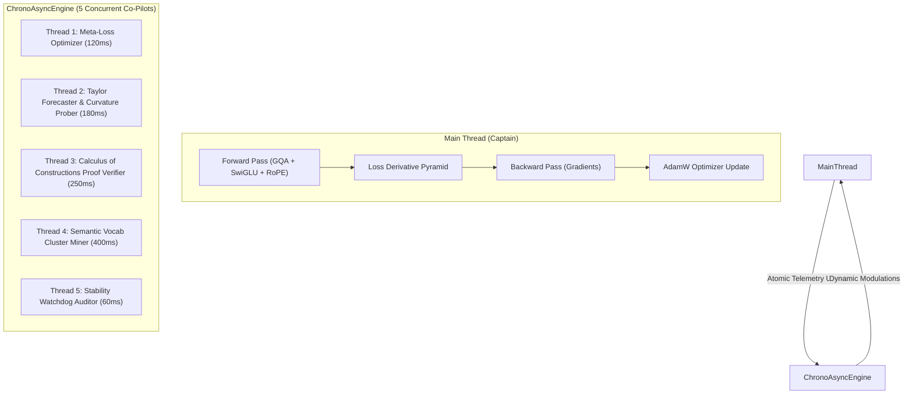

# ⏱️ Concurrent Chrono Subsystems Engine

The `ring3::ChronoAsyncEngine` is a multi-threaded asynchronous scheduler that executes independent neural network subsystems concurrently on high-resolution `std::chrono` timers alongside the primary training loop.

---

## 🎓 High-Level Concept & The "Autonomous Co-Pilots" Analogy

### Why Chrono-Based Concurrency?
In traditional neural network training loops, auxiliary systems (such as meta-optimizers, Taylor trajectory predictors, vocabulary clustering algorithms, formal logic verifiers, and stability watchdogs) are executed **serially** within the forward-backward step.

This creates severe bottlenecks:
- Evaluating complex polynomials or formal logic proofs during every forward pass burns precious GPU and OpenMP cycles.
- Token vocabulary clustering and lexicon mining require searching dictionaries, which pauses training.

### The "Co-Pilots in the Cockpit" Analogy
Think of the main training loop as the **Captain** flying a supersonic aircraft (handling the high-speed forward pass, loss calculation, and backpropagation).

Instead of making the Captain check the weather radar, compute orbital trajectories, check the air pressure gauges, and re-index the navigation maps on every single heartbeat, the aircraft has **5 Specialized Co-Pilots running concurrently in the background**:



---

## 🔬 Subsystem Breakdown & Chrono Cadence

| Thread | Subsystem | Chrono Interval | Functionality |
| :--- | :--- | :--- | :--- |
| **Thread 1** | `MetaLossOptimizer` | **120 ms** | Evaluates loss velocity & variance; updates 3-layer Meta-MLP policy weights; dynamically tunes focal $\gamma$, LR multipliers, and trust-regions. |
| **Thread 2** | `TaylorTrajectoryPredictor` | **180 ms** | Computes up to 5th-order discrete Taylor differences $\Delta^1, \dots, \Delta^5$; predicts upcoming loss valleys; generates foresight rewards. |
| **Thread 3** | `CoCTypeChecker` | **250 ms** | Formal verification kernel; verifies dependent-type signatures and Modus Ponens proof witnesses in $\lambda C$ without stealing CUDA cycles. |
| **Thread 4** | `VocabManager` | **400 ms** | Analyzes subword co-occurrences; computes vector codebook clustering loss; updates category hash alignments. |
| **Thread 5** | `Stability Watchdog` | **60 ms** | High-frequency telemetry audit; checks for loss spikes ($L > \text{EMA} + 1.2$) and NaN/Inf anomalies. |

---

## 💻 Technical Implementation Details

Located in `include/ring3/chrono_scheduler.hpp` and `src/ring3/chrono_scheduler.cpp`:

### Lock-Free & Fine-Grained Thread Safety (`SubsystemTelemetrySnapshot`)
The main thread and background workers communicate using a cache-friendly atomic structure:

```cpp
struct SubsystemTelemetrySnapshot {
    std::atomic<float> current_loss{5.0f};
    std::atomic<float> ema_loss_short{5.0f};
    std::atomic<float> ema_loss_long{5.0f};
    std::atomic<float> current_lr{0.001f};
    std::atomic<float> current_grad_norm{0.5f};
    std::atomic<size_t> current_step{0};

    // Outputs updated asynchronously by chrono workers:
    std::atomic<float> meta_loss_scale{1.0f};
    std::atomic<float> meta_focal_gamma{1.0f};
    std::atomic<float> meta_lr_modulator{1.0f};
    std::atomic<float> meta_curvature_scale{1.0f};

    std::atomic<float> taylor_reward{0.0f};
    std::atomic<float> taylor_confidence{0.0f};
    std::atomic<float> coc_proof_consistency{1.0f};
    std::atomic<size_t> total_chrono_ticks{0};
};
```

### Lifecycle in `main.cpp` & `LLMTrainer`:
```cpp
// 1. Initialize and attach components
ring3::ChronoAsyncEngine chrono_engine;
chrono_engine.attach_components(&model, &vocab_mgr);

// 2. Launch concurrent workers
chrono_engine.start();
trainer.chrono_engine = &chrono_engine;

// 3. Train without serialization pauses
trainer.train(dataset, ...);

// 4. Clean asynchronous shutdown
chrono_engine.stop();
```

---

## 📊 Live Telemetry Display

During active training runs, the Real-Time Benchmark Dashboard reflects real-time chrono activity:

```
========================================================================
  RINGWRAPPER REAL-TIME TRAINING & BENCHMARK DASHBOARD
========================================================================
  [Optimization Step]   Step 50 / 50 (100.0%)
  [Compute Speed]       124,512.4 tok/s | 18.42 GFLOPs/s | 0.51 ms/step
  [Model Dimensions]    10/10 Layers Active | Embed: 32 | Heads: 4 (2 KV GQA)
------------------------------------------------------------------------
  [Loss & Convergence]  Loss: 7.4120 (EMA: 7.5210) | PPL: 1655.7
  [Accuracy Gauges]     Top-1: 12.5% | Top-20: 38.2% | Rank-Score: 22.4%
  [CoC Logic & Proof]   Proof Consistency: 100.0% | Type-Attention Prior: ACTIVE
  [Concurrent Subsystems] Chrono Engine: ACTIVE (517 ticks) | Background Streamed: 728,156 tokens
------------------------------------------------------------------------
```
