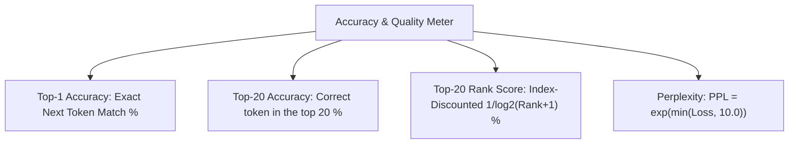

# 💾 Evaluation & Checkpoint Lifecycle

Two related mechanisms: (1) periodic loss evaluation on held-out batches without touching parameters, and (2) a multi-file checkpoint bundle system that saves the *best* models the run has produced and quietly prunes stale ones.

---

## 📋 Prerequisites

Before reading this, you should be comfortable with:
- [[04 - Ring 3 (Data & Training Pipelines)/LLMTrainer Architecture|LLMTrainer Architecture]] — where evaluation is called from
- [[03 - Ring 2 (Models & Transformers)/TransformerLM Decoder (GQA + SwiGLU + RoPE)|TransformerLM Decoder]] — the model whose weights get serialized
- Cross-entropy loss / perplexity fundamentals (log-loss basics)
- Optional: [[03 - Ring 2 (Models & Transformers)/BPE Tokenizer & Merging Engine|BPE Tokenizer]] — vocabulary is saved alongside the weights so a bundle is self-contained

---

## 🧠 The Big Picture

Evaluation and checkpointing are cheap safety nets on a long run:
- **Evaluation** gives you a periodic honest measurement of how well the model is doing on unseen data, decoupled from the noisy per-batch training loss.
- **Checkpointing** lets you resume from your best-ever moment if a later step (or a whole later run) makes things worse.

Both are additive — they never modify parameters — so they compose safely with the [[02 - Ring 1 (Layers & Advanced Optimizers)/Training Stability & Fast-Start Descent|stability watchdog]] and every other adaptive module.

---

## 📊 Real-Time Accuracy Metrics

`LLMTrainer::evaluate_loss(dataset, batches)` runs `model.forward` on `batches` random samples and reports the mean CE loss. The training step additionally tracks accuracy metrics you can compare against evaluation:



Why four metrics instead of one?
- **Top-1** is what a greedy decoder would produce; it's binary and coarse.
- **Top-20** is more forgiving — it tells you whether the true token is "in contention" at all. On a 10k-vocab model with random init, top-20 is ≈ 20/10000 = 0.2%, so a real signal appears there long before top-1 moves.
- **Rank-discounted score** rewards the model for placing the true token *near* the top of its ranking, not just anywhere in the top-20. Formally, it sums `1/log2(rank+2)` across correct-in-top-20 predictions, matching DCG in information retrieval.
- **Perplexity** is `exp(loss)` clamped so a divergent step (loss=18) doesn't overflow to `inf`. Handy for humans (it's roughly "how many tokens the model is choosing between"), noisy for machines (already implied by loss).

### Why perplexity is clamped
Unclamped, PPL blows up to `inf` on spike steps, making the dashboard unreadable and ruining any log-scale plot. The `min(loss, 10.0)` clamp caps display PPL at `e^10 ≈ 22026`; the raw loss is still logged unmodified so post-hoc analysis has the true number.

---

## 📦 Multi-File Milestone Checkpoint Bundles

When the model achieves a new best evaluation loss (specifically, ≤ 5.2 by default, and better than any prior bundle), a self-contained directory is created under `checkpoints/`:

```
checkpoints/milestone_step_0100_loss_4.85/
├── model_weights.bin     (raw IEEE-754 float32 weights, in fixed layer order)
├── metadata.txt          (step, loss, top-1, top-20, rank score, param count, git hash)
├── vocab.txt             (BPE token dictionary and learned merge rules)
└── sample_generation.txt (text generated from a fixed prompt at this milestone)
```

**Why a directory, not one blob:**
- **Weights, vocab, and sample are independently useful.** You can grep `sample_generation.txt` across a whole `checkpoints/` tree to see how the model's outputs evolved without deserializing anything.
- **Debugging is easier** — `diff metadata.txt` between two milestones shows exactly what changed.
- **Vocabulary drift** — because the [[03 - Ring 2 (Models & Transformers)/BPE Tokenizer & Merging Engine|BPE tokenizer]] grows across training, a bundle without its vocab is unusable. Bundling them together makes checkpoints self-contained.

### Load-if-better semantics
On startup, `main.cpp` calls `model.load_best_checkpoint_from_dir("checkpoints", initial_eval_loss)`, which:
1. Scans `checkpoints/` for all bundles whose `metadata.txt` reports a loss lower than the current model's baseline.
2. Picks the best one and loads its weights + vocab.
3. If the current model is already better (e.g. a fresh init with the log-unigram bias seed happens to beat every saved bundle), it doesn't load — the run starts from where it is.

This means a resume never *silently degrades* your starting point.

---

## 🧹 Automated Failsafe Purging

Every 20 steps, the trainer scans `checkpoints/` and deletes any bundle whose loss exceeds:

$$
\text{Threshold} \;=\; \min(\text{observed loss}) \times 1.15
$$

So bundles that were "good enough" at the time but have since been beaten by at least 15% get removed. Rationale:
- **Disk hygiene** — an all-night run can easily produce 100+ milestone events.
- **Keep-the-best-N is not enough** — you might have a run that plateaus at 5.0, produces 30 bundles all near that value, then breaks through to 3.0. All 30 of the 5.0 bundles are now dead weight; the ratio-based rule prunes them but keeps the "5x better than 3.0" bundles you might want as a fallback.

The threshold uses ratio (×1.15) rather than absolute gap (Δ=1.0) because a 1-nat drop from 4.0 to 3.0 is meaningful, but a 1-nat drop from 10.0 to 9.0 is not. Ratio scales with how well you're doing.

**Failsafe**: if the purge would delete the current best bundle (edge case: floating-point tie), it's skipped. You can never lose the best save.

---

## 🔄 Interaction with Safe Mode

Under `--safe-mode` (see [[04 - Ring 3 (Data & Training Pipelines)/LLMTrainer Architecture|LLMTrainer Architecture]]):
- Evaluation still runs on schedule.
- Checkpoints still save on new bests.
- Purging still fires — a safe-mode run produces bundles that are directly comparable to full-mode runs, which is what makes safe-mode useful as a baseline.

---

## 🔗 Related Notes
- [[04 - Ring 3 (Data & Training Pipelines)/LLMTrainer Architecture|LLMTrainer Architecture]] — invokes evaluation and checkpoint save
- [[03 - Ring 2 (Models & Transformers)/TransformerLM Decoder (GQA + SwiGLU + RoPE)|TransformerLM Decoder]] — the `save_checkpoint_bundle` / `load_best_checkpoint_from_dir` implementations
- [[03 - Ring 2 (Models & Transformers)/BPE Tokenizer & Merging Engine|BPE Tokenizer]] — why vocab must ride along with weights
- [[04 - Ring 3 (Data & Training Pipelines)/Real-Time Benchmark & Telemetry Dashboard|Real-Time Benchmark Dashboard]] — where the accuracy metrics are printed live
- [[Index|Return to Index]]
