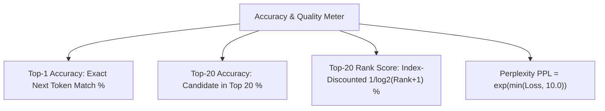

# 💾 Evaluation & Checkpoint Lifecycle

The system incorporates rigorous multi-metric evaluation and an automated multi-file checkpoint bundle manager with baseline loss validation and stale checkpoint purging.

---

## 📊 Real-Time Accuracy Metrics



---

## 📦 Multi-File Milestone Checkpoint Bundles

Whenever the model achieves a quality loss milestone ($\mathcal{L} \le 5.2$), a self-contained bundle directory is created under `checkpoints/`:

```
checkpoints/milestone_step_0100_loss_4.85/
├── model_weights.bin     (Raw binary IEEE-754 float weights)
├── metadata.txt          (Step index, Loss, Top-1 Acc, Rank Score, Parameter counts)
├── vocab.txt             (BPE token dictionary and learned subword rules)
└── sample_generation.txt (Text generated at this exact training milestone)
```

---

## 🧹 Automated Failsafe Purging

Every 20 steps, the trainer scans the `checkpoints/` directory and removes any bundle whose loss exceeds:
$$\text{Threshold} = \min(\text{Loss}) \cdot 1.15$$
This prevents disk saturation while retaining only the highest-quality historical models.

---

## 🔗 Related Notes
- [[04 - Ring 3 (Data & Training Pipelines)/LLMTrainer Architecture|LLMTrainer Architecture]]
- [[03 - Ring 2 (Models & Transformers)/TransformerLM Decoder (GQA + SwiGLU + RoPE)|TransformerLM Decoder]]
- [[Index|Return to Index]]
