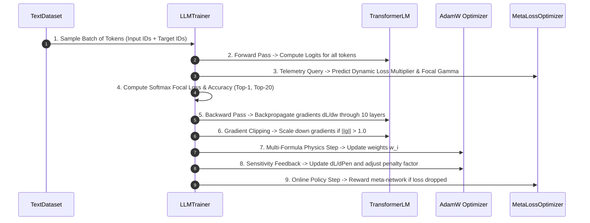

# 🚀 LLMTrainer Architecture & Dynamic Schedules

The `ring3::LLMTrainer` is the central orchestration engine of the entire training system. It coordinates batch sampling, forward evaluation, loss derivative pyramids, backward backpropagation, gradient clipping, dynamic learning rate scaling, and parameter physics updates.

---

## 📋 Prerequisites

Before reading this, you should be comfortable with:
- **Mini-batch SGD training loop** — the classical forward → loss → backward → optimizer.step() flow
- **Warmup + cosine LR schedule** — the baseline this class extends
- **Cross-entropy loss + softmax** at the token level
- [[03 - Ring 2 (Models & Transformers)/TransformerLM Decoder (GQA + SwiGLU + RoPE)|TransformerLM Decoder]] — the model being trained
- [[02 - Ring 1 (Layers & Advanced Optimizers)/AdamW, Fisher Metric & Nesterov|AdamW]] — the optimizer being driven
- [[04 - Ring 3 (Data & Training Pipelines)/Progressive Curriculum & Horizon Growth|Progressive Curriculum & Horizon Growth]] — how dataset / depth / context grow across the run
- [[02 - Ring 1 (Layers & Advanced Optimizers)/Training Stability & Fast-Start Descent|Training Stability & Fast-Start Descent]] — the spike-skip and watchdog logic that live in this class
- [[04 - Ring 3 (Data & Training Pipelines)/Debug Log Format & Reading Guide|Debug Log Format]] — the per-step block the trainer writes
- Optional: [[01 - Ring 0 (Core Math & Hardware)/Taylor Loss-Trajectory Predictor|Taylor Predictor]] & [[02 - Ring 1 (Layers & Advanced Optimizers)/Meta-Neural Loss & Step Optimizer|Meta-Loss Network]] — two adaptive controllers this class integrates

---

## 🎓 Beginner-Friendly Learning Guide: How a Training Step Works

### The Cyclical Feedback Loop of Deep Learning
Every single training step follows 5 fundamental phases:



---

## ⚡ The Dynamic Learning Rate Formula

In standard training, learning rate is a simple fixed line. In RingWrapper, the applied learning rate is the product of **4 specialized dynamic controls**:

$$\alpha_{\text{applied}}(t) = \alpha_{\text{scheduled}}(t) \cdot \text{Shrink}(t) \cdot \text{SurgeGain}(t) \cdot \mathcal{M}_{\mathcal{L}}(t)$$

| Component | What it Does in Plain English | Why It's Necessary |
| :--- | :--- | :--- |
| **$\alpha_{\text{scheduled}}(t)$** | Cosine decay with linear warmup ($5\%$ of steps). | Smoothly ramps up from $0.0$, reaches peak LR, and smoothly descends towards $0.0001$. |
| **$\text{Shrink}(t)$** | Compares short-window loss EMA vs long-window loss EMA. | If the short-term loss suddenly spikes above long-term loss, it **instantly cuts LR by up to $80\%$** to prevent divergence! |
| **$\text{SurgeGain}(t)$** | Detects sustained loss reduction ($\Delta \mathcal{L} < -0.01$). | When the model finds a steep downhill gradient, it **surges LR up to $2.0\times$** to speed through easy learning phases. |
| **$\mathcal{M}_{\mathcal{L}}(t)$** | Predicted online by `MetaLossOptimizer` ($0.2\times$ to $4.0\times$). | Dynamically shapes gradient scale based on real-time optimization curvature and entropy. |

---

## 💻 Deep Code Breakdown

Located in `src/ring3/llm_trainer.cpp`:

```cpp
LLMStepMetrics LLMTrainer::train_step(const TextBatch& batch, bool compute_detailed_metrics) {
    size_t total_tokens = batch.input_ids.size();
    size_t V = model.config.vocab_size;

    // 1. Forward Pass
    Matrix logits = model.forward(batch.input_ids);

    // 2. Query Meta-Neural Optimizer Network
    MetaLossTelemetry telemetry;
    telemetry.current_loss = ema_initialized ? ema_loss_short : 5.0f;
    telemetry.delta_loss = ema_initialized ? (ema_loss_short - ema_loss_long) : 0.0f;
    telemetry.accel_loss = ema_initialized ? (ema_loss_short - initial_loss) : 0.0f;
    telemetry.d_loss_d_penalty = optimizer.ema_d_loss_d_penalty;
    telemetry.learning_rate = optimizer.get_learning_rate();

    MetaOptimizationOutput meta_out = meta_loss_opt.predict(telemetry);

    // 3. Loss & Analytical Focal Gradient Computation
    Matrix grad_logits(total_tokens, V);
    float total_loss = 0.0f;
    float total_z_loss = 0.0f;
    size_t correct_top1 = 0;
    size_t correct_top20 = 0;
    float total_rank_score = 0.0f;

    // Parallel Softmax Cross-Entropy loop across all batch tokens
    #pragma omp parallel for reduction(+:total_loss, total_z_loss, correct_top1, correct_top20, total_rank_score) schedule(static)
    for (int i_idx = 0; i_idx < static_cast<int>(total_tokens); ++i_idx) {
        // [Softmax, Log-sum-exp, Focal Loss, Top-20 Accuracy computation...]
    }

    float avg_loss = (total_loss + total_z_loss) / static_cast<float>(total_tokens);

    // 4. Update Meta-Neural Loss Network via Online Policy Gradient
    if (config.enable_meta_loss_opt) {
        meta_loss_opt.update_online(avg_loss);
    }

    // 5. Backward Pass: Backpropagate through all 10 Transformer Blocks
    model.backward(grad_logits);

    // 6. Global Gradient Norm L2 Clipping (Prevents exploding gradients)
    if (config.max_grad_norm > 0.0f) {
        model.clip_grad_norm(config.max_grad_norm);
    }

    // 7. Optimizer Parameter Physics Update (Dispatches to Formulas 1-4)
    optimizer.config.enable_multi_formula = config.enable_multi_formula_opt;
    model.update_parameters(optimizer);

    return LLMStepMetrics{
        optimizer.timestep, avg_loss, exp(min(avg_loss, 10.0f)),
        (100.0f * correct_top1) / total_tokens,
        (100.0f * correct_top20) / total_tokens,
        (100.0f * total_rank_score) / total_tokens,
        optimizer.get_learning_rate(), current_seq_len,
        optimizer.penalty_factor, optimizer.ema_d_loss_d_penalty,
        meta_out.loss_scale_multiplier, meta_out.dynamic_focal_gamma
    };
}
```

#### 🔍 Line-by-Line Beginner Breakdown of `train_step`:
- `Matrix logits = model.forward(batch.input_ids);`: Runs the input token IDs through all transformer blocks to compute raw unnormalized vocabulary predictions.
- `MetaOptimizationOutput meta_out = meta_loss_opt.predict(telemetry);`: Feeds real-time telemetry (loss derivatives, entropy, learning rate) into the online Meta-Loss network to receive adaptive scaling multipliers.
- `#pragma omp parallel for reduction(...)`: An OpenMP multi-threaded parallel loop that computes Cross-Entropy and Top-1 / Top-20 prediction accuracy across all tokens in the batch simultaneously.
- `model.backward(grad_logits);`: Backpropagates the loss gradients backwards from the output head down through all 10 layers using the mathematical chain rule.
- `model.clip_grad_norm(config.max_grad_norm);`: Checks if the total gradient Euclidean length $\|g\|_2$ exceeds $0.65$; if so, scales all gradients down to prevent explosive updates.
- `model.update_parameters(optimizer);`: Applies the chosen weight physics formula (Natural Grad, Nesterov, AdamW, or Sparse Decay) to every parameter tensor in the model.

---

## 🔮 Foresight Hooks in `train_step` & the Training Loop

The trainer holds a `ring0::TaylorTrajectoryPredictor loss_forecaster` and calls it once per step on the loss history. The resulting `last_forecast` wires into four places:

```cpp
// Inside train_step, before/around the meta-network query:
last_forecast = loss_forecaster.observe(ring0::Loss::loss_history);

telemetry.predicted_delta      = last_forecast.pred_delta[0];
telemetry.predicted_net        = last_forecast.predicted[K-1] - last_forecast.diffs[0];
telemetry.trajectory_reward    = last_forecast.reward;
telemetry.trajectory_confidence= last_forecast.confidence;

// Anticipatory shaping — act BEFORE the loss moves (predictive Armijo):
optimizer.penalty_factor      += 0.10f * last_forecast.penalty_foresight;   // pre-empt spikes
optimizer.config.lr           *= last_forecast.lr_foresight_scale;          // bolder into descent
optimizer.config.curvature_scale *= last_forecast.curvature_foresight;      // damp oscillation

// Meta-policy trained on the predicted PATH, not just the last step:
meta_loss_opt.update_online(avg_loss, last_forecast.reward, /*foresight_weight=*/0.5f);
```

#### 🔍 Line-by-Line Beginner Breakdown of Foresight Hooks:
- `loss_forecaster.observe(...)`: Fits an $n$-th order Taylor polynomial to recent loss values to estimate forward trajectory derivatives.
- `telemetry.predicted_delta = last_forecast.pred_delta[0];`: The forecast loss change between step $t$ and step $t+1$.
- `optimizer.penalty_factor += 0.10f * ...`: If the Taylor polynomial anticipates an upcoming upward loss surge, pre-emptively increases the penalty factor to brake the model before the spike occurs.
- `meta_loss_opt.update_online(...)`: Trains the meta-policy network by rewarding it when it creates a smooth, downward multi-step path.

---

## 🌱 Dynamic Neurogenesis: Two Triggers

Capacity is injected (`model.expand_capacity(1.4)`) under **two** independent conditions, because they cover different failure modes:

1. **Loss-drop trigger (original).** When `ema_loss_short < last_expansion_loss × 0.8` — the model just earned a 20% improvement, so reward it with more capacity to keep going. *Problem:* this **never fires on a plateau**, which is exactly when the model is most starved.

2. **Pruning-saturation trigger (forced).** The [[02 - Ring 1 (Layers & Advanced Optimizers)/4-Formula Dynamic Weight Physics|4-Formula optimizer]] routes low-importance weights through **Formula 4 (inertial sparse decay / pruning)**. When `pct_f4() ≥ 85%` for a sustained window (`f4_saturation_window = 100` consecutive steps), the model has collapsed most of its weights into the pruning path — a clear signal it is out of usable capacity. This **forces** a growth event even though the loss is flat:

```cpp
if (optimizer.last_formula_stats.pct_f4() >= 85.0f) f4_saturation_streak++;
else                                                f4_saturation_streak = 0;

if (f4_saturation_streak >= 100 && expansion_count < max_expansions) {
    cout << "  >> [Forced Neurogenesis] F4 (pruning) held ≥85% for "
         << f4_saturation_streak << " steps → injecting capacity.\n";
    model.expand_capacity(1.4);
    f4_saturation_streak = 0;
}
```

#### 🔍 Line-by-Line Beginner Breakdown of Forced Neurogenesis:
- `pct_f4() >= 85.0f`: Checks if $\ge 85\%$ of all weights in the network are currently routed to Formula 4 (noise pruning).
- `f4_saturation_streak++`: Counts consecutive steps spent in this pruned saturation state.
- `if (f4_saturation_streak >= 100)`: If the model remains starved of usable capacity for 100 consecutive steps, automatically triggers neurogenesis.
- `model.expand_capacity(1.4);`: Enlarges hidden feature channels and embedding dimensions by $1.4\times$ ($+40\%$ more neurons) non-destructively, rescuing the network from plateau starvation.

> **Intuition:** trigger #1 grows a model that's *winning*; trigger #2 rescues a model that's *stuck*. Together they keep the network from either starving on a plateau or freezing under its own pruning.

---

## 🔗 Related Notes
- [[01 - Ring 0 (Core Math & Hardware)/Taylor Loss-Trajectory Predictor|Taylor Loss-Trajectory Predictor (nth-Order Foresight)]]
- [[02 - Ring 1 (Layers & Advanced Optimizers)/Meta-Neural Loss & Step Optimizer|Meta-Neural Loss Optimizer]]
- [[02 - Ring 1 (Layers & Advanced Optimizers)/4-Formula Dynamic Weight Physics|4-Formula Dynamic Weight Physics]]
- [[04 - Ring 3 (Data & Training Pipelines)/Progressive Curriculum & Horizon Growth|Progressive Curriculum & Horizon Growth]]
- [[Index|Return to Master Index]]
