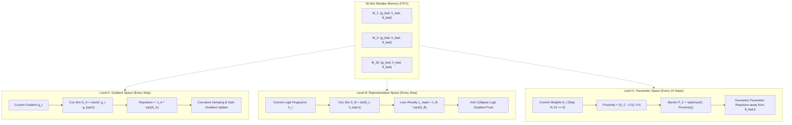

# 🛡️ Tri-Level Mistake Checkpoint Memory & Repulsion Engine

> **Ring Level**: Ring 3 (`ring3::LLMTrainer`) & Ring 2 (`ring2::TransformerLM`)
> **Prerequisites**: [[04 - Ring 3 (Data & Training Pipelines)/LLMTrainer Architecture|LLMTrainer Architecture]], [[02 - Ring 1 (Layers & Advanced Optimizers)/Training Stability & Fast-Start Descent|Training Stability & Fast-Start Descent]]
> **Source Files**: `include/ring3/llm_trainer.hpp`, `src/ring3/llm_trainer.cpp`, `src/ring2/transformer_lm.cpp`

---

## 🎯 Motivation: Why Memory of Past Mistakes Matters

During language model pre-training, catastrophic divergences rarely occur without warning. Instead, they typically follow recognizable geometric and kinetic trajectories:
1. Gradients suddenly concentrate in an unstable direction ($\|g\| > 3.0$).
2. The loss momentarily spikes above the moving average ($\mathcal{L} > \text{EMA} + 1.5$).
3. The optimizer surges dynamic learning rate into a high-curvature canyon, resulting in loss explosion.

Traditional optimizers treat every optimization step as memoryless Markovian transitions. If an aggressive learning rate step destabilizes the network at step 150, the optimizer might repeat the exact same mistake at step 320.

**Mistake Checkpoint Memory** provides a 30-slot episodic memory buffer storing triple-signatures (gradient direction, latent prediction distribution, parameter weight fingerprint) of the network immediately prior to or during major failures.

---

## 📐 The Mistake Data Structure (30 Slots FIFO)

The `MistakeCheckpoint` structure stores normalized signatures across all three operational spaces:

```cpp
struct MistakeCheckpoint {
    float loss = 0.0f;                   ///< Loss at failure step
    float ema_loss = 0.0f;               ///< Pre-spike baseline EMA loss
    float grad_norm = 0.0f;              ///< Gradient norm that triggered the failure
    float penalty = 0.0f;                ///< Active loss penalty factor
    float meta_scale = 0.0f;             ///< Meta-loss scale multiplier
    float gain = 1.0f;                   ///< Dynamic LR gain when mistake occurred
    size_t step = 0;                     ///< Step index
    std::vector<float> fingerprint;      ///< Level C: Compact model weight fingerprint
    std::vector<float> grad_signature;   ///< Level A: Normalized gradient direction signature
    std::vector<float> latent_signature; ///< Level B: Normalized representation/logit distribution signature
};
```

---

## 🏛️ Tri-Level Repulsion Architecture



---

## 🧮 The Mathematics: Square-Root Inverted Difference Metric

For any space with distance metric $d = \|\mathbf{x} - \mathbf{m}\|_2$ and danger threshold $R$, the **proximity** (the opposite of the difference) is:
$$\text{Proximity} = \max\left(0.0, \; 1.0 - \frac{d}{R}\right)$$

The repulsive barrier penalty applies a sub-linear **square root** curve:
$$\mathcal{P}_{\text{repel}} = \sqrt{\text{Proximity}} = \sqrt{\max(0.0, \; S)}$$

```
Penalty Curve: P(S) = sqrt(S)
1.0 | *
    |   *
    |     *
    |        *
    |            *
0.0 +----------------*---- (Distance d / Difference)
    0               R
```

### Why the Square Root $\sqrt{x}$ Outperforms Quadratic Penalties:
1. **Instant Boundary Stiffening**: Unlike quadratic penalties $(1 - d/R)^2$ that have near-zero derivative at the boundary, $\frac{d}{dx}\sqrt{x} = \frac{1}{2\sqrt{x}}$ has an **infinite derivative at $x \to 0$**.
2. **Early Steering Wall**: The moment the model even slightly grazes the danger radius, the repulsion immediately pushes the optimization trajectory away before weights fall into an unstable attractor basin.

---

## ⚙️ Operational Execution Details

| Level | Operational Space | Cadence | Formulation | Action Taken |
| :--- | :--- | :--- | :--- | :--- |
| **Level A** | Gradient Space | **Every step** | $\mathcal{P}_A = \sqrt{\max(0, \; \hat{g}_t \cdot \hat{g}_{\text{bad}})}$ | Damps curvature and orthogonalizes gradient away from bad direction. |
| **Level B** | Representation Space | **Every step** | $\mathcal{L}_{\text{repel}} = \lambda_B \sum \sqrt{\max(0, \; \hat{h}_t \cdot \hat{h}_{\text{bad}})}$ | Adds anti-collapse penalty directly to cross-entropy loss. |
| **Level C** | Parameter Space | **Every 10 steps** | $\mathcal{P}_C = \sqrt{\max\left(0, \; \frac{\hat{\theta}_t \cdot \hat{\theta}_{\text{bad}} - 0.5}{0.5}\right)}$ | Applies direct geometric parameter displacement away from failure basin. |

---

## 📊 Telemetry Dashboard Display

When mistakes are recorded, telemetry is surfaced directly on the console dashboard:
```
  [Mistake Memory]      Stored Checkpoints: 3 / 30 | State Similarity: 14.2%
```

This ensures full observability of the model's active avoidance of previously charted failure modes.
