# 📦 Progressive Curriculum, Horizon Growth & Fast-Track Depth

The curriculum learning engine in `ring3::LLMTrainer` employs **Three-Dimensional Progressive Expansion**:
1. **Dimension 1: Dataset Horizon** (5% focused slice $\to$ 100% full corpus)
2. **Dimension 2: Context Sequence Length** (32 tokens $\to$ 2048 tokens)
3. **Dimension 3: Model Depth** (4 layers $\to$ 10 layers)

---

## 🎓 Beginner-Friendly Learning Guide: The Schooling Analogy

### Why Training Everything at Once Fails
Imagine teaching a human child how to read and write:
- **The Wrong Way**: On day 1 of kindergarten, you hand the child an entire 1,000-page encyclopedia and force them to read 50 pages at a time. The child gets overwhelmed, confused by complex sentences, and learns nothing.
- **The Progressive Curriculum Way**:
  1. **Phase 1 (Kindergarten)**: Short vocabulary flashcards ($5\%$ data slice, $32$ token windows, $4$ simple layers). The child quickly masters basic spelling and common word connections.
  2. **Phase 2 (Middle School)**: Short stories ($25\%$ data, $128$ tokens, $6-8$ layers).
  3. **Phase 3 (University)**: Full technical books and complex multi-paragraph essays ($100\%$ corpus, $2048$ tokens, all $10$ deep layers).

---

## 📊 The 3D Growth Schedule

```mermaid
gantt
    title 3D Curriculum Timeline (Steps 1 to 300+)
    dateFormat X
    axisFormat %s

    section 1. Dataset Horizon
    5% Data (Master Basic Syntax)      :0, 40
    25% Data (Expanding Vocabulary)    :40, 100
    60% Data (Complex Sentence Flow)   :100, 200
    100% Full Corpus (Complete Domain) :200, 300

    section 2. Context Window
    32 Tokens (Local Word Bigrams)     :0, 30
    64 Tokens (Short Sentences)        :30, 80
    128 Tokens (Full Paragraphs)       :80, 150
    256 -> 2048 Tokens (Long Documents):150, 300

    section 3. Layer Depth
    4 Layers (Fast Early Flow)         :0, 15
    All 10 Layers (Plateau Breakout)   :15, 300
```



---

## 🚀 The Fast-Track Depth Unlock (Crushing the Plateau)

### What Happens at Step 15?
During the first 15 steps, training with only 4 active layers allows gradients to flow smoothly through the network without vanishing.

However, once basic token bigrams are learned, 4 layers lack the representational capacity to model complex cross-sentence logic, causing loss to stall near $4.5$.

At step 15 (or when loss crosses $3.8$), the engine triggers a **Fast-Track Depth Unlock**:
- Instantly activates layers $5, 6, 7, 8, 9, \text{and } 10$.
- Because layers 1-4 are already well-conditioned, the deep layers rapidly adapt, crushing the loss plateau down toward $2.0$!

---

## 💻 Deep Code Breakdown

Located in `src/ring3/llm_trainer.cpp`:

```cpp
// 1. Progressive Dataset Horizon Expansion
if (config.progressive_dataset_growth && current_dataset_ratio < 1.0f) {
    float target_ratio = current_dataset_ratio;

    // Loss-driven expansion triggers:
    if (ema_loss_short < 4.0f && current_dataset_ratio < 1.0f) {
        target_ratio = 1.0f;  // 100% full dataset!
    } else if (ema_loss_short < 4.8f && current_dataset_ratio < 0.60f) {
        target_ratio = 0.60f; // 60% of dataset
    } else if (ema_loss_short < 5.4f && current_dataset_ratio < 0.25f) {
        target_ratio = 0.25f; // 25% of dataset
    }

    // Step milestone failsafe triggers (prevents starving on long runs):
    if (step >= 200) target_ratio = std::max(target_ratio, 1.0f);
    else if (step >= 100) target_ratio = std::max(target_ratio, 0.50f);
    else if (step >= 40) target_ratio = std::max(target_ratio, 0.20f);

    if (target_ratio > current_dataset_ratio) {
        current_dataset_ratio = target_ratio;
        dataset.set_active_ratio(current_dataset_ratio);
        std::cout << "\n  📦 [Dataset Horizon] Expanding data slice to: " 
                  << (current_dataset_ratio * 100.0f) << "% (" 
                  << dataset.get_active_tokens() << " tokens)\n\n";
    }
}

// 2. Progressive Depth Growth & Fast-Track Depth Unlock
if (config.progressive_depth_growth) {
    size_t target_layers = config.initial_layers;
    
    // Fast-Track Plateau Breakout:
    if (rt_cfg.fast_track_depth_unlock && (step >= 15 || ema_loss_short >= 3.8f)) {
        target_layers = model.blocks.size(); // Unlock ALL 10 layers!
    } else if (step >= 500) {
        target_layers = model.blocks.size();
    } else if (step >= 200) {
        target_layers = std::min(model.blocks.size(), size_t(8));
    } else if (step >= 50) {
        target_layers = std::min(model.blocks.size(), size_t(6));
    }

    if (target_layers != model.num_active_layers) {
        model.set_active_layers(target_layers);
    }
}
```

---

## 🔗 Related Notes
- [[04 - Ring 3 (Data & Training Pipelines)/LLMTrainer Architecture|LLMTrainer Architecture]]
- [[04 - Ring 3 (Data & Training Pipelines)/Token Relevancy & Interpolated Parsing|Token Relevancy & Interpolated Parsing]]
- [[Index|Return to Master Index]]
