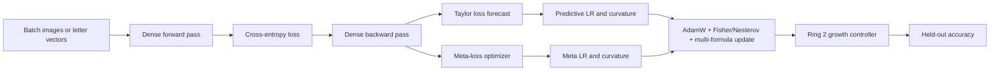

# Recognition Benchmarks: A-Z, MNIST & Fashion-MNIST

This note documents the current image and letter-recognition application in `src/main.cpp`. It is separate from the transformer language-model path: the recognizer uses fixed-size feature matrices, dense layers, labeled classification targets, and held-out accuracy.

## Datasets

| Benchmark | Input | Classes | Training data | Test data | Source |
|---|---:|---:|---:|---:|---|
| A-Z hard split | 35 values (5 x 7) | 26 | 40 noisy samples per letter | 10 independently seeded, more heavily corrupted samples per letter | `LetterDataset` |
| MNIST | 784 values (28 x 28) | 10 | Up to 10,000 IDX images | Up to 2,000 IDX images | `data/mnist/` |
| Fashion-MNIST | 784 values (28 x 28) | 10 | Up to 10,000 IDX images | Up to 2,000 IDX images | `data/fashion-mnist/` |

The A-Z test set is generated with a different random seed and stronger salt-and-pepper/Gaussian noise than the training set. It is therefore not the clean training set repeated at evaluation time.

The real image datasets use the IDX3 image and IDX1 label format:

```text
data/mnist/train-images.idx3-ubyte
data/mnist/train-labels.idx1-ubyte
data/mnist/t10k-images.idx3-ubyte
data/mnist/t10k-labels.idx1-ubyte

data/fashion-mnist/train-images.idx3-ubyte
data/fashion-mnist/train-labels.idx1-ubyte
data/fashion-mnist/t10k-images.idx3-ubyte
data/fashion-mnist/t10k-labels.idx1-ubyte
```

`MnistDataset` validates the IDX magic numbers, dimensions, image/label counts, and normalizes pixels from `[0, 255]` to `[0, 1]`.

## Model

Each benchmark uses the same feed-forward recognition shape for its input size:

```text
Input -> Dense(64 or 128, ReLU) -> Dense(class_count, linear logits)
```

- A-Z: `35 -> 64 -> 26`
- MNIST/Fashion-MNIST: `784 -> 128 -> 10`
- Cross-entropy is computed from the final logits.
- Accuracy is top-1 class agreement against the one-hot label matrix.

## Adaptive Training Path

`ring3::RingTrainer` applies the recognition update through the same adaptive components used by the larger training stack where they are compatible with a dense classifier.



### Ring 0

- `Loss::compute()` and `Loss::gradient()` calculate classification loss and gradients.
- `TaylorTrajectoryPredictor` observes batch-loss history.
- Its forecast provides direct `lr_foresight_scale` and `curvature_foresight` signals.
- Gradient norm and variance are measured before the update.

### Ring 1

- `AdamW` owns parameter moments and applies updates to dense weights and biases.
- Fisher diagonal, Nesterov behavior, weight decay, and multi-formula routing remain active.
- `MetaLossOptimizer` consumes current loss, loss delta, acceleration, gradient variance, penalty sensitivity, and Taylor trajectory signals.
- The meta output supplies LR and curvature multipliers.
- Direct Taylor and meta signals are blended and clamped before AdamW receives them.

The effective controls are conceptually:

$$
\text{LR}_t = \text{base LR} \times \text{MetaLR}_t \times
\left((1-w) + w\,\text{TaylorLR}_t\right)
$$

$$
\text{Curvature}_t = \text{MetaCurvature}_t \times
\left((1-w) + w\,\text{TaylorCurvature}_t\right)
$$

where `w` is `TrainingConfig::taylor_forecast_weight`, currently set to `0.5` by the application.

### Ring 2

`NeuralNet` provides the dense classifier. The loss-guided `GrowthController` can expand the network when the epoch trajectory stalls. When structure changes, `RingTrainer` re-registers the changed tensors with AdamW so optimizer state matches parameter shapes.

### Ring 3

`RingTrainer` shuffles batches, performs forward/backward passes, updates adaptive state, and evaluates labels. The application prints the current meta and Taylor LR scales during progress output.

Transformer-only systems such as KV cache, BPE vocabulary management, causal attention, and Chrono's transformer attachments are intentionally not used for these fixed-vector classifiers.

## Running

From the repository root:

```powershell
cmake --build build --config Release --target nn_demo
.\build\Release\nn_demo.exe --letter A
```

`--letter` selects which noisy A-Z sample is rendered in the final tested-versus-guessed report. The image benchmarks run afterward when their `data/` folders exist.

## Output

The application reports:

- Epoch loss
- Held-out accuracy
- Meta LR multiplier
- Taylor LR multiplier
- Tested class and guessed class
- PASS/FAIL for the displayed sample
- Total elapsed time
- Training samples per second
- Parameter count

The displayed sample match is only one example. The held-out accuracy over the complete test matrix is the primary benchmark metric.

## Related Notes

- [[01 - Ring 0 (Core Math & Hardware)/Taylor Loss-Trajectory Predictor|Taylor Loss-Trajectory Predictor]]
- [[02 - Ring 1 (Layers & Advanced Optimizers)/Meta-Neural Loss & Step Optimizer|Meta-Neural Loss Optimizer]]
- [[02 - Ring 1 (Layers & Advanced Optimizers)/AdamW, Fisher Metric & Nesterov|AdamW, Fisher Metric & Nesterov]]
- [[04 - Ring 3 (Data & Training Pipelines)/LLMTrainer Architecture|LLMTrainer Architecture]]
- [[04 - Ring 3 (Data & Training Pipelines)/Real-Time Benchmark & Telemetry Dashboard|Benchmark & Telemetry Dashboard]]
- [[Index|Master Index]]
