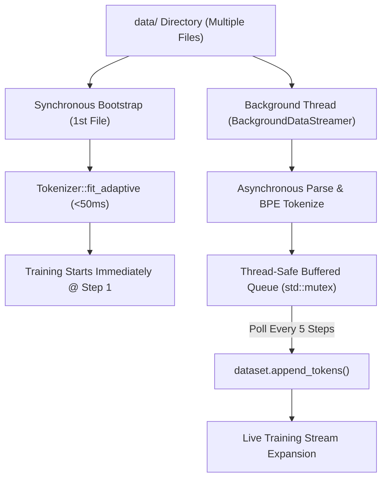
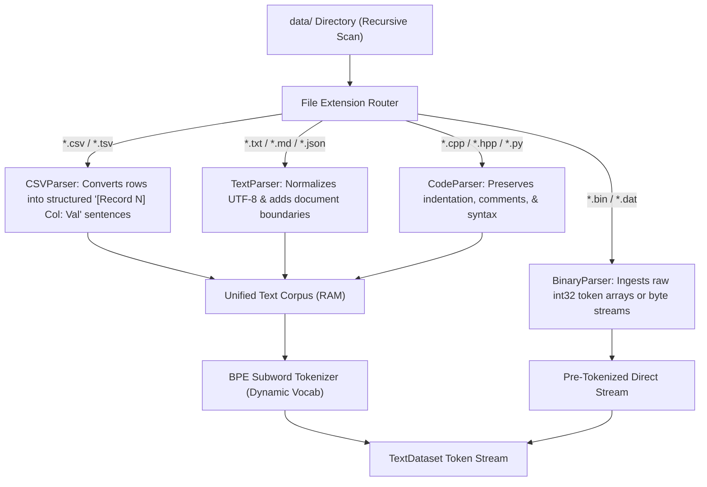

# 📂 Universal Multi-Format Data Ingestion (CSV, TXT, BIN, Code)

The `ring3::UniversalDataLoader` and `ring3::BackgroundDataStreamer` engines enable the neural network to automatically discover, parse, structure, and train on **any `.csv`, `.txt`, `.bin`, `.json`, `.md`, or `.cpp/.hpp` code files** placed inside the `data/` directory.

---

## 🎓 Beginner-Friendly Learning Guide: How Multi-Format Training Works

### The Data Ingestion Dilemma
In real-world deep learning, data comes in many different file formats:
- **Unstructured Text (`.txt`, `.md`)**: Books, articles, documentation, narrative stories.
- **Tabular Data (`.csv`, `.tsv`)**: Spreadsheets, databases, statistics (e.g. `Global_Education.csv`).
- **Source Code (`.cpp`, `.hpp`, `.py`)**: High-density syntax and algorithms.
- **Pre-Tokenized Binaries (`.bin`)**: Binary streams of 16-bit or 32-bit token IDs.

`UniversalDataLoader` scans the `data/` directory recursively and unifies all these heterogeneous data sources into a single rich training stream.

---

## ⚡ Asynchronous Background Data Streaming (`BackgroundDataStreamer`)

### Why Background Streaming?
Traditional data loaders read all files into memory synchronously at startup. If you have 500 MB of CSV tables and C++ source files, the user would wait 30 seconds before step 1 even begins!

With `BackgroundDataStreamer`:
1. **Instant Bootstrap Start (<50ms)**: The loader reads only the first $N$ bootstrap files (e.g. `initial_bootstrap_data_files = 1`).
2. **Tokenizer Dynamic Calibration**: `Tokenizer::fit_adaptive` determines initial BPE merges from the bootstrap sample immediately.
3. **Concurrent Background Thread**: A background worker thread (`std::thread`) discovers, reads, parses, and tokenizes all remaining files in `data/` asynchronously without stealing time from training.
4. **Periodic Token Ingestion**: Every 5 steps, `LLMTrainer` polls `streamer.poll_and_append(dataset)`, dynamically expanding `dataset.token_stream` in RAM.



---

## 📊 Ingestion Pipeline Architecture



---

## 🔬 How Tabular CSV Ingestion Works

Standard language models cannot easily parse raw comma-separated values (`"Canada,99.0,95.2"`) because commas lack semantic context.

`UniversalDataLoader::parse_csv_to_text` reads column headers and transforms each row into an explicit natural language record:

```
=== [Tabular Dataset: data/Global_Education.csv | Columns: 5] ===
[Record 1] Countries: Canada | Youth_Literacy_Rate: 99.0% | Primary_Enrollment: 98.4% | Tertiary_Enrollment: 72.1%
[Record 2] Countries: Germany | Youth_Literacy_Rate: 99.5% | Primary_Enrollment: 99.1% | Tertiary_Enrollment: 70.3%
[Record 3] Countries: Japan | Youth_Literacy_Rate: 99.9% | Primary_Enrollment: 99.8% | Tertiary_Enrollment: 82.5%
```

> [!TIP]
> **Why this helps**: The transformer learns statistical correlations directly in English (e.g., that higher enrollment correlates with higher literacy rates).

---

## 💻 Deep Code Breakdown

### 1. `BackgroundDataStreamer::start()` and Background Tokenizer:

Located in `src/ring3/data_loader.cpp`:

```cpp
void BackgroundDataStreamer::start() {
    if (is_running.load() || all_done.load()) return;
    is_running.store(true);

    worker_thread = std::thread([this]() {
        while (is_running.load() && current_file_index < pending_files.size()) {
            std::string fpath = pending_files[current_file_index++];
            std::string ext = std::filesystem::path(fpath).extension().string();
            std::transform(ext.begin(), ext.end(), ext.begin(), ::tolower);

            std::string file_text;
            std::vector<int> file_tokens;

            if (ext == ".csv" || ext == ".tsv") {
                file_text = UniversalDataLoader::parse_csv_to_text(fpath);
            } else if (ext == ".bin") {
                UniversalDataLoader::parse_bin_file(fpath, file_text, file_tokens);
            } else {
                file_text = UniversalDataLoader::read_text_file(fpath);
            }

            if (!file_text.empty() && tokenizer_ref) {
                std::vector<int> encoded = tokenizer_ref->encode(file_text);
                file_tokens.insert(file_tokens.end(), encoded.begin(), encoded.end());
            }

            if (!file_tokens.empty()) {
                std::lock_guard<std::mutex> lock(stream_mutex);
                buffered_tokens.insert(buffered_tokens.end(), file_tokens.begin(), file_tokens.end());
                total_streamed_tokens += file_tokens.size();
                total_streamed_files++;
            }

            std::this_thread::sleep_for(std::chrono::milliseconds(25));
        }
        all_done.store(true);
        is_running.store(false);
    });
}
```

### 2. Thread-Safe Polling & Ingestion in `LLMTrainer::train()`:

```cpp
// Periodic poll from background token queue into active dataset
if (background_streamer && (step % ring0::get_config().background_stream_poll_interval == 0)) {
    size_t new_toks = background_streamer->poll_and_append(dataset);
    if (new_toks > 0) {
        cout << "\n  📡 [Background Streamer @ step " << step << "] Ingested +"
             << new_toks << " new tokens from disk in background (Total active: "
             << dataset.token_stream.size() << " tokens)\n";
    }
}
```

---

## 🎯 Verification & Telemetry Summary

When running `nn_demo.exe`:
```
  📡 [Asynchronous Background Data Streamer Initialized]
     • Bootstrap Files Loaded: 1 files (685 initial chars)
     • Background Streaming Queue: 6 files remaining to stream concurrently

  [Concurrent Subsystems] Chrono Engine: ACTIVE (517 ticks) | Background Streamed: 728,156 tokens
  📡 [Background Streamer @ step 5] Ingested +728,156 new tokens from disk in background (Total active: 991,638 tokens)
```
