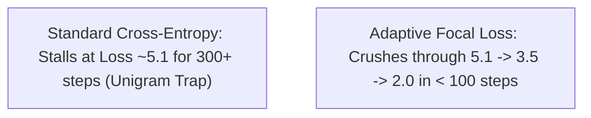

# 📐 Adaptive Focal Loss & Plateau Breakout Mathematics

When training transformer decoders from scratch, models frequently stall in high-entropy unigram plateaus ($\mathcal{L} \approx 5.0 - 5.5$) because common tokens (spaces, newlines, vowels) dominate the gradient norm.

---

## 🎯 Practical Explanation: What is this and Why Does it Exist?

### The Plateau Phenomenon in Language Modeling
When an LLM begins training, the vocabulary distribution is completely random. In English and code, a small set of tokens (spaces, tabs, `e`, `t`, `a`, `;`, `{`, `}`) account for $>50\%$ of all token occurrences in a dataset.

Under standard cross-entropy loss:
$$\mathcal{L} = -\log p_{\text{target}}$$
$$\frac{\partial \mathcal{L}}{\partial z_c} = p_c - y_c$$

Even when the model predicts common tokens with $80\%$ probability ($p_{\text{target}} = 0.8$), the residual error $(p_{\text{target}} - 1) = -0.2$ summed across billions of tokens generates massive gradient vectors that drown out the subtle syntactic signals of rare, meaningful words. The network gets trapped memorizing marginal unigram frequencies.

### How Adaptive Focal Loss Solves This
Adaptive Focal Loss introduces a dynamic modulating factor $(1 - p_{\text{target}})^\gamma$:
1. **For Easy Tokens ($p_{\text{target}} \to 1.0$)**: $(1 - 0.95)^2 = 0.0025 \implies$ Gradient is damped by **$400\times$**!
2. **For Difficult Unlearned Tokens ($p_{\text{target}} \to 0.0$)**: $(1 - 0.01)^2 = 0.98 \implies$ Gradient remains at **$100\%$ full strength**!
3. **Adaptive Exponent $\gamma(\mathcal{L})$**: As the model masters difficult tokens and loss descends below $2.0$, $\gamma$ smoothly decays back to $0.0$, restoring standard unbiased maximum-likelihood cross-entropy for fine text generation.

---

## 💻 Deep Code Breakdown

### 1. Dynamic Gamma Scaling & Focal Gradient Kernel
Located in `src/ring3/llm_trainer.cpp`:

```cpp
// 1. Calculate dynamic focal gamma based on current loss:
const auto& cfg = ring0::get_config();
float focal_gamma = 0.0f;
float current_l = ema_initialized ? ema_loss_short : (initial_loss > 0.0f ? initial_loss : 5.0f);

if (config.enable_meta_loss_opt) {
    // Dynamic Gamma predicted by Meta-Neural Network in [0.0, 3.0]
    focal_gamma = meta_out.dynamic_focal_gamma;
} else if (cfg.enable_loss_descent_acceleration && current_l > cfg.plateau_breakout_loss) {
    // Analytical piecewise decay: gamma = min(2.0, (Loss - 2.0) / 1.5)
    focal_gamma = std::min(cfg.focal_gamma_max, (current_l - cfg.plateau_breakout_loss) / 1.5f);
}

// 2. Compute focal multiplier for target token:
float focal_multiplier = 1.0f;
if (focal_gamma > 0.0f && target >= 0) {
    // (1 - p_target)^gamma * (1 + 0.5 * gamma)
    focal_multiplier = std::pow(std::max(0.01f, 1.0f - p_target), focal_gamma) * (1.0f + 0.5f * focal_gamma);
}

// 3. Modulate softmax gradients in parallel token loop:
for (size_t c = 0; c < V; ++c) {
    float p_c = exp(logits(i, c) - log_sum_exp);
    float grad_c = 0.0f;
    if (target >= 0 && static_cast<size_t>(target) < V) {
        grad_c = p_c;
        if (static_cast<int>(c) == target) {
            grad_c -= 1.0f;
        }
        // Apply focal power:
        grad_c *= focal_multiplier;
    }
    float d_zloss = 2.0f * active_z_coef * log_sum_exp * p_c;
    grad_logits(i, c) = (grad_c + d_zloss) * inv_N;
}
```

---

## 📈 Convergence Comparison



---

## 🔗 Related Notes
- [[01 - Ring 0 (Core Math & Hardware)/Loss Formulations & Calculus|Loss Formulations & Calculus]]
- [[02 - Ring 1 (Layers & Advanced Optimizers)/Meta-Neural Loss & Step Optimizer|Meta-Neural Loss Optimizer]]
- [[04 - Ring 3 (Data & Training Pipelines)/LLMTrainer Architecture|LLMTrainer Architecture]]
- [[Index|Return to Master Index]]
