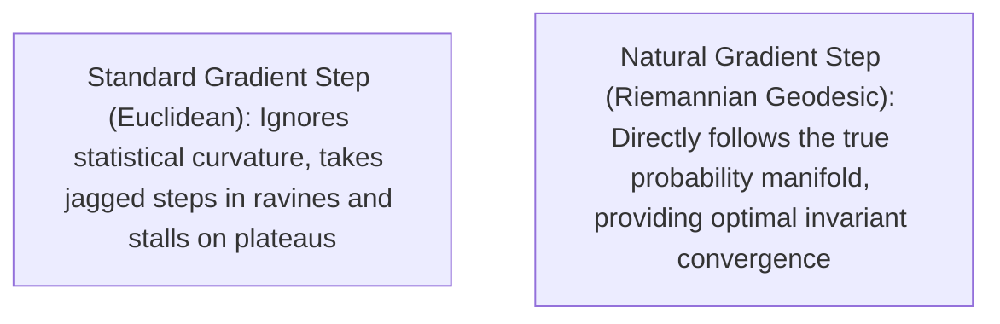

# 📐 Riemannian Manifolds, Natural Gradients & Information Geometry

Standard deep learning algorithms (like standard SGD) assume the parameter space is **flat Euclidean space** (like a sheet of graph paper). In reality, neural networks output probability distributions, which live on a curved **Riemannian statistical manifold**.

---

## 🎓 Beginner-Friendly Learning Guide: What is Information Geometry?

### The Euclidean Distance Fallacy (The Lightbulb Analogy)
Imagine you have two simple 1-parameter models:
- **Model A**: Predicts probabilities $\mathbf{p} = [0.50, 0.50]$ (a fair coin). If parameter $\theta$ changes by $+0.1$, the probabilities shift to $[0.55, 0.45]$. This is a small, subtle change in output behavior.
- **Model B**: Predicts probabilities $\mathbf{p} = [0.9999, 0.0001]$ (an almost certain coin). If parameter $\theta$ changes by the **exact same $+0.1$**, the probabilities shift to $[0.90, 0.10]$! This completely destroys the model's certainty, changing the probability of the rare event by **$1,000\times$**!

> [!CAUTION]
> **The Problem with Standard Gradients**: Euclidean distance $\|\Delta \boldsymbol{\theta}\|_2 = 0.1$ says both changes were identical. But in probability space, Model B underwent a massive catastrophic shock!

---

## 🌐 The Fisher Information Metric (The True Distance on Manifolds)

To measure the true behavioral distance between two neural networks, we must use **Kullback-Leibler (KL) Divergence**:
$$D_{\text{KL}}(p_{\boldsymbol{\theta}} \,\|\, p_{\boldsymbol{\theta} + d\boldsymbol{\theta}}) \ge 0$$

Taking the second-order Taylor expansion of KL-divergence reveals the local **Riemannian Metric Tensor** $\mathbf{F}(\boldsymbol{\theta})$, called the **Fisher Information Matrix (FIM)**:

$$ds^2 = 2 \cdot D_{\text{KL}}(p_{\boldsymbol{\theta}} \,\|\, p_{\boldsymbol{\theta} + d\boldsymbol{\theta}}) \approx d\boldsymbol{\theta}^\top \mathbf{F}(\boldsymbol{\theta}) \, d\boldsymbol{\theta}$$

Where $\mathbf{F}(\boldsymbol{\theta})$ is the expectation of the outer product of log-likelihood gradients:
$$\mathbf{F}(\boldsymbol{\theta}) = \mathbb{E}_{x \sim p_{\boldsymbol{\theta}}}\left[ \nabla_{\boldsymbol{\theta}} \log p_{\boldsymbol{\theta}}(x) \cdot \nabla_{\boldsymbol{\theta}} \log p_{\boldsymbol{\theta}}(x)^\top \right]$$

---

## ⚡ Natural Gradient Descent (The Shortest Path on a Sphere)

Instead of stepping in the Euclidean direction $-\nabla \mathcal{L}$, **Natural Gradient Descent** steps along the **geodesic** (the shortest curve on the statistical manifold):

$$\tilde{\nabla}_{\boldsymbol{\theta}} \mathcal{L} = \mathbf{F}(\boldsymbol{\theta})^{-1} \nabla_{\boldsymbol{\theta}} \mathcal{L}$$

---

## 🔬 How Formula 1 in RingWrapper Approximates Natural Gradients

Computing the full $D \times D$ Fisher matrix for a 100,000-parameter transformer would require a $100,000 \times 100,000$ matrix ($40\text{ GB}$ of RAM), which is too expensive.

Instead, RingWrapper's **Formula 1 (`MultiFormulaKernel`)** computes the **Empirical Diagonal Fisher Metric** $\hat{F}_{ii}$ in $O(N)$ linear time:

$$\hat{F}_{ii}^{(t)} = \beta_2 \hat{F}_{ii}^{(t-1)} + (1 - \beta_2) (g_i^2)$$
$$\Delta w_i = \frac{\alpha}{\frac{1}{2}\sqrt{\hat{v}_i} + \frac{1}{2}\sqrt{\hat{F}_{ii}} + \epsilon} \cdot \left(\beta_1 \hat{m}_i + (1 - \beta_1) \frac{g_i}{1 - \beta_1^t}\right)$$

### Physical Meaning of this Formula:
- If a weight is in a high-curvature region (high Fisher score $F_{ii}$), the denominator automatically dampens the step to prevent catastrophic forgetting.
- If a weight is in a flat, safe valley (low Fisher score), the denominator allows larger steps to accelerate learning.

---

## 🔗 Related Notes
- [[02 - Ring 1 (Layers & Advanced Optimizers)/4-Formula Dynamic Weight Physics|4-Formula Dynamic Weight Physics]]
- [[02 - Ring 1 (Layers & Advanced Optimizers)/AdamW, Fisher Metric & Nesterov|AdamW, Fisher Metric & Nesterov]]
- [[02 - Ring 1 (Layers & Advanced Optimizers)/Meta-Neural Loss & Step Optimizer|Meta-Neural Loss Optimizer]]
- [[Index|Return to Master Index]]
