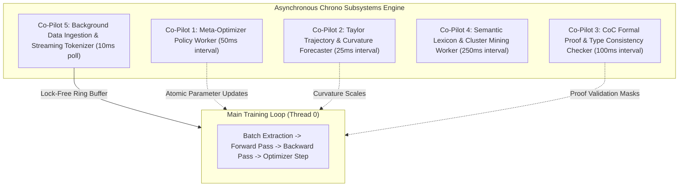

# ⚡ Asynchronous Chrono Co-Pilots & Background Streaming

This guide explains the multi-threaded concurrent architecture implemented in Ring 3 (`include/ring3/chrono_scheduler.hpp`, `src/ring3/chrono_scheduler.cpp`, and `src/ring3/universal_data_ingestion.cpp`).

---

## 💡 In Plain English

The main training loop should never stop to do laundry. So we run five little helper threads *alongside* it — each on its own timer — that handle the slow chores: reading files, tokenizing text, running the meta-network's policy update, forecasting where the loss curve is going, verifying formal-logic type checks, mining semantic clusters. The main thread just checks a mailbox at the start of each step and applies whatever recommendations the helpers dropped off. Nothing blocks, nothing waits — the main compute stays saturated on matrix math while everything else happens in the background.

**Real-world analogy:** an F1 driver stays on the track while the pit crew watches telemetry, forecasts weather, and prepares fresh tires — none of which pauses the race.

---

## 🧭 Concurrency Architecture

---

## 1. The 5 Chrono Background Co-Pilots

| Thread ID | Subsystem Name | Cadence (ms) | Responsibility & Non-Blocking Action |
| :--- | :--- | :--- | :--- |
| **Co-Pilot 1** | `Meta-Optimizer Policy Worker` | $50\text{ ms}$ | Evaluates trailing loss derivatives and runs forward/backward passes on the 3-layer Meta-Loss Neural Network to update $\gamma$, $\text{loss\_scale}$, and $\text{lr\_mod}$. |
| **Co-Pilot 2** | `Taylor Trajectory Forecaster` | $25\text{ ms}$ | Extrapolates Newton–Gregory polynomial trajectory of loss curve and computes Rayleigh curvature quotient $\kappa_R$. |
| **Co-Pilot 3** | `CoC Proof Consistency Checker` | $100\text{ ms}$ | Normalizes lambda terms and verifies universe levels ($\text{Prop} : \text{Type}_0 : \text{Type}_1$) for recent thought vectors. |
| **Co-Pilot 4** | `Semantic Cluster Miner` | $250\text{ ms}$ | Clusters token embedding vectors using cosine similarity to discover synonym relationships and update semantic masks. |
| **Co-Pilot 5** | `Data Streamer & Tokenizer` | $10\text{ ms}$ | Reads corpus files from disk (CSV, TXT, BIN), tokenizes text in chunks, and feeds token IDs into the main dataset ring buffer. |

---

## 2. Lock-Free Background Data Streaming Mechanics

When training on large datasets ($100\text{ MB} \sim 10\text{ GB}+$):
1. **Zero Training Stutter**: The main compute thread never halts to perform disk I/O or token string parsing.
2. **Chunked Streaming**: The streamer reads files in chunks ($64\text{ KB}$ buffer blocks).
3. **Atomic Append**: Parsed token IDs are placed into a thread-safe circular buffer. Every $N$ steps (`background_stream_poll_interval = 5`), the trainer drains available tokens from the queue into the active training tensor.

---

## 3. Thread Safety & Mutex Philosophy

- **Read-Heavy Shared State**: Telemetry metrics (loss, step, gradient norms) are accessed via atomic primitives or double-buffered snapshot copies to prevent mutex lock contention.
- **Write Isolation**: The background Co-Pilots only write to dedicated recommendation buffers (`suggested_lr_mod`, `curvature_scale`), which the main thread applies synchronously at the start of each step.

---

## 4. Observing the Co-Pilots in the Debug Log

Each co-pilot's recommendations show up in the per-step log lines it feeds:
- Co-Pilot 1 (meta-optimizer) → the `META` line (`scale`, `focal_gamma`, deltas).
- Co-Pilot 2 (Taylor forecaster) → the `TAYL` line (`pred_dL`, `pred_net`, `reward`, `conf`).
- Co-Pilot 3 (CoC proof checker) → the `coc_proof_score` / `coc_verified` metrics.
- Co-Pilot 4 (semantic cluster miner) → periodic `VOCAB` entries in the debug log.
- Co-Pilot 5 (data streamer) → visible as the corpus-size / active-token counters in the dashboard.

See [[04 - Ring 3 (Data & Training Pipelines)/Debug Log Format & Reading Guide|Debug Log Format]] for the full block schema.

---

## 5. When to Disable Them (Safe Mode)

`--safe-mode` in `main.cpp` turns off Co-Pilots 1–3 (meta, Taylor, CoC) because they are the experimental adaptive controllers most likely to destabilize training. Co-Pilots 4 (semantic mining) and 5 (data streaming) stay on — they only produce read-only recommendations and pull data.

---

## 🔗 Related Notes
- [[04 - Ring 3 (Data & Training Pipelines)/Concurrent Chrono Subsystems Engine|Concurrent Chrono Subsystems Engine]] — the primary implementation note in the main vault
- [[04 - Ring 3 (Data & Training Pipelines)/Universal Data Ingestion (CSV, TXT, BIN)|Universal Data Ingestion]] — what Co-Pilot 5 actually does
- [[02 - Ring 1 (Layers & Advanced Optimizers)/Meta-Neural Loss & Step Optimizer|Meta-Neural Loss Optimizer]] — Co-Pilot 1's payload
- [[01 - Ring 0 (Core Math & Hardware)/Taylor Loss-Trajectory Predictor|Taylor Loss-Trajectory Predictor]] — Co-Pilot 2's payload
- [[04 - Ring 3 (Data & Training Pipelines)/Debug Log Format & Reading Guide|Debug Log Format & Reading Guide]] — where the co-pilots' output appears per step
- [[Index|Return to Master Index]]
