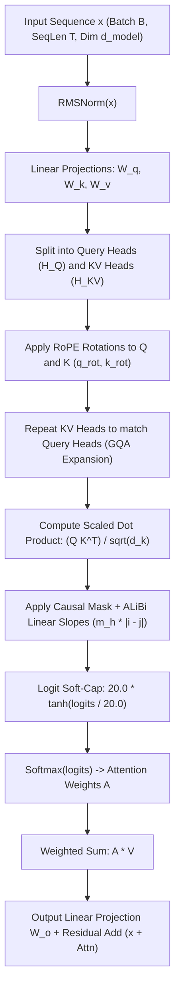

# 👁️ Attention Mechanics Visualized & Head Math Walkthrough

This guide provides a step-by-step mathematical and tensor dimension walkthrough of the **Grouped-Query Attention (GQA)**, **Rotary Position Embedding (RoPE)**, and **Attention with Linear Biases (ALiBi)** engine implemented in `include/ring1/attention.hpp` and `src/ring1/attention.cpp`.

---

## 🧭 Pipeline Overview

---

## 1. Concrete Dimension Example

Let us trace a batch through the exact default training dimensions:
- **Batch Size ($B$)**: $32$
- **Sequence Length ($T$)**: $64$
- **Model Dimension ($d_{\text{model}}$)**: $256$
- **Query Heads ($H_Q$)**: $8$
- **Key/Value Heads ($H_{KV}$)**: $2$ (Grouped-Query Attention with group size $G = \frac{8}{2} = 4$)
- **Head Dimension ($d_k = d_v$)**: $\frac{256}{8} = 32$
- **Feed-Forward Hidden Dimension ($d_{\text{ffn}}$)**: $512$

---

## 2. Step-by-Step Mathematical Walkthrough

### Step 1: Pre-Attention RMSNorm
Before projection, inputs are normalized to prevent activation scale drift:

$$\text{RMS}(x) = \sqrt{\frac{1}{d} \sum_{i=1}^d x_i^2 + \epsilon}$$

$$x_{\text{norm}} = \frac{x}{\text{RMS}(x)} \odot \gamma \quad \in \mathbb{R}^{B \times T \times 256}$$

where $\gamma \in \mathbb{R}^{256}$ is a learnable scaling vector initialized to $1.0$.

---

### Step 2: Linear Projections & Head Splitting
The normalized hidden state is projected into Query, Key, and Value subspaces:

$$\mathbf{Q} = x_{\text{norm}} W_q \quad \in \mathbb{R}^{B \times T \times (8 \times 32)} = \mathbb{R}^{32 \times 64 \times 256}$$

$$\mathbf{K} = x_{\text{norm}} W_k \quad \in \mathbb{R}^{B \times T \times (2 \times 32)} = \mathbb{R}^{32 \times 64 \times 64}$$

$$\mathbf{V} = x_{\text{norm}} W_v \quad \in \mathbb{R}^{B \times T \times (2 \times 32)} = \mathbb{R}^{32 \times 64 \times 64}$$

> [!TIP]
> **Why GQA Saves Memory**: Standard Multi-Head Attention (MHA) would allocate $8 \times 32 = 256$ dimensions for $K$ and $V$. By using $H_{KV} = 2$, the memory footprint of the autoregressive KV cache is **reduced by $75\%$ ($4\times$ smaller)**.

---

### Step 3: Rotary Position Embedding (RoPE)
For each query and key vector at token position $m \in [0, T-1]$, coordinate pairs are rotated in 2D planes:

$$\theta_i = 10000^{-2(i-1)/d_k} \quad \text{for } i \in \{1, 2, \dots, 16\}$$

$$\begin{pmatrix} q_{2i-1}' \\ q_{2i}' \end{pmatrix} = \begin{pmatrix} \cos(m \theta_i) & -\sin(m \theta_i) \\ \sin(m \theta_i) & \cos(m \theta_i) \end{pmatrix} \begin{pmatrix} q_{2i-1} \\ q_{2i} \end{pmatrix}$$

This endows the dot product $q_m^T k_n$ with relative distance awareness:

$$\langle \mathbf{R}_{\Theta, m} q_m, \mathbf{R}_{\Theta, n} k_n \rangle = g(q_m, k_n, m - n)$$

---

### Step 4: Grouped-Query Attention Expansion
Because there are $8$ Query heads but only $2$ KV heads, each KV head is shared across $4$ Query heads:
- Query Heads $0, 1, 2, 3 \longrightarrow$ attend to Key/Value Head $0$.
- Query Heads $4, 5, 6, 7 \longrightarrow$ attend to Key/Value Head $1$.

---

### Step 5: Scaled Dot-Product & ALiBi Falloff
For each query head $h \in [0, 7]$, the raw attention logits between token $i$ and token $j$ are:

$$\text{Logit}_{h}(i, j) = \frac{\mathbf{q}_{h, i} \cdot \mathbf{k}_{\text{group}(h), j}}{\sqrt{d_k}} - m_h \cdot |i - j| + \text{Mask}(i, j)$$

where:
- $\sqrt{d_k} = \sqrt{32} \approx 5.6568$.
- $m_h = 2^{-8 \cdot (h+1) / H}$ is the ALiBi geometric slope.
- $\text{Mask}(i, j) = 0$ if $j \le i$, and $-\infty$ if $j > i$ (strictly causal / autoregressive).

---

### Step 6: Logit Soft-Capping
To prevent extreme values from causing softmax saturation:

$$\text{Logit}_{\text{capped}} = 20.0 \cdot \tanh\left(\frac{\text{Logit}}{20.0}\right)$$

---

### Step 7: Softmax & Context Aggregation
$$\mathbf{A}_{h}(i, :) = \text{softmax}\left(\text{Logit}_{\text{capped}, h}(i, :)\right) \quad \in \mathbb{R}^{64}$$

$$\mathbf{O}_{h, i} = \sum_{j=1}^i \mathbf{A}_{h}(i, j) \cdot \mathbf{v}_{\text{group}(h), j} \quad \in \mathbb{R}^{32}$$

All 8 head outputs are concatenated into a single vector $\mathbf{O}_i \in \mathbb{R}^{256}$ and passed through the output projection:

$$\text{AttnOut} = \mathbf{O} \cdot W_o \quad \in \mathbb{R}^{32 \times 64 \times 256}$$

---

### Step 8: Residual Connection & SwiGLU FFN Block
$$\mathbf{x}_{\text{mid}} = \mathbf{x}_{\text{in}} + \text{AttnOut}$$

The intermediate state passes through a SwiGLU Feed-Forward Network:

$$\text{SwiGLU}(z) = \left( (z W_{\text{gate}}) \odot \text{SiLU}(z W_{\text{up}}) \right) W_{\text{down}}$$

$$\mathbf{x}_{\text{out}} = \mathbf{x}_{\text{mid}} + \text{SwiGLU}(\text{RMSNorm}(\mathbf{x}_{\text{mid}}))$$

---

## 3. Attention Summary Table

| Operation | Input Shape | Weights Shape | Output Shape | Primary Purpose |
| :--- | :--- | :--- | :--- | :--- |
| **RMSNorm** | $(32, 64, 256)$ | $\gamma \in \mathbb{R}^{256}$ | $(32, 64, 256)$ | Prevents activation scale explosion. |
| **$W_q$ Projection** | $(32, 64, 256)$ | $(256, 256)$ | $(32, 64, 8, 32)$ | Maps to 8 Query subspaces. |
| **$W_k, W_v$ Projection** | $(32, 64, 256)$ | $(256, 64)$ | $(32, 64, 2, 32)$ | Maps to 2 shared KV subspaces (GQA). |
| **RoPE Rotation** | $(32, 64, 8, 32)$ | Fixed Frequencies | $(32, 64, 8, 32)$ | Injects relative positional geometry. |
| **Attention Matrix** | $Q \in (8, 32), K \in (2, 32)$ | None | $(32, 8, 64, 64)$ | Computes all-pairs causal relevance. |
| **ALiBi Falloff** | $(32, 8, 64, 64)$ | Geometric slopes | $(32, 8, 64, 64)$ | Enables context length extrapolation. |
| **Output $W_o$** | $(32, 64, 256)$ | $(256, 256)$ | $(32, 64, 256)$ | Merges multi-head features into stream. |
| **SwiGLU FFN** | $(32, 64, 256)$ | $(256, 512) \times 3$ | $(32, 64, 256)$ | Non-linear knowledge storage & retrieval. |
