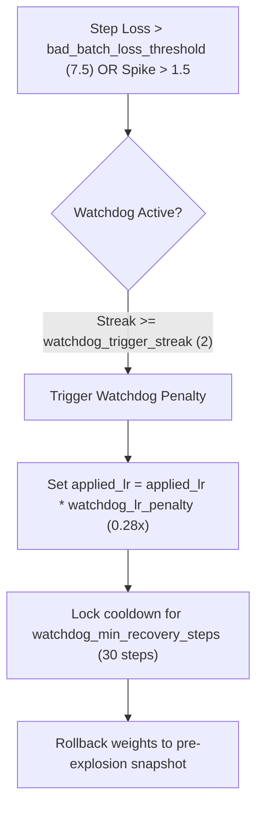

# ⚙️ Configuration Values Master Explainer

This master guide provides a comprehensive, field-by-field breakdown of every configuration struct in the RingWrapper NeuralNet engine. It details what each parameter does physically, its valid and recommended ranges, the default value in code, and what symptoms occur if the parameter is configured too high or too low.

---

## 🧭 Config Index
- [1. `RuntimeConfig` (Ring 0 Global Engine Settings)](#1-runtimeconfig-ring-0-global-engine-settings)
  - [A. Debug & Telemetry Switches](#a-debug--telemetry-switches)
  - [B. Thought Chain & CoC Reasoning Options](#b-thought-chain--coc-reasoning-options)
  - [C. Optimizer Physics & Trust Region Options](#c-optimizer-physics--trust-region-options)
  - [D. Stability Watchdog & Rollback Recovery](#d-stability-watchdog--rollback-recovery)
  - [E. Multi-Formula Routing & Taylor Forecaster](#e-multi-formula-routing--taylor-forecaster)
  - [F. Generation & Sampling Hyperparameters](#f-generation--sampling-hyperparameters)
  - [G. Hardware & Execution](#g-hardware--execution)
- [2. `TransformerLMConfig` (Ring 2 Architecture & Repulsion)](#2-transformerlmconfig-ring-2-architecture--repulsion)
- [3. `LLMTrainingConfig` (Ring 3 Training Loop & Growth)](#3-llmtrainingconfig-ring-3-training-loop--growth)
- [4. Practical Tuning Playbook by Hardware & Symptoms](#4-practical-tuning-playbook-by-hardware--symptoms)

---

## 1. `RuntimeConfig` (Ring 0 Global Engine Settings)
Declared in [`include/ring0/config.hpp`](file:///E:/NeuralNetNew/include/ring0/config.hpp). Accessed globally via `ring0::get_config()`.

### A. Debug & Telemetry Switches

| Field Name | Type | Default | Description & Engine Behavior | Too High / Too Low Symptom |
| :--- | :--- | :--- | :--- | :--- |
| `debug_mode` | `bool` | `true` | Master switch enabling verbose diagnostics and live console telemetry. | If `false`, suppresses all real-time ASCII telemetry tables. |
| `log_level` | `LogLevel` | `TRACE` | Telemetry detail level (`QUIET=0`, `STANDARD=1`, `VERBOSE=2`, `DEBUG=3`, `TRACE=4`). | `QUIET` hides warnings; `TRACE` logs every per-step vector check. |
| `verbose_thought_chains` | `bool` | `true` | Prints internal token-by-token vector convergence across recursive layers. | If `true` on huge batches, console output will scroll extremely fast. |
| `verbose_gradient_flow` | `bool` | `false` | Prints per-layer gradient L2 norms and projection shift angles. | Useful for diagnosing vanishing gradients across deep layers. |
| `verbose_kv_cache` | `bool` | `false` | Prints KV-cache token slot allocation and cache hit/miss rates. | Enable when debugging O(1) autoregressive streaming generation. |

---

### B. Thought Chain & CoC Reasoning Options

| Field Name | Type | Default | Description & Mathematical Behavior | Failure Modes & Tuning Rules |
| :--- | :--- | :--- | :--- | :--- |
| `enable_thought_chain_looping` | `bool` | `true` | Allows recursive layers to iteratively refine hidden states before passing to the next block. | Disabling turns the model into a standard single-pass feed-forward transformer. |
| `default_thought_loops` | `size_t` | `3` | Number of recursive self-attention passes performed per recursive layer. | **Too High (>8)**: Slows step throughput by $2\times\text{--}3\times$. **Too Low (1)**: Disables multi-step reasoning. |
| `thought_convergence_tol` | `float` | `1e-4` | Early exit delta $\Delta = \|h^{(k)} - h^{(k-1)}\|_2$. If change is smaller than this, loop breaks early. | **Too High (>0.01)**: Exits prematurely before reasoning converges. |
| `thought_damping` | `float` | `0.65` | Momentum damping across recursive passes: $h^{(k)} = (1-d) h^{(k)} + d \cdot f(h^{(k-1)})$. | **Too High (>0.9)**: New reasoning updates are ignored. **Too Low (<0.3)**: Thought vectors oscillate wildly. |
| `enable_coc_verification` | `bool` | `true` | Runs formal Calculus of Constructions dependent type checker on reasoning trajectories. | Disabling allows unverified semantic hallucinations to pass through. |
| `coc_verification_interval` | `size_t` | `5` | Cadence (in optimization steps) to execute formal proof validation. | **Too Low (1)**: Computational overhead on CPU. **Too High (>50)**: Delay in catching semantic type drift. |
| `coc_type_guidance_alpha` | `float` | `0.25` | Weight of formal typing compatibility prior injected into self-attention logits. | **Too High (>0.8)**: Forces overly rigid syntax, stifling creative text generation. |
| `max_beta_reduction_steps` | `size_t` | `1000` | Hard evaluation step bound on CoC normalization to guarantee termination. | Prevents infinite lambda reduction loops in circular dependent types. |

---

### C. Optimizer Physics & Trust Region Options

| Field Name | Type | Default | Description & Mathematical Behavior | Failure Modes & Tuning Rules |
| :--- | :--- | :--- | :--- | :--- |
| `enable_damped_operation_reversal` | `bool` | `true` | If an update step immediately worsens loss significantly, rolls back and scales back step. | Prevents catastrophic single-step divergence into NaN regimes. |
| `reversal_shrink_factor` | `float` | `0.15` | Multiplier applied to step vector when reversing a bad update: $\Delta \theta \leftarrow -\rho \Delta \theta$. | **Too Low (<0.05)**: Parameter update freezes completely. **Too High (>0.50)**: Reversal overshoots in the opposite direction. |
| `global_gradient_clip_norm` | `float` | `0.65` | Maximum allowed global gradient L2 norm $\|g\|_2$. Clips via $g \leftarrow g \cdot \frac{C}{\|g\|_2}$. | **Too High (>2.0)**: Allows gradient explosions ($|g| \approx 5 \sim 10$). **Too Low (<0.10)**: Progress slows to a crawl. |
| `logit_soft_cap` | `float` | `20.0` | Tanh squashing applied to attention logits: $S_{\text{cap}} \tanh(\text{logit} / S_{\text{cap}})$. | **Too Low (<10.0)**: Softmax distribution becomes overly diffuse/uniform. **Too High (>50.0)**: Attention saturates to one-hot vectors. |
| `adamw_beta1` | `float` | `0.91` | First uncentered moment exponential decay rate ($m_t = \beta_1 m_{t-1} + (1-\beta_1) g_t$). | **Too High (>0.98)**: High momentum inertia; takes too long to change direction. **Too Low (<0.70)**: High gradient noise. |
| `adamw_beta2` | `float` | `0.82` | Second raw moment decay rate ($v_t = \beta_2 v_{t-1} + (1-\beta_2) g_t^2$). | Lower values ($0.82$) react rapidly to sudden gradient variance shifts. |
| `base_weight_decay` | `float` | `0.01` | L2 weight shrinkage rate decoupled from gradient updates. | Prevents parameter norms from drifting toward infinity over long runs. |
| `max_trust_region_step` | `float` | `0.45` | Maximum Euclidean distance step allowed in parameter space when loss is low/stable. | Upper speed limit on optimization steps during clean descent. |
| `min_trust_region_step` | `float` | `0.14` | Minimum trust region step floor enforced during high-loss or unstable phases. | Guarantees minimum exploratory movement even when gradients are uncertain. |

---

### D. Stability Watchdog & Rollback Recovery

| Field Name | Type | Default | Description & System Action | Tuning Advice |
| :--- | :--- | :--- | :--- | :--- |
| `enable_weight_rollback_recovery` | `bool` | `true` | Restores last healthy model weights snapshot whenever a batch loss explodes. | Essential for uninterrupted unattended 24/7 training runs. |
| `bad_batch_loss_threshold` | `float` | `7.5` | Absolute cross-entropy loss ceiling above which a batch is rejected as corrupted. | Lower if your converged loss is $<4.0$; raise to $10.0$ on random initialization. |
| `watchdog_rise_gap` | `float` | `0.40` | Sudden loss increase threshold ($\mathcal{L}_t - \mathcal{L}_{\min} > \text{gap}$) that increments the watchdog streak. | Higher values make watchdog less trigger-happy; lower values make it hyper-sensitive. |
| `watchdog_trigger_streak` | `size_t` | `2` | Number of consecutive bad steps required to activate the stability watchdog. | Prevents false alarms on isolated noisy batches while catching true divergence. |
| `watchdog_lr_penalty` | `float` | `0.28` | Multiplicative LR reduction factor applied when watchdog engages ($\eta \leftarrow 0.28 \eta$). | Drastically reduces step size so weights can re-equilibrate. |
| `watchdog_min_recovery_steps`| `size_t` | `30` | Duration (in steps) the watchdog enforces throttled LR before allowing normal ramp. | Ensures optimizer momentum buffers have fully flushed contaminated gradients. |

---

### E. Multi-Formula Routing & Taylor Forecaster

| Field Name | Type | Default | Description & Mathematical Action |
| :--- | :--- | :--- | :--- |
| `enable_multi_formula_routing` | `bool` | `true` | Dynamically routes weights between Natural Gradient, Nesterov, AdamW, and Sparse Decay based on coordinate Fisher salience. |
| `f1_natural_gradient_threshold` | `float` | `0.52` | Fisher information salience threshold to route a weight parameter to Formula 1 (Riemannian Natural Gradient). |
| `f2_nesterov_threshold` | `float` | `0.30` | Salience threshold to route to Formula 2 (Nesterov Accelerated Momentum). |
| `f3_adamw_threshold` | `float` | `0.16` | Salience threshold to route to Formula 3 (Standard Adaptive AdamW). Below this, Formula 4 (Sparse Decay) prunes noise. |
| `enable_taylor_prediction` | `bool` | `true` | Evaluates $n$-th order Taylor polynomial of loss to forecast trajectory and modulate step sizing. |
| `taylor_step_damping` | `float` | `-0.38` | Negative feedback damping scalar applied when Taylor predicts an impending loss rebound. |
| `enable_rayleigh_curvature` | `bool` | `true` | Computes local Rayleigh quotient curvature $\kappa_R$ to precondition gradient step sizes. |
| `curvature_scale_floor` | `float` | `0.05` | Minimum allowable curvature preconditioning scale, preventing step size from vanishing to zero. |
| `curvature_scale_ceiling` | `float` | `2.50` | Maximum allowable curvature preconditioning boost in ultra-flat landscape regions. |

---

### F. Generation & Sampling Hyperparameters

| Field Name | Type | Default | Description |
| :--- | :--- | :--- | :--- |
| `default_temperature` | `float` | `0.60` | Logit temperature scaling: $P(i) \propto \exp(z_i / T)$. Lower ($0.2\sim 0.5$) = deterministic & focused; Higher ($0.7\sim 1.0$) = creative. |
| `default_top_k` | `size_t` | `50` | Limits sampling to the top $K$ highest-probability tokens. |
| `default_top_p` | `float` | `0.62` | Nucleus sampling: cuts off candidate tokens once cumulative mass exceeds $P$. |
| `default_min_p` | `float` | `0.002` | Discards any token whose probability is less than $\text{Min-P} \times P(\text{top token})$. |
| `default_repetition_penalty` | `float` | `1.10` | Multiplicative discount applied to logits of tokens that appeared in the lookback window. |
| `default_lookback_window` | `size_t` | `32` | Number of previous generated tokens tracked for the repetition penalty. |

---

### G. Hardware & Execution

| Field Name | Type | Default | Description |
| :--- | :--- | :--- | :--- |
| `num_threads` | `size_t` | `0` | Number of OpenMP parallel threads. `0` automatically detects and uses all CPU cores. |
| `enable_avx2_acceleration` | `bool` | `true` | Uses vectorized 256-bit AVX2/FMA SIMD instructions for matrix dot products. |
| `enable_cuda_backend` | `bool` | `false` | Offloads heavy GEMM operations and attention tensors to NVIDIA CUDA GPU. |

---

## 2. `TransformerLMConfig` (Ring 2 Architecture & Repulsion)
Declared in [`include/ring2/transformer_lm.hpp`](file:///E:/NeuralNetNew/include/ring2/transformer_lm.hpp).

| Field Name | Type | Default | Mathematical & Structural Function |
| :--- | :--- | :--- | :--- |
| `vocab_size` | `size_t` | `32000` | Total number of unique tokens in vocabulary and output projection matrix $W_u \in \mathbb{R}^{d \times |V|}$. |
| `embed_dim` | `size_t` | `64` | Hidden dimension $d_{\text{model}}$ of residual stream throughout all layers. |
| `num_layers` | `size_t` | `10` | Maximum vertical stack depth of Transformer blocks. |
| `num_heads` | `size_t` | `4` | Number of Query attention heads ($d_k = \text{embed\_dim} / \text{num\_heads}$). |
| `num_kv_heads` | `size_t` | `2` | Number of Key/Value heads. If $< \text{num\_heads}$, activates Grouped-Query Attention (GQA). |
| `ffn_dim` | `size_t` | `128` | SwiGLU / MLP intermediate projection hidden dimension. |
| `max_seq_len` | `size_t` | `256` | Maximum context window buffer size for RoPE frequencies and attention masks. |
| `use_swiglu` | `bool` | `true` | Uses Gated Linear Unit with Swish activation $\text{SwiGLU}(x) = (x W_1) \cdot \text{swish}(x W_2) \cdot W_3$. |
| `use_alibi` | `bool` | `true` | Injects Attention with Linear Biases (ALiBi) slope matrix for length extrapolation. |
| `rope_theta` | `float` | `10000.0` | Base frequency scalar for Rotary Position Embeddings. |
| `repulsion_scale_a` | `float` | `0.35` | **Level A Repulsion Scale**: Strength of gradient deflection vector subtracted from parameter updates. |
| `repulsion_scale_b` | `float` | `0.50` | **Level B Repulsion Scale**: Percentage learning rate damping when parameters drift into failure zone. |
| `repulsion_scale_c` | `float` | `0.20` | **Level C Repulsion Scale**: Strength of top-head activation feature orthogonalization. |
| `mistake_history_capacity` | `size_t` | `30` | Maximum number of past exploded states retained in circular mistake memory buffer. |

---

## 3. `LLMTrainingConfig` (Ring 3 Training Loop & Growth)
Declared in [`include/ring3/llm_trainer.hpp`](file:///E:/NeuralNetNew/include/ring3/llm_trainer.hpp).

| Field Name | Type | Default | Description & Role in Optimization Loop |
| :--- | :--- | :--- | :--- |
| `batch_size` | `size_t` | `32` | Number of parallel sequences processed per gradient accumulation step. |
| `seq_len` | `size_t` | `64` | Starting training context length (grows dynamically with progressive curriculum). |
| `total_steps` | `size_t` | `25000` | Total optimization steps scheduled for training run. |
| `base_lr` | `float` | `0.005` | Target peak learning rate after linear warmup. |
| `min_lr` | `float` | `0.0001` | Minimum learning rate floor at end of cosine decay schedule. |
| `warmup_steps` | `size_t` | `200` | Number of initial steps during which LR ramps linearly from $0 \to \text{base\_lr}$. |
| `eval_interval` | `size_t` | `50` | Step cadence for running evaluation validation passes and computing Top-1/Top-5 accuracy. |
| `checkpoint_interval` | `size_t` | `200` | Step cadence for serializing binary weight snapshots to disk (`checkpoints/step_*.bin`). |
| `enable_progressive_growth` | `bool` | `true` | Starts model at shallow depth (4 layers) and short sequence length, dynamically adding layers as loss stabilizes. |
| `growth_step_interval` | `size_t` | `50` | Minimum step duration required before unlocking the next progressive layer. |

---

## 4. Practical Tuning Playbook by Hardware & Symptoms

### Scenario A: Low CPU Memory / High Latency per Step
- **Decrease**: `batch_size` $\to 16$, `max_seq_len` $\to 128$, `default_thought_loops` $\to 2$.
- **Ensure**: `enable_avx2_acceleration = true`, `num_threads = 0` (auto-detect all cores).

### Scenario B: Loss is Bouncing Wildly or Oscillating ($8.0 \leftrightarrow 12.0$)
- **Decrease**: `base_lr` $\to 0.001$, `global_gradient_clip_norm` $\to 0.40$.
- **Increase**: `watchdog_min_recovery_steps` $\to 40$, `bad_batch_cooldown` $\to 15$.
- **Verify**: `enable_weight_rollback_recovery = true` and `enable_damped_operation_reversal = true`.

### Scenario C: Model Generates Repetitive or Looping Text
- **Increase**: `default_temperature` $\to 0.75$, `default_repetition_penalty` $\to 1.25$, `default_lookback_window` $\to 64$.
- **Decrease**: `default_top_p` $\to 0.70$, `default_top_k` $\to 40$.
