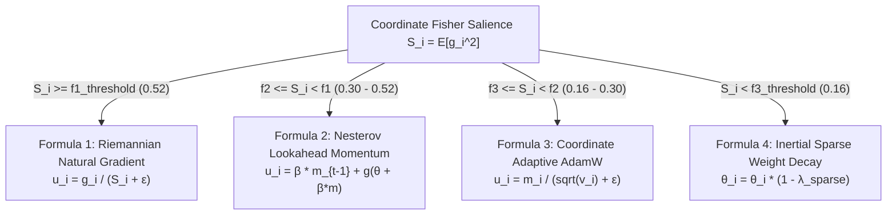

# 🏔️ Loss Landscapes, Curvature & Optimization Physics

This guide explores the geometry of deep transformer loss surfaces, explaining why optimization is inherently challenging, how curvature affects gradient descent, and how the **4-Formula Dynamic Weight Physics** and **Fisher Information Metric** navigate non-Euclidean loss manifolds.

---

## 🧭 Theoretical Roadmap
- [1. The Geometry of High-Dimensional Loss Surfaces](#1-the-geometry-of-high-dimensional-loss-surfaces)
- [2. The Hessian Matrix & Rayleigh Curvature Quotient](#2-the-hessian-matrix--rayleigh-curvature-quotient)
- [3. Condition Number $\kappa$ & Ill-Conditioned Ravines](#3-condition-number-kappa--ill-conditioned-ravines)
- [4. Euclidean vs. Riemannian Optimization](#4-euclidean-vs-riemannian-optimization)
- [5. The 4-Formula Dynamic Routing Mechanics](#5-the-4-formula-dynamic-routing-mechanics)

---

## 1. The Geometry of High-Dimensional Loss Surfaces

In deep transformers with millions of parameters, the loss landscape $\mathcal{L}(\theta)$ is characterized by:
1. **Saddle Points (Not Local Minima)**: In high dimensions ($D > 10^5$), almost all critical points ($\nabla \mathcal{L} = 0$) are saddle points with both positive and negative curvature directions.
2. **Sharp Ravines & Valleys**: The loss drops rapidly along certain directions (steep walls) while remaining flat along others (slow floor).
3. **Loss Cliffs & Plateaus**: Regions where cross-entropy error changes abruptly due to rare out-of-distribution tokens or softmax saturation.

```
       Loss
        ^
        │            Steep Valley Wall (High Curvature λ_max)
        │           \                                       /
        │            \                                     /
        │             \         Flat Valley Floor         /
        │              \       (Low Curvature λ_min)     /
        │               \       . . . . . . . . .       /
        │                \_____/                 \_____/
        └─────────────────────────────────────────────────────> θ_1, θ_2
```

---

## 2. The Hessian Matrix & Rayleigh Curvature Quotient

The second-order Taylor expansion of the loss function around parameter point $\theta_0$ is:

$$\mathcal{L}(\theta_0 + \Delta \theta) \approx \mathcal{L}(\theta_0) + \nabla \mathcal{L}^T \Delta \theta + \frac{1}{2} \Delta \theta^T \mathbf{H} \Delta \theta$$

where $\mathbf{H} \in \mathbb{R}^{D \times D}$ is the **Hessian matrix**:

$$H_{i, j} = \frac{\partial^2 \mathcal{L}}{\partial \theta_i \partial \theta_j}$$

### The Rayleigh Curvature Quotient ($\kappa_R$)
Computing the full $D \times D$ Hessian is intractable for large networks ($O(D^2)$ space). RingWrapper approximates the directional curvature along the gradient vector $g$ using the **Rayleigh Quotient**:

$$\kappa_R = \frac{g^T \mathbf{H} g}{g^T g} \approx \frac{\Delta g^T \Delta \theta}{\|\Delta \theta\|_2^2}$$

In code ([`src/ring0/taylor_predictor.cpp`](file:///E:/NeuralNetNew/src/ring0/taylor_predictor.cpp)), this scalar measures how quickly the gradient vector is rotating and scaling per unit step:
- **$\kappa_R < 0.10$**: Flat terrain. Step size can be safely boosted.
- **$\kappa_R > 1.50$**: Extremely sharp ravine. Step size must be clamped to prevent overshooting.

---

## 3. Condition Number $\kappa$ & Ill-Conditioned Ravines

The **condition number** of the loss landscape is defined as:

$$\kappa = \frac{\lambda_{\max}(\mathbf{H})}{\lambda_{\min}(\mathbf{H})}$$

```
  Condition Number Regime        Optimization Challenge
  ───────────────────────        ──────────────────────
  κ ≈ 1 (Isotropic Ball)         Standard SGD converges rapidly in straight line.
  κ ≈ 100 (Moderate Valley)      Standard SGD oscillates; AdamW accelerates along flat floor.
  κ > 10,000 (Ill-Conditioned)   Standard SGD diverges; requires Fisher Natural Gradient.
```

When $\kappa$ is large, standard gradient descent points almost perpendicular to the true minimum, bouncing violently between the steep walls of the ravine rather than sliding along the floor.

---

## 4. Euclidean vs. Riemannian Optimization

### Standard Euclidean Gradient
Standard gradient descent assumes parameter space is flat Euclidean space ($\mathbb{R}^D$) with metric tensor $G = I$:

$$\Delta \theta_{\text{Euclidean}} = -\eta \nabla_\theta \mathcal{L}$$

### Riemannian Natural Gradient
In probabilistic models (like language models outputting token distributions $p_\theta(y|x)$), parameters live on a **probability manifold** governed by the **Fisher Information Metric**:

$$F_{i, j} = \mathbb{E}_{x \sim p}\left[ \frac{\partial \ln p_\theta}{\partial \theta_i} \frac{\partial \ln p_\theta}{\partial \theta_j} \right]$$

The Natural Gradient takes the steepest descent step invariant to parameter reparameterization:

$$\Delta \theta_{\text{Natural}} = -\eta F^{-1} \nabla_\theta \mathcal{L}$$

---

## 5. The 4-Formula Dynamic Routing Mechanics

To achieve optimal convergence without the $O(D^3)$ cost of full Fisher matrix inversion, RingWrapper routes each weight coordinate dynamically to one of 4 formulas based on its Fisher importance salience $S_i = \text{diag}(F)_i$:



### Formula Breakdown

| Formula | Optimization Category | Activation Regime | Core Update Action |
| :--- | :--- | :--- | :--- |
| **F1: Natural Gradient** | High-Salience Parameters | $S_i \ge 0.52$ | Scales coordinate update inversely by Fisher metric, preventing critical knowledge destruction. |
| **F2: Nesterov Accelerated** | Moderate High Salience | $0.30 \le S_i < 0.52$ | Evaluates lookahead gradient to brake momentum before cresting sharp loss peaks. |
| **F3: Standard AdamW** | General Parameters | $0.16 \le S_i < 0.30$ | Tracks first and second moments for balanced adaptive learning across standard features. |
| **F4: Sparse Weight Decay**| Noise / Low Salience | $S_i < 0.16$ | Prunes inactive weights and suppresses gradient noise with decoupled exponential decay. |
