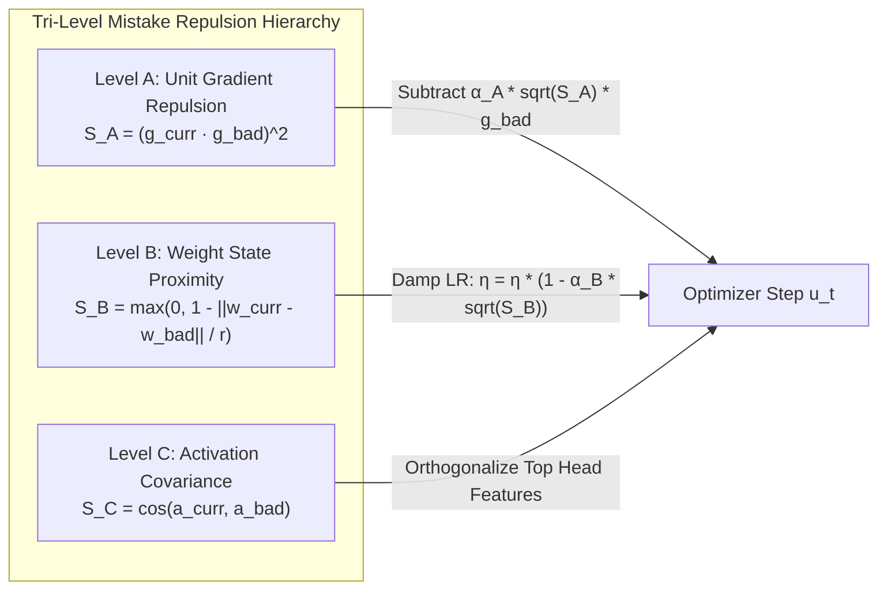

# 📖 Mathematical & Systems Variables Dictionary

This dictionary provides an exhaustive reference for every mathematical symbol, algorithmic variable, tensor dimension, and runtime telemetry metric used across **Ring 0 through Ring 3** of the RingWrapper NeuralNet engine.

---

## 🧭 Subsystem Quick Links
- [1. Optimization, Calculus & Directional Physics](#1-optimization-calculus--directional-physics)
- [2. Tri-Level Mistake Checkpoint & Repulsion Variables](#2-tri-level-mistake-checkpoint--repulsion-variables)
- [3. Transformer Architecture & Tensor Dimensions](#3-transformer-architecture--tensor-dimensions)
- [4. Attention, Normalization & Positional Variables](#4-attention-normalization--positional-variables)
- [5. Calculus of Constructions (CoC) & Formal Logic Variables](#5-calculus-of-constructions-coc--formal-logic-variables)
- [6. Training, Curriculum & Data Streaming Metrics](#6-training-curriculum--data-streaming-metrics)

---

## 1. Optimization, Calculus & Directional Physics

| Symbol | C++ Identifier | Ring / File | Typical Range | Physical & Mathematical Meaning |
| :--- | :--- | :--- | :--- | :--- |
| $\theta, W$ | `weights`, `params` | `ring1/`, `ring2/` | $[-1.0, 1.0]$ | **Model Parameters**: The collection of learnable weight matrices and bias vectors updated at each step. |
| $g_t$ | `grad`, `gradients` | `ring1/optimizer.hpp` | $[-5.0, 5.0]$ | **Stochastic Gradient**: $\nabla_\theta \mathcal{L}_t$, the vector of partial derivatives of loss with respect to parameters for current batch $t$. |
| $\|g\|_2$ | `grad_norm`, `total_norm` | `ring3/llm_trainer.cpp` | $0.05 \sim 1.50$ | **Global Gradient L2 Norm**: Euclidean magnitude $\sqrt{\sum g_i^2}$. If $\|g\|_2 > 0.65$, clipping engages to prevent numerical explosions. |
| $m_t$ | `m`, `first_moment` | `ring1/adamw.hpp` | $[-0.5, 0.5]$ | **First Uncentered Moment**: Exponential moving average of past gradients ($m_t = \beta_1 m_{t-1} + (1-\beta_1) g_t$). Represents optimizer momentum direction. |
| $v_t$ | `v`, `second_moment` | `ring1/adamw.hpp` | $[0.0, 10.0]$ | **Second Raw Moment**: Exponential moving average of squared gradients ($v_t = \beta_2 v_{t-1} + (1-\beta_2) g_t^2$). Tracks coordinate variance. |
| $\hat{m}_t, \hat{v}_t$ | `m_hat`, `v_hat` | `ring1/adamw.hpp` | Coordinates | **Bias-Corrected Moments**: $\hat{m}_t = \frac{m_t}{1-\beta_1^t}$, $\hat{v}_t = \frac{v_t}{1-\beta_2^t}$. Corrects zero-initialization bias in early iterations. |
| $\beta_1$ | `adamw_beta1` | `ring0/config.hpp` | $0.85 \sim 0.95$ | **Momentum Decay Rate**: Controls memory horizon of gradient direction (default: $0.91$). |
| $\beta_2$ | `adamw_beta2` | `ring0/config.hpp` | $0.80 \sim 0.99$ | **Variance Decay Rate**: Controls memory horizon of uncentered gradient variance (default: $0.82$). |
| $\eta$ | `lr`, `applied_lr` | `ring3/llm_trainer.cpp` | $10^{-5} \sim 0.05$ | **Applied Learning Rate**: Step size multiplier for weight updates ($\theta_{t+1} = \theta_t - \eta \cdot u_t$). |
| $\eta_{\text{base}}$ | `base_lr` | `ring3/llm_trainer.hpp` | $10^{-4} \sim 0.01$ | **Nominal Baseline LR**: The target learning rate prior to dynamic gain scaling and watchdog penalties. |
| $G_{\text{dyn}}$ | `dynamic_lr_gain` | `ring3/llm_trainer.cpp` | $0.30 \sim 3.50$ | **Dynamic LR Gain**: Multiplicative scalar modulating base LR based on loss derivative speed and plateau conditions. |
| $\lambda_{\text{decay}}$ | `weight_decay` | `ring1/adamw.hpp` | $0.001 \sim 0.1$ | **Decoupled Weight Decay**: Shrinkage factor applied directly to weights ($\theta \leftarrow \theta(1 - \eta \lambda)$) preventing norm bloat without corrupting $m_t$. |
| $\epsilon$ | `adamw_eps` | `ring0/config.hpp` | $10^{-8}$ | **Numerical Epsilon**: Small constant added to $\sqrt{\hat{v}_t} + \epsilon$ to avoid division by zero. |
| $\mathcal{L}$ | `loss`, `metrics.loss` | `ring0/loss.hpp` | $0.0 \sim 15.0$ | **Training Loss**: Empirical batch cross-entropy / focal loss measuring divergence between prediction and ground truth. |
| $\frac{d\mathcal{L}}{dt}$ | `d_loss`, `delta_loss` | `ring0/taylor_predictor.hpp` | $[-2.0, 2.0]$ | **First Loss Derivative**: Rate of change of loss between consecutive optimization steps. |
| $\frac{d^2\mathcal{L}}{dt^2}$ | `d2_loss` | `ring0/taylor_predictor.hpp` | $[-5.0, 5.0]$ | **Second Loss Derivative**: Curvature / acceleration of the loss curve. Positive means decelerating or bottoming out. |
| $\kappa_R$ | `rayleigh_curvature` | `ring0/loss.hpp` | $0.05 \sim 2.50$ | **Rayleigh Quotient Curvature**: Second-order approximation of Hessian quadratic form $\frac{g^T H g}{g^T g}$ used for preconditioning. |
| $\rho_{\text{rev}}$ | `reversal_shrink_factor` | `ring0/config.hpp` | $0.10 \sim 0.30$ | **Damped Reversal Factor**: Shrinkage scalar applied when an optimization step results in immediate loss blow-up. |

---

## 2. Tri-Level Mistake Checkpoint & Repulsion Variables



| Symbol | C++ Identifier | Ring / File | Typical Range | Physical & Mathematical Meaning |
| :--- | :--- | :--- | :--- | :--- |
| $\mathbf{g}_{\text{bad}}$ | `gradient_direction` | `ring2/transformer_lm.hpp` | Unit Vector | **Failure Gradient Vector**: Normalized unit gradient $\frac{g}{\|g\|_2}$ captured at the exact moment a bad batch exploded. |
| $\mathbf{w}_{\text{snap}}$ | `weights_snapshot` | `ring2/transformer_lm.hpp` | Parameter Space | **Failure Weight Coordinates**: Flattened parameter vector $\theta$ at the step prior to divergence. |
| $\mathbf{a}_{\text{bad}}$ | `activation_vector` | `ring2/transformer_lm.hpp` | Activation Space | **Failure Activation Signature**: Mean hidden state activations across layers for the exploded batch. |
| $S_A$ | `sim_a` | `ring2/transformer_lm.cpp` | $[0.0, 1.0]$ | **Level A Gradient Similarity**: Squared cosine similarity $(\hat{g}_{\text{curr}} \cdot \hat{g}_{\text{bad}})^2$. Measures if current step points toward the previous failure direction. |
| $S_B$ | `sim_b` | `ring2/transformer_lm.cpp` | $[0.0, 1.0]$ | **Level B Spatial Proximity**: Linear radial proximity $\max(0, 1 - \frac{\|\theta_{\text{curr}} - \theta_{\text{bad}}\|}{R_{\text{thresh}}})$. Measures if parameters have drifted back into the danger zone. |
| $S_C$ | `sim_c` | `ring2/transformer_lm.cpp` | $[0.0, 1.0]$ | **Level C Representation Similarity**: Activation cosine similarity $\frac{a_{\text{curr}} \cdot a_{\text{bad}}}{\|a_{\text{curr}}\| \|a_{\text{bad}}\|}$. Measures internal representation collapse. |
| $\sqrt{S}$ | `sqrt(sim)` | `ring2/transformer_lm.cpp` | $[0.0, 1.0]$ | **Root-Similarity Metric**: Inverse of squared distance $(\sqrt{1 - \Delta^2})^{-1}$. Amplifies small similarities into strong initial repulsive force. |
| $\alpha_A$ | `repulsion_scale_a` | `ring2/transformer_lm.hpp` | $0.20 \sim 0.60$ | **Level A Repulsion Multiplier**: Weight of gradient deflection vector subtracted from parameter update. |
| $\alpha_B$ | `repulsion_scale_b` | `ring2/transformer_lm.hpp` | $0.30 \sim 0.75$ | **Level B LR Damping Scale**: Strength of learning rate attenuation when weights enter spatial danger radius. |
| $\alpha_C$ | `repulsion_scale_c` | `ring2/transformer_lm.hpp` | $0.10 \sim 0.40$ | **Level C Feature Deflection Scale**: Strength of activation feature orthogonalization. |
| $K_{\text{cd}}$ | `bad_batch_cooldown` | `ring3/llm_trainer.cpp` | $5 \sim 25$ steps | **Recovery Cooldown Counter**: Number of post-rollback steps during which LR is forced into a guarded recovery mode. |

---

## 3. Transformer Architecture & Tensor Dimensions

| Symbol | C++ Identifier | Ring / File | Typical Value | Physical & Mathematical Meaning |
| :--- | :--- | :--- | :--- | :--- |
| $B$ | `batch_size` | `ring3/llm_trainer.hpp` | $16 \sim 64$ | **Batch Size**: Number of independent token sequences processed concurrently per step. |
| $T$ | `seq_len`, `max_seq_len` | `ring2/transformer_lm.hpp` | $64 \sim 2048$ | **Sequence Length / Context Horizon**: Number of consecutive tokens per input sequence. |
| $d_{\text{model}}$ | `embed_dim` | `ring2/transformer_lm.hpp` | $32 \sim 1024$ | **Embedding Dimension**: Vector dimensionality of token embeddings and hidden states throughout the residual stream. |
| $d_{\text{ffn}}$ | `ffn_dim` | `ring2/transformer_lm.hpp` | $2 \sim 4 \times d_{\text{model}}$ | **Feed-Forward Hidden Dimension**: Intermediate expansion dimensionality of SwiGLU / MLP blocks. |
| $L$ | `num_layers` | `ring2/transformer_lm.hpp` | $4 \sim 32$ | **Total Layers**: Total vertical stack of Transformer decoder blocks. |
| $L_{\text{act}}$ | `active_layers` | `ring2/growth_controller.hpp`| $2 \sim L$ | **Active Depth**: Currently unmasked layers in progressive horizon / depth growth curriculum. |
| $H_Q$ | `num_heads` | `ring2/transformer_lm.hpp` | $4 \sim 32$ | **Query Attention Heads**: Number of independent query projection subspaces. |
| $H_{KV}$ | `num_kv_heads` | `ring2/transformer_lm.hpp` | $1 \sim H_Q$ | **Key/Value Attention Heads**: Number of KV projection subspaces (when $H_{KV} < H_Q$, Grouped-Query Attention is active). |
| $d_k, d_v$ | `head_dim` | `ring1/attention.hpp` | $\frac{d_{\text{model}}}{H_Q}$ | **Head Dimension**: Dimensionality of each individual attention head subspace (e.g., $32 / 4 = 8$). |
| $|V|$ | `vocab_size` | `ring2/vocab_manager.hpp` | $256 \sim 32000$ | **Active Vocabulary Size**: Number of unique token IDs recognized by the tokenizer and embedding table. |

---

## 4. Attention, Normalization & Positional Variables

```
  Input Residual x
        │
        ▼
   [ RMSNorm ] ──────> x_norm = x / RMS(x) * γ
        │
   [ Q, K, V Projections ]
        │
   [ RoPE Rotary Embedding ] ──> q_rot = R(m*θ) * q
        │
   [ Attention Matrix ] ───────> A = Softmax( (Q K^T) / sqrt(d_k) + M )
        │
   [ Output Projection & Residual Add ]
```

| Symbol | C++ Identifier | Ring / File | Typical Value | Physical & Mathematical Meaning |
| :--- | :--- | :--- | :--- | :--- |
| $Q, K, V$ | `q`, `k`, `v` | `ring1/attention.hpp` | Tensor3D | **Query, Key, Value Tensors**: Projected representations for multi-head associative memory lookup. |
| $\Theta_{\text{base}}$ | `rope_theta` | `ring1/attention.hpp` | $10000.0$ | **RoPE Base Frequency**: Base wavelength for geometric progression $\theta_i = \Theta^{-2(i-1)/d}$ in Rotary Position Embeddings. |
| $\mathbf{R}_{\Theta, m}$ | `rope_cos`, `rope_sin` | `ring1/attention.hpp` | $2 \times 2$ Blocks | **Rotary Embedding Matrix**: Orthogonal rotation applied to 2D coordinate pairs of Query and Key vectors at position $m$. |
| $\gamma$ | `scale`, `gamma` | `ring1/layer.hpp` | $[0.8, 1.2]$ | **RMSNorm Scale Parameter**: Element-wise learnable scaling vector applied after root-mean-square normalization. |
| $m_h$ | `alibi_slope` | `ring1/attention.hpp` | $2^{-8/H}$ | **ALiBi Head Slope**: Linear geometric bias slope subtracted from attention logits based on token distance $|i - j|$. |
| $S_{\text{cap}}$ | `logit_soft_cap` | `ring0/config.hpp` | $15.0 \sim 30.0$ | **Soft Logit Cap**: Tanh-based threshold $S_{\text{cap}} \tanh(\text{logit} / S_{\text{cap}})$ preventing attention logit blowup. |

---

## 5. Calculus of Constructions (CoC) & Formal Logic Variables

| Symbol | C++ Identifier | Ring / File | Typical Range | Physical & Mathematical Meaning |
| :--- | :--- | :--- | :--- | :--- |
| $\Gamma$ | `type_context` | `ring0/calculus_of_constructions.hpp` | Symbol Table | **Typing Environment**: Map of bound variables and hypotheses to their proven dependent types. |
| $\text{Prop}$ | `Universe::PROP` | `ring0/calculus_of_constructions.hpp` | Sort $\star$ | **Propositional Universe**: The bottom universe of logical propositions and proof terms. |
| $\text{Type}_i$ | `Universe::TYPE_N` | `ring0/calculus_of_constructions.hpp` | Sort $\square_i$ | **Stratified Universes**: Cumulative hierarchy ($\text{Prop} : \text{Type}_0 : \text{Type}_1 : \dots$) preventing Russell/Girard paradoxes. |
| $N_\beta$ | `max_beta_reduction_steps` | `ring0/config.hpp` | $100 \sim 10000$ | **Normalization Budget**: Maximum beta-reduction evaluation steps before flagging infinite recursion in thought chains. |
| $\mathcal{C}_{\text{proof}}$ | `coc_proof_consistency_threshold`| `ring0/config.hpp` | $0.70 \sim 0.95$ | **Proof Soundness Gate**: Minimum dependent type consistency score required to commit a reasoning vector. |
| $\alpha_{\text{CoC}}$ | `coc_type_guidance_alpha` | `ring0/config.hpp` | $0.10 \sim 0.40$ | **CoC Attention Bias Scale**: Additive attention prior prioritizing tokens that satisfy formal type-correctness. |

---

## 6. Training, Curriculum & Data Streaming Metrics

| Symbol / Metric | C++ Identifier | Ring / File | Unit / Target | Physical & Telemetry Meaning |
| :--- | :--- | :--- | :--- | :--- |
| $\text{tok/s}$ | `tokens_per_sec` | `ring3/llm_trainer.cpp` | $800 \sim 50000$ | **Throughput**: Effective token ingestion and forward/backward compute speed per elapsed wall-clock second. |
| $\text{GFLOPs/s}$ | `gflops` | `ring3/llm_trainer.cpp` | $2.0 \sim 500.0$ | **Billion Floating-Point Ops / Sec**: Hardware execution efficiency measure across matrix multiplications. |
| $\text{PPL}$ | `perplexity` | `ring3/llm_trainer.cpp` | $1.0 \sim \infty$ | **Perplexity**: $\exp(\mathcal{L})$, the effective branching factor / uncertainty when predicting the next token. |
| $\text{Top-1}$ | `top1_acc` | `ring3/llm_trainer.cpp` | $0.0\% \sim 100.0\%$ | **Top-1 Accuracy**: Percentage of batch positions where the argmax model logit exactly matches ground truth. |
| $\text{Top-5}$ | `top5_acc` | `ring3/llm_trainer.cpp` | $0.0\% \sim 100.0\%$ | **Top-5 Accuracy**: Percentage of batch positions where the ground truth token appears in the top 5 highest logits. |
| $\mathcal{H}$ | `entropy` | `ring3/llm_trainer.cpp` | $0.0 \sim \ln(|V|)$ | **Shannon Entropy**: $-\sum p_i \ln p_i$, measuring the randomness/sharpness of the output vocabulary probability distribution. |
| $r_i$ | `token_relevance` | `ring3/text_dataset.cpp` | $[0.0, 1.0]$ | **Token Information Salience**: TF-IDF / lexicon rarity score of token $i$ used to dynamically resize training horizons. |
| $W(r)$ | `interpolated_window` | `ring3/text_dataset.cpp` | $[8, 64]$ | **Interpolated Context Window**: Non-linear parsed token span surrounding a given token based on its salience exponent $\alpha$. |
