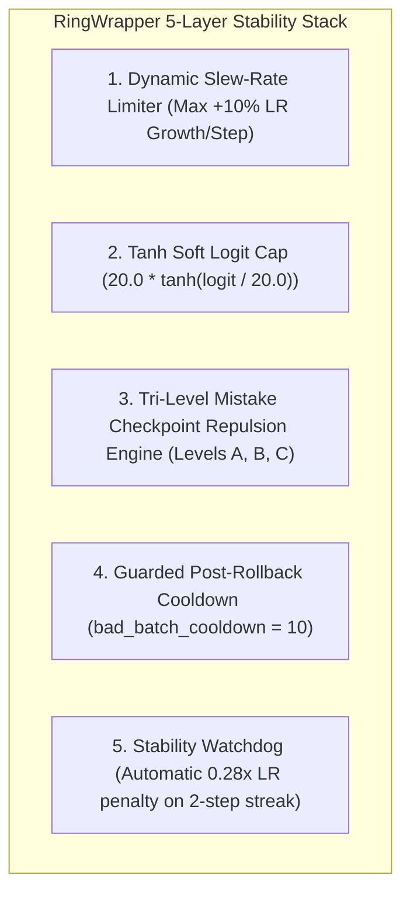

# 🎯 Practical Guide: Why Neural Networks Overshoot & How RingWrapper Stabilizes Them

Understanding why deep transformers and language models suddenly destabilize, overshoot, or oscillate in training is one of the most important concepts in deep learning engineering.

This guide explains the exact physical, geometric, and optimization mechanisms that cause overshoots, using intuitive analogies, mathematical formulas, and the defensive countermeasures built into RingWrapper.

---

## 🧭 Table of Contents
- [1. The Fundamental Mechanics of an Overshoot](#1-the-fundamental-mechanics-of-an-overshoot)
- [2. Mechanism 1: Step Size vs. Parameter Scale Mismatch](#2-mechanism-1-step-size-vs-parameter-scale-mismatch)
- [3. Mechanism 2: Loss Landscape Curvature Cliffs ($\lambda_{\max}$)](#3-mechanism-2-loss-landscape-curvature-cliffs-lambda_max)
- [4. Mechanism 3: "Momentum Poisoning" in AdamW ($m_t$)](#4-mechanism-3-momentum-poisoning-in-adamw-m_t)
- [5. Mechanism 4: Softmax Saturation in Self-Attention](#5-mechanism-4-softmax-saturation-in-self-attention)
- [6. Mechanism 5: Multi-Layer Gradient Compounding & Depth Shocks](#6-mechanism-5-multi-layer-gradient-compounding--depth-shocks)
- [7. How RingWrapper Prevents Overshoots (The Defense Stack)](#7-how-ringwrapper-prevents-overshoots-the-defense-stack)

---

## 1. The Fundamental Mechanics of an Overshoot

In gradient descent, we compute the slope of the loss surface $\nabla_\theta \mathcal{L}$ and take a step in the opposite direction:

$$\theta_{t+1} = \theta_t - \eta \cdot u_t$$

If the landscape were a simple smooth bowl (a parabola $f(x) = x^2$), a large step size $\eta$ would move us rapidly toward the bottom. But neural network loss surfaces in $100,000$+ dimensional space are **non-convex, warped, and full of razor-sharp canyons**.

```
         Loss (Cross-Entropy)
          ^               \             /  <- Sharp Ravine (High Curvature)
          |                \           /
          |                 \   *     /     * = True minimum
          |                  \ / \   /
          |       --------->  X   \ /
          |      Large Step        X  <- Overshoots to opposite wall! (Loss 12.0)
          +──────────────────────────────────────────────> Weights (θ)
```

When the step size $\eta \cdot u_t$ is larger than the width of the valley, the optimizer skips over the valley floor and lands on the steep opposite cliff, causing loss to spike from $5.0 \to 12.0+$.

---

## 2. Mechanism 1: Step Size vs. Parameter Scale Mismatch

### The Mathematical Problem
In small-to-medium transformer models:
- **Embedding Dimension**: $d_{\text{model}} = 32 \sim 64$.
- **Standard Initialization**: Weights are sampled from $\mathcal{N}(0, \frac{1}{\sqrt{d}})$. Typical weight values are between **$-0.15 \text{ and } +0.15$**.

In AdamW, the update vector coordinate is normalized by the variance:
$$u_t = \frac{\hat{m}_t}{\sqrt{\hat{v}_t} + \epsilon} \approx \pm 1.0$$

When the learning rate is set to **$\text{LR} = 0.025$**:

$$\Delta W_i = -\eta \cdot u_t \approx 0.025$$

$$\text{Relative Weight Displacement} = \frac{|\Delta W_i|}{|W_i|} \approx \frac{0.025}{0.15} = \mathbf{16.7\% \text{ to } 25\% \text{ shift in a SINGLE step!}}$$

### Intuitive Analogy
Imagine driving a car down a narrow mountain trail. If steering by $1^\circ$ changes your heading slightly, but your steering wheel suddenly jerks your tires by $25^\circ$ in one frame, you immediately fly off the cliff. In high-dimensional spaces, a $20\%$ shift in weights completely rearranges all feature representations.

---

## 3. Mechanism 2: Loss Landscape Curvature Cliffs ($\lambda_{\max}$)

### The Mathematical Problem
From Taylor series analysis, the second-order approximation of loss after a step $\Delta \theta = -\eta g$ is:

$$\mathcal{L}(\theta - \eta g) \approx \mathcal{L}(\theta) - \eta g^T g + \frac{1}{2} \eta^2 g^T H g$$

where $H = \nabla^2 \mathcal{L}$ is the **Hessian matrix** (the matrix of all second derivatives).

For the step to actually decrease loss ($\mathcal{L}_{t+1} < \mathcal{L}_t$), the step size $\eta$ must satisfy:

$$\eta < \frac{2}{\lambda_{\max}(H)}$$

where $\lambda_{\max}(H)$ is the **maximum eigenvalue of the Hessian** (the sharpest local curvature).

```
  Landscape Regime       Local Curvature (λ_max)      Max Stable LR
  ────────────────       ───────────────────────      ─────────────
  Smooth Basin           λ_max ≈ 50                   LR < 0.040 (Stable)
  Canyon Approach        λ_max ≈ 200                  LR < 0.010 (Borderline)
  Novel Data Ingestion   λ_max ≈ 2000                 LR < 0.001 (OVERSHOOT!)
```

When novel data is ingested (e.g. background data streamer appends millions of tokens), the model encounters unexpected token combinations, causing $\lambda_{\max}$ to spike by $10\times\text{--}50\times$. If the learning rate was operating at $0.025$, it instantly violates the stability bound $\eta < \frac{2}{\lambda_{\max}}$.

---

## 4. Mechanism 3: "Momentum Poisoning" in AdamW ($m_t$)

### The Trap
AdamW maintains a velocity/momentum vector $m_t$:

$$m_t = \beta_1 m_{t-1} + (1-\beta_1) g_t \quad (\beta_1 = 0.90 \sim 0.91)$$

When a bad batch or sudden shock occurs:
1. Step $t$ produces an explosive gradient $g_t$ with $\|g_t\| = 6.5$.
2. This huge spike is immediately absorbed into the momentum vector:
   $$m_t = 0.90 \cdot m_{t-1} + 0.10 \cdot (6.5 \cdot \hat{g}_{\text{bad}})$$
3. Even if your system detects the explosion and rolls back the **weights** $\theta$, **the momentum buffer $m_t$ is still pointing directly in the explosive direction!**
4. On step $t+1$, the optimizer uses $m_t$ to push the restored weights straight back into the exact same cliff.

### How Long Momentum Poisoning Lasts
Because $m_t$ decays at $(0.91)^k$:
- After 5 steps: $(0.91)^5 = 0.62$ ($62\%$ poison remains).
- After 10 steps: $(0.91)^{10} = 0.38$ ($38\%$ poison remains).
- After 25 steps: $(0.91)^{25} = 0.09$ ($9\%$ poison remains).

This explains why training runs get stuck in **2-step alternating oscillations** for $20\text{--}40$ steps after a single bad batch.

---

## 5. Mechanism 4: Softmax Saturation in Self-Attention

In Transformer attention:

$$\text{Attention}(Q, K, V) = \text{softmax}\left(\frac{Q K^T}{\sqrt{d_k}}\right) V$$

For head dimension $d_k = 8$ (since $d_{\text{model}} = 32$, heads $= 4$):
$$\sqrt{d_k} = \sqrt{8} \approx 2.828$$

If $Q$ and $K$ vector norms grow slightly from $1.0 \to 1.8$:
$$Q \cdot K^T \approx 12.0 \implies \frac{Q K^T}{\sqrt{d_k}} \approx \frac{12.0}{2.828} \approx 4.24$$

In Softmax:
$$\exp(4.24) \approx 69.4 \quad \text{vs} \quad \exp(0) = 1.0$$

The attention weights collapse into a **hard, near-one-hot delta function** on a single token. When softmax becomes near one-hot:
1. Gradients for all other tokens vanish ($\to 0$).
2. Gradients on the selected token become extremely spiky and volatile.
3. The backward pass experiences violent gradient spikes through the $W_q, W_k, W_v$ projection matrices.

---

## 6. Mechanism 5: Multi-Layer Gradient Compounding & Depth Shocks

When progressive depth growth activates at Step 50 (adding Layers 5 and 6):
$$\text{Output} = f_6(f_5(f_4(f_3(f_2(f_1(x))))))$$

During backpropagation, the gradient flows through 6 layers via the chain rule:
$$\frac{\partial \mathcal{L}}{\partial x_1} = \frac{\partial \mathcal{L}}{\partial x_6} \cdot \prod_{l=2}^6 \left( I + \frac{\partial f_l}{\partial x_{l-1}} \right)$$

If each residual block has an effective gain slightly greater than $1$ (e.g. $1.15$), gradient variance compounds exponentially:
$$(1.15)^6 \approx 2.31 \quad \text{vs} \quad (1.15)^4 \approx 1.75$$

An applied learning rate of $0.025$ that was stable for 4 layers becomes unstable when propagating through 6 or more layers.

---

## 7. How RingWrapper Prevents Overshoots (The Defense Stack)

To solve these exact failure modes, RingWrapper implements a multi-layered defense architecture:



### 1. Dynamic Slew-Rate Limiter
Limits learning rate increases to $\le +10\%$ per step:
$$\eta_{t+1} \le 1.10 \cdot \eta_t$$
Prevents dynamic LR gain controllers from doubling the learning rate in a single step after a rollback.

### 2. Logit Soft Capping
Squashes attention logits before Softmax:
$$\text{logit}_{\text{capped}} = 20.0 \cdot \tanh\left(\frac{\text{logit}}{20.0}\right)$$
Guarantees logits never exceed $\pm 20.0$, preventing softmax saturation and one-hot gradient collapse.

### 3. Tri-Level Mistake Checkpoint Repulsion
Stores the exact gradient failure vector $\mathbf{g}_{\text{bad}}$ and spatial coordinates $\theta_{\text{bad}}$:
$$\Delta \theta_{\text{repelled}} = \Delta \theta - \alpha_A \cdot \sqrt{S_A} \cdot \mathbf{g}_{\text{bad}}$$
Physically deflects the optimizer away from failure directions even if momentum $m_t$ tries to steer it back.

### 4. Guarded Post-Rollback Cooldown
When a rollback occurs, sets `bad_batch_cooldown = 10`:
- Overrides dynamic gain floors.
- Clamps $\text{LR} \le 50\%$ for 10 full steps.
- Gives the AdamW momentum buffer $m_t$ time to decay the contaminated gradient vector without blowing up.

### 5. Stability Watchdog
Monitors loss streaks. If 2 consecutive steps show loss $> \text{baseline} + 0.40$, engages the watchdog:
- Immediately cuts LR to $0.28\times$.
- Locks in recovery mode for $30$ steps until the loss trajectory stabilizes.
