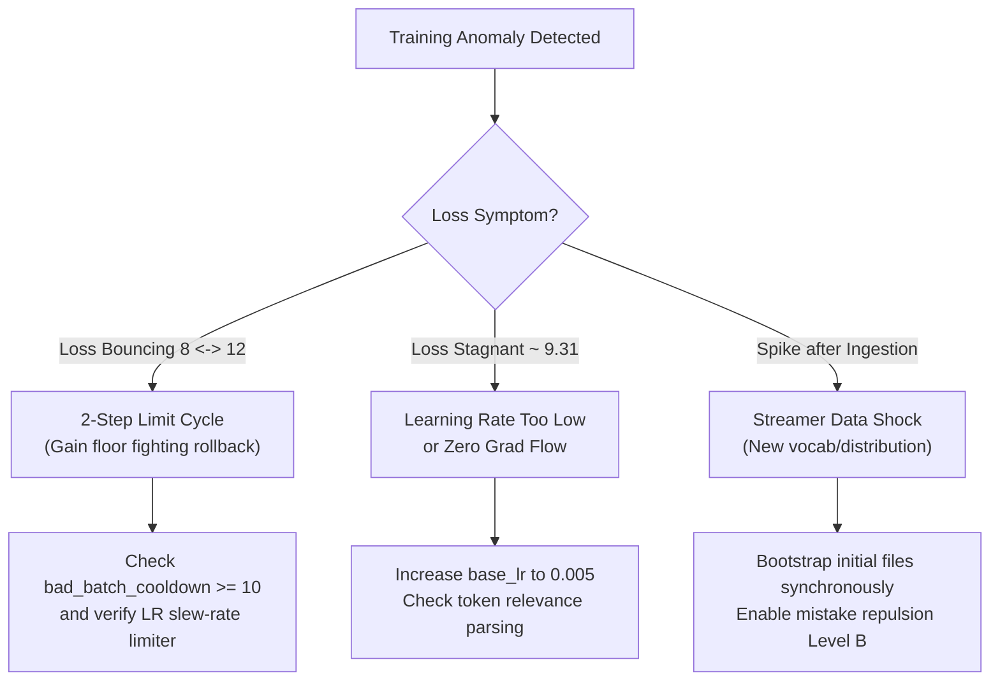

# 🩺 Training Log Diagnostics & Troubleshooting Runbook

This runbook is the definitive operational guide for inspecting, diagnosing, and troubleshooting training runs generated by RingWrapper (`logs/debug_run_*.txt` and console output).

---

## 🧭 Runbook Index
- [1. Anatomical Breakdown of the 11-Line Dashboard Block](#1-anatomical-breakdown-of-the-11-line-dashboard-block)
- [2. Diagnostic Warning Flags & What They Mean](#2-diagnostic-warning-flags--what-they-mean)
- [3. Troubleshooting Playbook & Root-Cause Matrix](#3-troubleshooting-playbook--root-cause-matrix)
- [4. Step-by-Step Recovery Checklist](#4-step-by-step-recovery-checklist)

---

## 1. Anatomical Breakdown of the 11-Line Dashboard Block

Every step in `logs/debug_run_*.txt` outputs an 11-line ASCII telemetry block:

```
========================================================================
  RINGWRAPPER NEURAL BENCHMARK & REAL-TIME TRAINING TELEMETRY DASHBOARD
------------------------------------------------------------------------
  [Step & Progress]     Step    50 / 25000  [==----------------------] 0.2% | Time: 42.1s | ETA: 350m 10s
  [Compute Speed]       1042.8 tok/s | 3.08 GFLOPs/s | 1963.80 ms/step (Batch: 32 x 64 = 2048 toks)
  [Model Dimensions]    6/10 Layers Active | Embed: 32 | Heads: 4 (2 KV GQA) | FFN: 64
------------------------------------------------------------------------
  [Loss & Convergence]  Loss: 6.1245 (EMA: 6.4520) | PPL: 456.92 | Min Loss: 5.8822
  [Accuracy Gauges]     Top-1: 18.4% | Top-5: 42.1% | Entropy: 4.892 | Bits/Tok: 8.83
  [Taylor Trajectory]   dL/dt: -0.0421 | d2L/dt2: +0.0018 | Curvature: 0.128 | Confidence: 88.4%
  [Optimizer & Energy]  LR: 0.005230 (Gain: 1.046x) | GradNorm: 0.3421 (Clip: 0.65) | Slew: 1.00x
  [Mistake Repulsion]   Mem: 4/30 | Repulsion A: ACTIVE (sim=0.042, force=0.0718) | Cooldown: 0
  [CoC Logic & Health]  Proof Checks: 10/10 Passed | Health: NOMINAL | Watchdog: IDLE
========================================================================
```

### Detailed Field Breakdown

| Line / Section | Metric | Healthy Baseline | Warning Signs / Red Flags |
| :--- | :--- | :--- | :--- |
| **[Step & Progress]** | `Step`, `Time`, `ETA` | Progressing smoothly with stable step time ($1.5\text{--}2.5\text{ s}$). | Step time spikes to $>10\text{ s}$ indicates memory swapping or thread contention. |
| **[Compute Speed]** | `tok/s`, `GFLOPs/s`, `ms/step` | $1000+\text{ tok/s}$, $3.0+\text{ GFLOPs/s}$ on modern multi-core CPU. | Drop to $<300\text{ tok/s}$ indicates recursive loop limit exceeded or unvectorized ops. |
| **[Model Dimensions]**| `Layers Active`, `Embed`, `Heads`| Layers expand progressively ($4 \to 6 \to 8 \to 10$) without loss blowup. | Layer transition immediately causing loss spike $>+2.0$. |
| **[Loss & Convergence]**| `Loss`, `PPL`, `Min Loss` | Monotonically decreasing loss; PPL dropping from $11000 \to 100 \to 10$. | Loss $> 10.0$ or bouncing by $> 2.0$ step-over-step; PPL $\to \infty$. |
| **[Accuracy Gauges]** | `Top-1`, `Top-5`, `Entropy` | Top-1 $> 15\%$, Top-5 $> 40\%$, Entropy decreasing ($7.0 \to 3.5$). | Top-1 stuck at $<0.5\%$; Entropy dropping to $<0.5$ (mode collapse). |
| **[Taylor Trajectory]**| `dL/dt`, `d2L/dt2`, `Curvature` | $dL/dt < 0$ (negative slope), Curvature $0.05 \sim 0.50$, Conf $> 70\%$. | $dL/dt \gg +0.50$; Curvature spiking to $>2.0$ (impending loss cliff). |
| **[Optimizer & Energy]**| `LR`, `Gain`, `GradNorm` | GradNorm $0.10 \sim 0.50$; Gain $0.5\times \sim 2.0\times$. | GradNorm $> 0.65$ (`[HUGE_GRAD_CLIPPED]`); LR surging by $>20\%$ per step. |
| **[Mistake Repulsion]** | `Mem`, `Repulsion A`, `Cooldown` | Repulsion A engages only when similarity detected (`sim > 0`); cooldown decays to 0. | Cooldown continuously refreshed (indicating alternating bad batch loop). |
| **[CoC Logic & Health]**| `Proof Checks`, `Health`, `Watchdog` | `NOMINAL`, `Watchdog: IDLE`. | `Watchdog: ACTIVE (penalty=0.28x)` or `Proof Checks: FAILED`. |

---

## 2. Diagnostic Warning Flags & What They Mean

### `[BAD_BATCH_SKIPPED]`
- **Log Message**: `[BAD_BATCH_SKIPPED] Batch loss 12.0000 exceeded threshold 7.5000. Snapshot restored.`
- **Physical Meaning**: Forward/backward pass produced an unacceptably high loss ($>7.50$). The trainer discarded the gradient update and restored parameter weights to the last known safe snapshot.
- **Underlying Cause**: Either a novel out-of-distribution token sequence, or learning rate was too high for the local landscape curvature.

### `[HUGE_GRAD_CLIPPED]`
- **Log Message**: `[HUGE_GRAD_CLIPPED] Unclipped GradNorm=5.007 > ClipThreshold=0.650.`
- **Physical Meaning**: Gradient Euclidean norm exceeded the safety threshold ($0.65$). All parameter gradients were scaled down by $\frac{0.65}{5.007} \approx 0.13\times$.
- **Underlying Cause**: Attention logits or FFN intermediate activations experienced a sharp slope surge. Clipping prevented weights from taking a catastrophic leap.

### `[WATCHDOG_TRIGGERED]`
- **Log Message**: `[WATCHDOG_TRIGGERED@9.068] active=YES recov_left=30 LR_penalty=0.28x`
- **Physical Meaning**: Loss failed to decrease or rose by $>0.40$ across 2 consecutive steps. The system forced a $0.28\times$ learning rate throttle and locked recovery mode for 30 steps.
- **Underlying Cause**: Model entered an unstable oscillatory regime. Watchdog enforces a cooling period to flush contaminated AdamW momentum buffers.

### `[MISTAKE_REPULSION]`
- **Log Message**: `[MISTAKE_REPULSION] Level A active (sim=0.184, repulsion_force=0.1502). Deflecting update.`
- **Physical Meaning**: Current proposed gradient direction $\hat{g}_{\text{curr}}$ aligned with a previous failure gradient $\mathbf{g}_{\text{bad}}$ stored in the mistake memory buffer. The engine subtracted a repulsive force vector $\alpha_A \sqrt{S_A} \mathbf{g}_{\text{bad}}$ to steer the optimizer away.

### `[LR_SLEW_LIMIT]`
- **Log Message**: `[LR_SLEW_LIMIT] Applied LR clamped from 0.015000 to 0.007370 (+10.0% max growth).`
- **Physical Meaning**: Dynamic LR gain controller attempted to increase LR faster than $+10\%$ in a single step. The slew-rate limiter clamped the update to protect against rebound shock.

---

## 3. Troubleshooting Playbook & Root-Cause Matrix



| Observable Symptom | Probable Root Cause | Immediate Action / Fix |
| :--- | :--- | :--- |
| **Alternating 2-Step Skips (OK $\to$ Skip $\to$ OK $\to$ Skip)** | Gain floor instantly restoring high LR after rollback before momentum drains. | Verify binary has `bad_batch_cooldown = 10` and slew-rate limiter ($+10\%/\text{step}$). |
| **Loss Spiking after Data Streamer message** | Model encountered thousands of novel out-of-distribution tokens at high LR. | Lower `base_lr` or increase `initial_bootstrap_data_files` to 2. |
| **PPL Stagnant at Initial Value ($11135$)** | Zero gradient flow or learning rate too low ($<10^{-5}$). | Check `base_lr \ge 0.001$ and confirm forward pass is not masking all targets. |
| **Top-1 Accuracy = 100%, Entropy = 0.0** | Output distribution collapsed to a single repetitive token. | Increase `default_temperature` ($0.70$) and `default_repetition_penalty` ($1.20$). |
| **Step time $>5000\text{ ms}$** | OpenMP thread contention or CoC proof checking executing every step. | Set `num_threads = 0`, `coc_verification_interval = 5` (not 1). |

---

## 4. Step-by-Step Recovery Checklist

If your training run ever destabilizes:
1. **Check the Last Known Safe Snapshot**:
   Verify that `checkpoints/step_*.bin` exists. You can resume training directly from the highest-accuracy checkpoint.
2. **Review the Gradient Norms**:
   Inspect the 5 steps preceding the crash. If GradNorm was climbing ($0.3 \to 0.8 \to 1.5 \to 5.0$), reduce `global_gradient_clip_norm` to $0.50$.
3. **Inspect Mistake Memory Capacity**:
   Ensure `mistake_history_capacity` is set to $30$, and `repulsion_scale_a = 0.35`.
4. **Verify Recovery Cooldown**:
   Ensure `bad_batch_cooldown` is active for at least 10 steps following any rejected batch.
