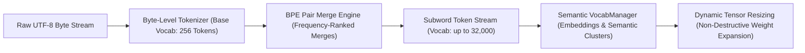

# 🔡 Vocabulary Expansion & BPE Subword Mechanics

This guide details the Byte-Pair Encoding (BPE) subword tokenizer, semantic lexicon clusters, and dynamic vocabulary expansion mechanics in Ring 2 (`include/ring2/tokenizer.hpp`, `include/ring2/vocab_manager.hpp`, and `src/ring2/vocab_manager.cpp`).

---

## 🧭 Tokenizer & Vocabulary Pipeline



---

## 1. Byte-Pair Encoding (BPE) Fundamentals

Unlike character-level or whole-word tokenizers, Byte-Pair Encoding finds the optimal middle ground:
1. **Base Foundation**: The initial vocabulary contains all 256 raw bytes ($0\text{--}255$). This guarantees **zero Out-Of-Vocabulary (OOV) tokens** — the model can tokenize and represent any string, Unicode emoji, or binary payload.
2. **Iterative Pair Merging**: The engine counts the frequency of all adjacent token pairs $(t_a, t_b)$ in the training corpus.
3. **Merge Table Insertion**: The most frequent pair is merged into a new unique token ID:
   $$\text{new\_token\_id} = \text{merge}(t_a, t_b)$$
4. This process repeats until the target vocabulary size (e.g. $32,000$) is reached.

---

## 2. Dynamic Adaptive Vocabulary Resizing ($256 \to 10,000 \to 32,000$)

In standard transformer implementations, changing vocabulary size requires rebuilding the model and retraining all weights from scratch. In RingWrapper, the **VocabManager** supports non-destructive **live vocabulary expansion**:

```
  Step 0 - 500:          Base Vocabulary (|V| = 256 Bytes)
                         Fast convergence on character structure.

  Step 500 - 2,500:      Expanded Subword Vocabulary (|V| = 10,000 Tokens)
                         Embeddings expanded; common word stems merged.

  Step 2,500+:           Full Deep Vocabulary (|V| = 32,000 Tokens)
                         Full subword dictionary with multi-token idioms.
```

### Weight Tensor Expansion Algorithm
When expanding vocabulary from $|V|_{\text{old}} \to |V|_{\text{new}}$:
1. The embedding matrix $W_e \in \mathbb{R}^{|V|_{\text{old}} \times d}$ and unembedding projection $W_u \in \mathbb{R}^{d \times |V|_{\text{old}}}$ are reallocated to size $|V|_{\text{new}}$.
2. Existing learned embeddings for IDs $0 \dots |V|_{\text{old}}-1$ are **copied directly into the new tensor without modification**.
3. Newly created subword tokens $t_{\text{new}} = \text{merge}(t_a, t_b)$ are initialized via **semantic composite interpolation**:
   $$W_e(t_{\text{new}}) = \frac{W_e(t_a) + W_e(t_b)}{2} + \mathcal{N}(0, 0.01)$$
4. This ensures newly unlocked tokens start with a meaningful semantic prior rather than random noise, preventing loss spikes during vocabulary expansion.

---

## 3. Semantic Concept Clusters & Lexicon Organization

The `VocabManager` maintains semantic clusters in embedding space to assist with attention routing and loss computation:
- **Syntactic Clusters**: Punctuation, whitespace, delimiters, brackets.
- **Structural Clusters**: Keywords, programming syntax, mathematical symbols.
- **Semantic Clusters**: Nouns, verbs, descriptive tokens clustered by cosine similarity.

These clusters allow the loss computation engine to evaluate semantic similarity penalties when computing focal loss weights.
