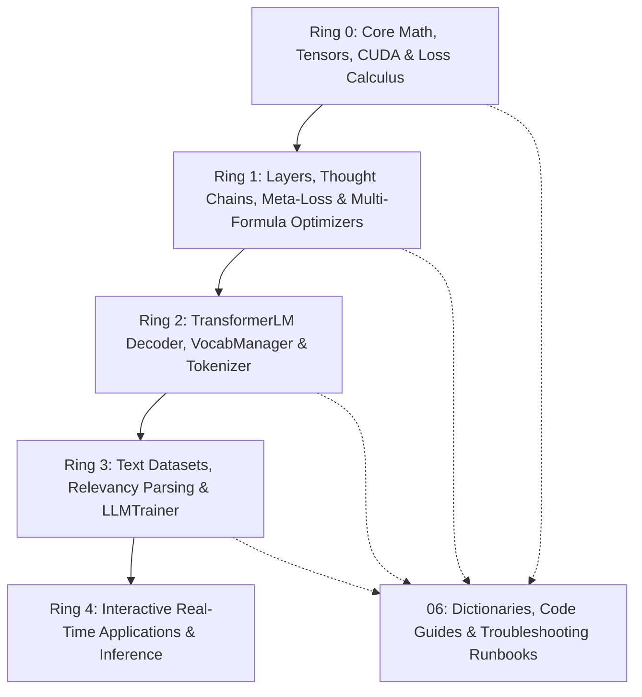

# 🧠 NeuralNet: RingWrapper Causal Transformer & Meta-Learning Engine

Welcome to the **NeuralNet Obsidian Knowledge Base**. This vault contains documentation, mathematical derivations, architectural specifications, configuration references, and practical troubleshooting guides for the **RingWrapper Causal Transformer LLM** and its meta-learning optimization framework.

---

## 🗺️ Master Navigation & Vault Index

### 📌 [[00 - Overview & Architecture/Architecture Map|00 - Overview & Architecture]]
- [[00 - Overview & Architecture/Beginner Roadmap & Core Concepts|Beginner Roadmap & Core Concepts (Prerequisites · Roadmaps · Analogies)]]
- [[00 - Overview & Architecture/Architecture Map|Architecture Map & System Overview]]
- [[00 - Overview & Architecture/Ring Dependency Hierarchy|Strict Ring Dependency Hierarchy (Ring 0 -> Ring 4)]]
- [[00 - Overview & Architecture/System Roadmap|Capabilities Roadmap]]

### ⚡ [[01 - Ring 0 (Core Math & Hardware)/Tensor3D & Matrix Math|01 - Ring 0 (Core Math & Hardware)]]
- [[01 - Ring 0 (Core Math & Hardware)/Tensor3D & Matrix Math|Tensor3D, Matrix & Block Cache Multiplication]]
- [[01 - Ring 0 (Core Math & Hardware)/Activation Functions|Activation Functions (GELU, SwiGLU, Softmax, Sigmoid, Tanh)]]
- [[01 - Ring 0 (Core Math & Hardware)/Loss Formulations & Calculus|Loss Formulations, Scale Multipliers & Derivatives]]
- [[01 - Ring 0 (Core Math & Hardware)/Loss Derivative Pyramid & Curvature Scaling|Loss Derivative Pyramid & Rayleigh Curvature Preconditioning]]
- [[01 - Ring 0 (Core Math & Hardware)/Taylor Loss-Trajectory Predictor|Taylor Loss-Trajectory Predictor (nth-Order Foresight & Trajectory Reward)]]
- [[01 - Ring 0 (Core Math & Hardware)/Taylor Penalty Prediction & Confidence Gating|Taylor Penalty Prediction & Multi-Factor Confidence Gating]]
- [[01 - Ring 0 (Core Math & Hardware)/Calculus of Constructions & Dependent-Typed Neural Reasoning|Calculus of Constructions (CoC) & Dependent-Typed Reasoning]]
- [[01 - Ring 0 (Core Math & Hardware)/Numerical Stability & NaN Prevention Physics|Numerical Stability, NaN Prevention & Gradient Sanitization Physics]]
- [[01 - Ring 0 (Core Math & Hardware)/CUDA & Hardware Acceleration Engine|CUDA GPU Acceleration & OpenMP/AVX CPU Fallback]]
- [[01 - Ring 0 (Core Math & Hardware)/Config & Telemetry Systems|Runtime Configuration & Telemetry Hooks]]

### 🧬 [[02 - Ring 1 (Layers & Advanced Optimizers)/Meta-Neural Loss & Step Optimizer|02 - Ring 1 (Layers & Advanced Optimizers)]]
- [[02 - Ring 1 (Layers & Advanced Optimizers)/Meta-Neural Loss & Step Optimizer|Meta-Neural Loss & Step Optimizer Network (Online Policy Learning)]]
- [[02 - Ring 1 (Layers & Advanced Optimizers)/4-Formula Dynamic Weight Physics|4-Formula Dynamic Weight Physics (Salience × Fisher Metric)]]
- [[02 - Ring 1 (Layers & Advanced Optimizers)/Hierarchical Recursive Thought Layer|Hierarchical Recursive Thought Layer & Multi-Pass Loops]]
- [[02 - Ring 1 (Layers & Advanced Optimizers)/Attention Mechanics & ALiBi|Grouped-Query Attention (GQA), RoPE & ALiBi Falloff]]
- [[02 - Ring 1 (Layers & Advanced Optimizers)/AdamW, Fisher Metric & Nesterov|AdamW, Natural Gradient (Fisher) & Nesterov Lookahead]]
- [[02 - Ring 1 (Layers & Advanced Optimizers)/Training Stability & Fast-Start Descent|Training Stability & Fast-Start Descent (Bias Init · Trust Region · Dimension Damping)]]

### 🏛️ [[03 - Ring 2 (Models & Transformers)/TransformerLM Decoder (GQA + SwiGLU + RoPE)|03 - Ring 2 (Models & Transformers)]]
- [[03 - Ring 2 (Models & Transformers)/TransformerLM Decoder (GQA + SwiGLU + RoPE)|TransformerLM Causal GPT Decoder Architecture]]
- [[03 - Ring 2 (Models & Transformers)/Dynamic Adaptive Vocabulary Sizing (10k Scaling)|Dynamic Adaptive Vocabulary Sizing (10k Scaling)]]
- [[03 - Ring 2 (Models & Transformers)/BPE Tokenizer & Merging Engine|Byte-Pair Encoding (BPE) Subword Tokenizer]]
- [[03 - Ring 2 (Models & Transformers)/Semantic VocabManager & Lexicon Clusters|Semantic VocabManager & Vector Indexed Lexicon]]
- [[03 - Ring 2 (Models & Transformers)/Autoregressive KV-Cache Generation|Autoregressive KV-Cached O(1) Streaming Generation]]

### 🚀 [[04 - Ring 3 (Data & Training Pipelines)/Token Relevancy & Interpolated Parsing|04 - Ring 3 (Data & Training Pipelines)]]
- [[04 - Ring 3 (Data & Training Pipelines)/LLMTrainer Architecture|LLMTrainer Optimization Loop & Dynamic Schedules]]
- [[04 - Ring 3 (Data & Training Pipelines)/Mistake Checkpoint Memory & State Fingerprinting|Mistake Checkpoint Memory & State Fingerprinting]]
- [[04 - Ring 3 (Data & Training Pipelines)/Concurrent Chrono Subsystems Engine|Concurrent Chrono Subsystems Engine (Multi-Threaded Co-Pilots)]]
- [[04 - Ring 3 (Data & Training Pipelines)/Universal Data Ingestion (CSV, TXT, BIN)|Universal Multi-Format Data Ingestion & Background Streaming (CSV, TXT, BIN)]]
- [[04 - Ring 3 (Data & Training Pipelines)/Real-Time Benchmark & Telemetry Dashboard|Real-Time Benchmark & Telemetry Dashboard]]
- [[04 - Ring 3 (Data & Training Pipelines)/Token Relevancy & Interpolated Parsing|Token Relevancy & Non-Linear Interpolated Context Parsing]]
- [[04 - Ring 3 (Data & Training Pipelines)/Progressive Curriculum & Horizon Growth|Progressive Curriculum, Horizon Growth & Fast-Track Depth]]
- [[04 - Ring 3 (Data & Training Pipelines)/Evaluation & Checkpoint Lifecycle|Evaluation Metrics & Multi-File Checkpoint Lifecycle]]
- [[04 - Ring 3 (Data & Training Pipelines)/Debug Log Format & Reading Guide|Debug Log Format & Reading Guide (per-step 11-line block)]]

### 📚 [[05 - Theoretical Foundations & Physics/Riemannian Manifolds & Fisher Information|05 - Theoretical Foundations & Physics]]
- [[05 - Theoretical Foundations & Physics/Information Geometry & Loss Dynamics|Information Geometry & Loss Dynamics]]
- [[05 - Theoretical Foundations & Physics/Riemannian Manifolds & Fisher Information|Riemannian Manifolds, Natural Gradients & Information Geometry]]
- [[05 - Theoretical Foundations & Physics/Adaptive Focal Loss Theory|Adaptive Focal Loss & Plateau Breakout Mathematics]]
- [[05 - Theoretical Foundations & Physics/Calculus of Constructions & Dependent Types|Calculus of Constructions & Dependent-Typed Attention]]
- [[05 - Theoretical Foundations & Physics/Multi-Order Loss Derivatives & Optimization|Multi-Order Empirical Loss Derivatives $\frac{d\mathcal{L}}{d\text{Pen}}$]]

### 📖 [[06 - Reference Dictionaries & Practical Guides/Master Practical Concepts & Real-World Analogies|06 - Reference Dictionaries & Practical Guides]]
- [[06 - Reference Dictionaries & Practical Guides/Beginner Line-by-Line Code Annotation Guide|🧑‍💻 Beginner Line-by-Line Code Annotation Guide (12 Critical C++ Functions Explained)]]
- [[06 - Reference Dictionaries & Practical Guides/Master Practical Concepts & Real-World Analogies|💡 Master Practical Concepts & Real-World Analogies (20 Core Concepts in Plain English)]]
- [[06 - Reference Dictionaries & Practical Guides/Mathematical & Systems Variables Dictionary|📖 Mathematical & Systems Variables Dictionary (Every Symbol, Metric & Coordinate Explained)]]
- [[06 - Reference Dictionaries & Practical Guides/Configuration Values Master Explainer|⚙️ Configuration Values Master Explainer (Field-by-Field Tuning Playbook)]]
- [[06 - Reference Dictionaries & Practical Guides/Practical Guide - Why Neural Nets Overshoot & How to Stabilize|🎯 Practical Guide: Why Neural Networks Overshoot & How RingWrapper Stabilizes Them]]
- [[06 - Reference Dictionaries & Practical Guides/Training Log Diagnostics & Troubleshooting Runbook|🩺 Training Log Diagnostics & Troubleshooting Runbook (Log Flag & Root-Cause Matrix)]]
- [[06 - Reference Dictionaries & Practical Guides/Attention Mechanics Visualized & Head Math|👁️ Attention Mechanics Visualized & Head Math Walkthrough]]
- [[06 - Reference Dictionaries & Practical Guides/Loss Landscapes, Curvature & Optimization Physics|🏔️ Loss Landscapes, Curvature & Optimization Physics]]
- [[06 - Reference Dictionaries & Practical Guides/Vocabulary Expansion & BPE Subword Mechanics|🔡 Vocabulary Expansion & BPE Subword Mechanics]]
- [[06 - Reference Dictionaries & Practical Guides/Asynchronous Chrono Co-Pilots & Background Streaming|⚡ Asynchronous Chrono Co-Pilots & Background Streaming]]

---

